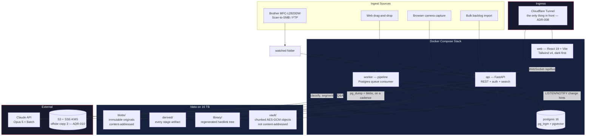
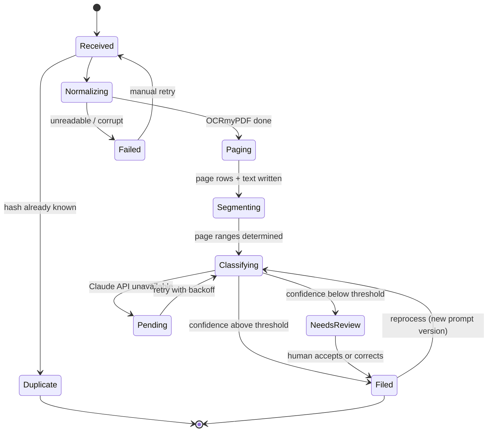
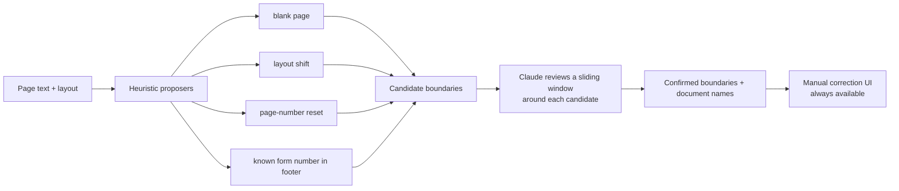

---
aliases:
  - Bindery Architecture
tags:
  - type/architecture
  - project/bindery
  - status/active
  - tech/python
  - tech/postgres
  - tech/docker
  - tech/react
  - tech/claude-api
project: bindery
created: 2026-08-27
updated: 2026-09-02
---

# Bindery — Architecture

> [!abstract] Shape of the system
> A **pipeline** (archetype F) wrapped in a **web application** (archetype A). Four containers: `api`, `worker`, `web`, `postgres`, plus `cloudflared` for ingress. The pipeline moves each source file through independently replayable stages, each persisting its output artifact. The web app reads the resulting index and lets a human correct anything the pipeline decided.

> [!important] The load-bearing principle — *Auditable Automation*
> Automate by default; make every automated decision cheap to inspect and one click to reverse. This constrains the schema (provenance on every AI-written field), the pipeline (nothing overwrites without recording), and every screen that displays AI output.

> [!info] Two rules this note is not free to contradict
> **Layering:** `worker/` may import `api/`; **`api/` must never import `worker/`.** Anything both processes need lives in `api/`, because that is the only package both images carry — which is why Q&A and backlog import are api-side and not worker-side, and why `tests/test_layering.py` exists. The diagram below shows the edges as they actually are.
>
> **Status lives in the Scope of Work**, not here. This note describes shape; [[Bindery/Scope of Work|Scope of Work]] says what is built.

---

## System Diagram



---

## L3 — Ingest Adapters

Every source produces the same thing: a **SourceFile** candidate with bytes and a provenance record. Adapters are swappable and each owns its failure modes.

| Adapter | Mechanism | Failure modes it must handle |
|---|---|---|
| **Watched folder** | `inotify` on `/data/inbox/<library>/`, one subdirectory per library | Partial writes (file still being copied), file locks, scanner writing a zero-byte placeholder first, name collisions. **Mitigation:** stability check — file size unchanged across two polls before pickup |
| **Web upload** | Multipart to `api`, streamed to a temp path, hashed, moved to blobs | Interrupted upload, duplicate drop, oversized file |
| **Browser camera capture** | Client-side capture → JPEG(s) → same upload endpoint with a `capture` provenance flag | Poor lighting, skew, multi-page sequencing |
| **Bulk import** | **api** walks a directory tree in dry-run mode first (`api/backlog/`), then enqueues; the worker only runs the resulting pipeline jobs | Enormous trees, permission errors, symlink loops, mid-import restart. *It lives in `api/` on purpose: a worker-side walker would have been a `ModuleNotFoundError` in production, and `tests/test_layering.py` records why* |

> [!warning] Spike required — SMBv1
> Many Brother MFPs negotiate **SMBv1 only**, which modern Samba disables by default. Fallback is **Scan-to-FTP** into the same watched directory. This is a named spike, not an assumption.

---

## L4 — Pipeline & Document State Machine



> [!success] The resilience property that matters
> **OCR and page-level indexing do not depend on Claude.** A document ingested during an API outage is immediately full-text searchable — it simply lacks a summary and tags until the classification job retries. The primary job (retrieval) degrades to "less convenient," never to "broken."

### Stages

Each stage reads a stored artifact and writes a stored artifact. **Every stage is independently replayable** — this is the decision that makes prompt and OCR iteration affordable forever.

| # | Stage | Input | Output artifact | Replay unlocks |
|---|---|---|---|---|
| 1 | **Ingest** | Raw bytes from an adapter | `blobs/<sha256>` + `source_file` row | — |
| 2 | **Normalize** | Original blob | `derived/<hash>/normalized.pdf` (OCRmyPDF, PDF/A, hidden text layer), `ocr.txt` sidecar, `ocr.json` word boxes | Swap OCR engine or settings without re-ingesting |
| 3 | **Page** | Normalized PDF | `page` rows with text + `tsvector`; `pages/NNNN.webp` renders; `thumbs/NNNN.webp` | Re-render at different resolution |
| 4 | **Segment** | Page text + layout signals | `document` rows (page ranges) | Re-segment without re-OCR |
| 5 | **Embed** | Document text | `pgvector` embedding column | Re-embed on model change |
| 6 | **Classify** | Document text + neighbour-derived candidate taxonomy | `classification` row + `derived/<hash>/classify/<prompt_version>.json` | **Re-classify 5,000 docs without re-OCR** |
| 7 | **Rules** | Classification result | Deterministic overrides applied and recorded separately | Re-run rules only |
| 8 | **File** | Final metadata | Document filed or routed to review | — |
| 9 | **Mirror** | Filed document | Hardlink under `library/<lib>/<year>/<type>/<title>.pdf` | Rebuild the entire tree from scratch, any time |

### Queue

**Postgres-backed**, `SELECT … FOR UPDATE SKIP LOCKED`. No Redis, no broker.

- The `job` table *is* the observability surface — "what's stuck and why" is a SQL query
- Retries with exponential backoff; permanent failures land in a visible dead-letter state, never silently dropped
- Worker concurrency sized to the host: **3–4 parallel OCR workers** on the 16 GB / Ryzen box
- Jobs are idempotent and keyed on `(source_file_id, stage, prompt_version)` — a job that runs twice produces the same result

---

## L5 — OCR, Bundles & Page-Level Indexing

> [!danger] The unit of search is the **page**, not the document
> This is the decision the whole product rests on. A 100-page bundle produces 100 indexed rows, each independently addressable, each with its own text and word-box overlay. Search returns "page 47 of Army Records 2019.pdf" and the viewer opens *there*.

**OCR:** OCRmyPDF 17.x driving Tesseract 5.x — hidden text layer beneath the original image, original resolution preserved, deskew and clean enabled, PDF/A output, `--sidecar` for raw text. Sub-second per page on CPU. PaddleOCR/PP-StructureV3 is a documented escalation path for table-heavy documents, not a v1 dependency.

**Segmentation** — heuristics propose, Claude confirms:



Cheap signals do the easy work; the model only sees ambiguous cases. Manual boundary correction ships regardless — a thumbnail strip where you drag the split points.

**Documents are page ranges.** There is no separate segment table: a `document` is `(source_file_id, page_start, page_end)`. A single-document file is simply `pages 1..N`. A bundle produces many `document` rows over one immutable `source_file`. Wrong boundaries are a metadata edit; the original file is never touched.

---

## L6 — Classification & the AI Layer

Claude API behind an **adapter** (`AIProvider` interface) so a local or hybrid backend is a config change, not a rewrite. Model: **`claude-opus-5`**, adaptive thinking, `strict: true` structured output. Backlog processing goes through the **Batch API** at 50% cost.

### The prompt contract

Six fields, borrowed from proven design and extended for Bindery's needs:

```json
{
  "title": "string  — 'Correspondent - Type - Identifier', ≤12 words, account numbers masked to last 4",
  "correspondent": { "existing_id": 42, "new_name": null },
  "tags":          { "existing_ids": [7, 12], "new_names": ["va-claim"] },
  "document_type": { "existing_id": 3, "new_name": null },
  "document_date": "YYYY-MM-DD | null",
  "language":      "en",
  "summary":       "string",
  "confidence":    { "title": 0.95, "correspondent": 0.88, "tags": 0.72, "document_date": 0.99, "document_type": 0.91 },
  "evidence":      [ { "field": "document_date", "page": 3, "snippet": "Date of Separation: 2014-08-11" } ]
}
```

> [!tip] Why `existing_ids` and `new_names` are separate fields
> Reused taxonomy resolves **deterministically by ID** and never passes through normalization, translation, or fuzzy matching — so an exact match can't be silently corrupted. Genuinely new suggestions are quarantined in `new_names` where they can be reviewed before entering the taxonomy. This is the schema-level answer to *"default to the tags it already has."*

> [!tip] Candidate taxonomy comes from embedding neighbours
> The document is embedded, its **top ~15 nearest already-filed neighbours** are retrieved via `pgvector`, and *their* tags, types, and correspondents become the ranked candidate list in the prompt. Passing the entire taxonomy scales badly and gives the model no signal about *likelihood* — only existence. Candidates are permission-filtered before the prompt, and every returned ID is re-validated against the requester's visible libraries afterward.

**Prompt caching:** the instruction block and stable taxonomy header sit before the last `cache_control` breakpoint; per-document text goes after it. Cache health is monitored via `usage.cache_read_input_tokens`.

**Prompt versioning:** every `classification` row records `prompt_version` and `model`. "Reprocess everything still on v2" is a query, which turns model improvement into a targeted operation instead of an $80 full re-run.

### Known-form registry

A curated library of high-value forms — DD-214, DD-215, VA rating and award letters, W-2, 1099, 1098, deeds, titles, mortgage notes, birth certificates, passports, marriage licences. Each entry has deterministic match rules (form number in a footer, characteristic phrases, layout signature) and optional typed field extractors. **A registry match is a fact, not an opinion** — and it's what makes "find my DD-214" a certainty rather than a ranked guess.

### Rules engine

Deterministic rules run alongside the classifier and can override it. `Correspondent = GEICO → tags {Insurance, Vehicle}`. Rules are recorded in the audit trail as rule-sourced, distinct from AI-sourced, so the why-panel can say *"this tag came from a rule you wrote,"* not *"the model decided."*

---

## L7 — Search & Retrieval

| Layer | Mechanism |
|---|---|
| **Body text** | Postgres `tsvector` + GIN on `page.text` — page-granular |
| **Fuzzy matching** | `pg_trgm` GIN on `document.title`, `tag.name`, `correspondent.name`, `asset.name` — covers the typo case Postgres FTS alone fails at |
| **Facets** | Library, date range, correspondent, asset, document type, known form, tags, confidence, review status |
| **Highlighting** | `ts_headline` for the snippet; `ocr.json` word boxes for the visual overlay on the page image |
| **Ranking** | Page hits rolled up to documents; best page surfaced per document; known-form matches boosted |
| **Similar** | `pgvector` cosine over document embeddings — reuses classification infrastructure |
| **Q&A** | Retrieve top-N pages, pass to Claude with `citations` enabled, **every answer carries its source page** |

> [!warning] pgvector is for classification and similarity, not primary search
> Semantic search was deliberately declined. The embeddings exist for tag-candidate retrieval, find-similar, and Q&A retrieval — keyword and fuzzy search remain the primary path.

**Latency budget** (derived from the 10-second success criterion): search query p95 **< 300 ms**; viewer open on the hit page **< 2 s**; ⌘K palette results **< 100 ms**.

---

## L8 — Storage Layout

```
/data
├── blobs/<aa>/<bb>/<sha256>              # immutable originals, content-addressed, dedup free
├── derived/<sha256>/
│   ├── normalized.pdf                    # OCRmyPDF output, searchable, PDF/A
│   ├── ocr.txt                            # sidecar plain text
│   ├── ocr.json                           # word boxes for highlight overlay
│   ├── pages/NNNN.webp                    # full-resolution page renders
│   ├── thumbs/NNNN.webp                   # thumbnails
│   └── classify/<prompt_version>.json     # classification input + output, per version
├── library/<library>/<year>/<type>/<title>.pdf   # regenerated hardlink mirror
├── inbox/<library>/                       # watched folder, one dir per library
└── exports/                               # packets, go-bag archives, full exports
```

- **Originals are never modified.** Content addressing makes exact dedup free and renames impossible to break.
- **The mirror tree is disposable** — deleting it costs nothing; the worker rebuilds it. It exists so Finder, `rsync`, and any backup tool see a human-readable archive.
- **Tiers:** `sensitivity` and `redundancy` are columns from the first migration. Retention was **rejected** — nothing auto-deletes, ever.
- **Encryption:** full-disk on the host; Postgres defaults. Two things since v1: vaulted documents are chunked AES-GCM ciphertext under `vault/`, outside `blobs/` and deliberately **not** content-addressed (a content address is an existence oracle); and the offsite copy is **SSE-KMS at S3** rather than client-side, which [[Bindery/ADR-010 — Offsite Replication to S3|ADR-010]] chose over the client-side encryption Phase 12 originally specified. The go-bag export is still encrypted before it leaves.

---

## L10 — Auth, Roles & Libraries

- **Cloudflare Tunnel** in front; no ports open on the host. **Cloudflare Access was removed on 2026-08-30** — [[Bindery/ADR-008 — App-Native Authentication as the Front Door|ADR-008]]: it expects a browser identity flow, which breaks scoped API tokens and any future native client (R-15). Do not reinstate it.
- **App-level JWT is the perimeter, not defence in depth.** `bindery.d3cloud.io` answers the open internet with Bindery's own login page, so `api/auth/throttle.py`, the password policy, TOTP and the nginx security headers are load-bearing — the difference between "nice to have" and "the only gate in front of a form guarding military and medical records" (CLAUDE.md invariant 9). *(Accepted risk: Cloudflare terminates TLS and can technically see traffic. Documented in the [[Bindery/Risk Register|Risk Register]].)*
- **A second lock, for the documents that would otherwise stay out of the archive** — the private vault ([[Bindery/ADR-012 — The Private Vault|ADR-012]], [[Bindery/ADR-013 — Chunked Vault Objects|ADR-013]]). A vaulted document is hidden whether the vault is open or shut; `api/vault/boundary.py` is the single definition of what is hidden, imported by both `api/db/scope.py` and `api/db/repository.py`.
- **Library** is the access boundary. Every document belongs to exactly one. Users hold memberships with a role: `owner` / `contributor` / `reader`
- Permission checks reduce to "which libraries can you see" — one join, hard to get wrong
- Moving a document between libraries is explicit and audited
- **Audit logging on all mutations** — ecosystem standard, and here it's also the trust surface

---

## L14 — Deployment

| Service | Image | Notes |
|---|---|---|
| `api` | Python 3.13 + FastAPI + uvicorn | REST, auth, search, blob serving |
| `worker` | Same base image, different entrypoint | Pipeline consumer, 3–4 OCR slots, includes Tesseract + OCRmyPDF + Ghostscript |
| `web` | React 19 + Vite build, served by nginx | Dark-first Tailwind v4 |
| `postgres` | `postgres:16` + `pg_trgm` + `pgvector` | Named volume; on the 16 TB pool |
| `cloudflared` | Cloudflare Tunnel | Ingress; no host ports published |

**Repo:** single repo — `api/`, `worker/`, `web/`, `infra/`. They share a schema and deploy together; splitting them creates version skew for no benefit.
**CI:** GitHub Actions, five gates in series — lint → unit → integration → e2e → images — cheapest first, and only the last publishes to GHCR. **Deploy is a deliberate manual pull-and-restart** on the ZimaOS host — you choose when the thing holding your passport restarts.
**Migrations:** Alembic, applied explicitly, never automatically on boot.

---

## See Also

- [[Bindery/Data Model|Data Model]]
- [[Bindery/Discovery & Requirements|Discovery & Requirements]]
- [[Bindery/Research Notes|Research Notes]]
- [[Bindery/Glossary|Glossary]]
- [[Bindery/Risk Register|Risk Register]]
- [[Infrastructure & Deployment]]
- [[Shared Patterns]]
