# Bindery — Scope of Work

> [!abstract] Ten phases, each independently shippable and independently verifiable
> Every phase ends in something you can run, see, and demo. **Phase 1 ships with no AI at all** and completely solves the stated pain — so if everything after it stalls, Bindery is still a working, valuable system.

> [!important] No time estimates
> Sizes are `XS` / `S` / `M` / `L` / `XL`. Sequencing comes from the dependency graph, not from a calendar.

---

## Phase Dependency Graph

```mermaid
graph LR
    P0[P0 Foundation] --> P1[P1 Retrieval — no AI]
    P1 --> P2[P2 Bundles & Known Forms]
    P2 --> P3[P3 Classification & Review]
    P3 --> P4[P4 Backlog Import]
    P3 --> P5[P5 Entities & Organization]
    P4 --> P6[P6 Trust, Export & Resilience]
    P5 --> P6
    P6 --> P7[P7 Household & Libraries]
    P7 --> P8[P8 Ask, Health & Hardening]
    P8 --> P85[P8.5 First Real Corpus]
    P85 --> P9[P9 Consolidation]
    P9 --> P10[P10 Accounts & Onboarding]
    P10 --> P11[P11 Documentation & Versioning]
    P11 --> P12[P12 Later Features]
    P11 --> P13[P13 Offsite Replication]
    P1 -.->|OCR quality gate<br/>R-01 — never measured| P3
    P9 -.->|hardening before<br/>the gate comes off| P10
    P6 -.->|completes 3-2-1<br/>copy 3 was never built| P13

    classDef done fill:#1b3a2a,stroke:#2f7d52,color:#d8f3e3
    classDef todo fill:#2a2333,stroke:#6b4f9e,color:#ece4ff
    class P0,P1,P2,P3,P4,P5,P6,P7,P8,P85 done
    class P9,P10,P11,P12,P13 todo
```

> [!danger] The gate on the dotted line was never actually cleared
> **Phase 1 was to produce a measured OCR word-accuracy figure on the real military and house bundles**, and re-plan Phase 3 if it came in under 90%. The scorer was built; the figure never was, because `tests/corpus/` never got real fixtures. Phases 3 through 8.5 were built straight through the gate.
>
> The archive works, so R-01 evidently did not materialise — but *evidently* is not *measured*, and the number that was supposed to justify proceeding still does not exist. **T-9.5 closes it**, late, and the result is worth having even now: it is the baseline any future OCR change is judged against.

> [!warning] The second dotted line is a hard sequence
> The login hardening in Phase 10a ships and is verified on the deployed stack **before** the Cloudflare Access policies come off in T-10.7. The other order leaves an unhardened login page facing the open internet for the length of the gap.

---

## Phase 0 — Foundation
> **Objective:** prove the stack runs end to end — a file can be uploaded and listed — with nothing exposed to the internet.

> [!success] Status — complete, and deployed
> **T-0.5 closed 2026-08-28**: tunnel live at `bindery.d3cloud.io`, Access challenging, service token reaching `/api/` without a browser. The stack runs on the ZimaOS host. See `docs/zimaos-deploy.md`.
>
> Verified 2026-08-27: five services healthy with no published host ports, `0001_baseline` applied explicitly, 23 tests green, a PDF uploaded and listed through the browser and through a bearer token. T-0.5 was the only open item; it closed on 2026-08-28.

**Deliverables:** Repo · Docker Compose stack · Postgres 16 with `pg_trgm` and `pgvector` · Alembic baseline · JWT auth · Cloudflare Tunnel with no published ports · staging stack.

- [x] **T-0.1** — Repo scaffold: `api/`, `worker/`, `web/`, `infra/`, `tests/` · Size `S`
  - Files: `README.md`, `CLAUDE.md`, `.gitignore`, `.env.example`, `pyproject.toml`, `web/package.json`
  - Done when: `git log` shows an initial commit and the tree matches the architecture doc
- [x] **T-0.2** — Docker Compose: `api`, `worker`, `web`, `postgres`, `cloudflared` · `REQ-104` · Size `M`
  - Files: `infra/docker-compose.yml`, `infra/Dockerfile.api`, `infra/Dockerfile.worker`, `infra/Dockerfile.web`
  - Done when: `docker compose ps` shows all services healthy and **zero published host ports**
- [x] **T-0.3** — Postgres 16 with `pg_trgm` + `pgvector`; Alembic baseline · `REQ-089`, `REQ-090`, `REQ-099`, `REQ-114` · Size `M`
  - Files: `api/db/models/*.py`, `alembic/versions/0001_baseline.py`
  - Done when: baseline migration creates library, source_file, page, document, tag, job with tier columns; **no destructive-delete code path exists**; migrations do not run on boot
- [x] **T-0.4** — JWT auth: HTTP-only cookie, refresh rotation, Argon2 · `REQ-103` · Size `M`
  - Files: `api/auth/`, `api/routers/auth.py`, `tests/test_auth.py`
  - Done when: login, refresh, and logout work; auth test suite green
- [x] **T-0.5** — Cloudflare Tunnel + Access, with a service-token path for `/api/` · `REQ-104`, `REQ-105` · Size `M` — *live 2026-08-28; service-token policy verified above the Allow policy*
  - Files: `infra/cloudflared/config.yml`, `docs/access-setup.md`
  - Done when: the app is reachable at its hostname through Access, **and** an API token authenticates without a browser flow
- [x] **T-0.6** — Staging compose stack for migration rehearsal · `REQ-115` · Size `S`
- [x] **T-0.7** — GitHub Actions builds and pushes images to GHCR · Size `S`
  - Workflow written and well-formed; unverified until the first push to `main`
- [x] **T-0.8** — Minimal upload endpoint + a list view, no processing · Size `S`

**Dependencies:** none · **Risks:** R-15 (Access blocking API tokens) — resolved by T-0.5
> [!success] Exit demo
> Upload a PDF through the browser at the Cloudflare hostname; see it appear in a list; `docker compose ps` shows no published ports; an API token fetches the same list without a browser.

---

## Phase 1 — Retrieval (no AI)
> **Objective:** find the DD-214. This phase alone solves the stated problem.

> [!success] Status — built; two hardware-bound tasks open
> Verified 2026-08-27 against a synthetic 100-page bundle: OCR 74 s, paging 17 s, exactly 100 page rows. `dd214` returns **page 47 in 17 ms**; ⌘K → Enter opens the viewer there with the term highlighted, the overlay rectangle matching the word box to four decimal places. Search p95 at a seeded **100,060 pages is 242 ms** (budget 300). 61 tests in the default run plus the slow OCR and latency suites.
>
> **Open:** T-1.12 needs real documents in `tests/corpus/` before the R-01 figure means anything — the scorer is built and the test *skips loudly* rather than passing on synthetic pages. T-1.13 needs the physical Brother.

**Deliverables:** All ingest paths except camera · OCR normalization · page-level index · search with facets and fuzzy matching · viewer with highlight overlay · ⌘K palette · pipeline status · **a measured OCR accuracy report**.

- [x] **T-1.1** — Postgres job queue with `SKIP LOCKED`, retries, backoff, dead-letter · `REQ-108`, `REQ-111` · Size `L`
  - Files: `worker/queue.py`, `worker/runner.py`, `api/db/models/job.py`, `tests/test_queue.py`
  - Done when: jobs are claimed exactly once under concurrency; a killed worker's job is retried; replay produces an identical end state
- [x] **T-1.2** — Ingest adapters: web upload and watched folder · `REQ-001`–`REQ-006`, `REQ-008` · Size `L`
  - Files: `worker/ingest/watched_folder.py`, `worker/ingest/upload.py`, `api/routers/upload.py`
  - Done when: a slowly-written file is not picked up until stable; byte-identical re-upload is detected and not duplicated
- [x] **T-1.3** — Content-addressed blob store · `REQ-004`, `REQ-005` · Size `M`
  - Done when: stored hash equals source hash; blob mtime never changes after write
- [x] **T-1.4** — Normalize stage: OCRmyPDF, deskew, clean, PDF/A, sidecar text, word boxes · `REQ-011`–`REQ-015`, `REQ-017` · Size `L`
  - Files: `worker/stages/normalize.py`, `infra/Dockerfile.worker` (Tesseract, Ghostscript, OCRmyPDF)
  - Done when: output PDF has selectable text over the image at source resolution; `ocr.txt` and `ocr.json` exist; digital-native PDFs skip OCR
- [x] **T-1.5** — Page stage: page rows, tsvector, renders, thumbnails · `REQ-016`, `REQ-019` · Size `M`
  - Done when: a 100-page file yields 100 page rows with populated `text_tsv`, one render and one thumbnail each
- [x] **T-1.6** — Search: FTS + trigram + facets + ranking · `REQ-020`, `REQ-023`, `REQ-024`, `REQ-025` · Size `L`
  - Files: `api/search/query.py`, `api/routers/search.py`, `tests/test_search_regression.py`
  - Done when: page-anchored results returned; "Hoda" matches "Honda"; p95 under 300 ms on a seeded 100K-page index
- [x] **T-1.7** — Viewer: renders a page, opens on the hit page, highlight overlay · `REQ-021`, `REQ-022`, `REQ-026` · Size `L`
  - Files: `web/src/features/viewer/`
  - Done when: a page-47 result opens on page 47 in under 2 s with terms highlighted
- [x] **T-1.8** — ⌘K command palette · `REQ-027` · Size `M`
- [x] **T-1.9** — URL-addressable search state · `REQ-028` · Size `S`
- [x] **T-1.10** — Pipeline status screen; nothing fails silently · `REQ-070` · Size `M`
- [x] **T-1.11** — Authenticated, library-scoped blob serving · `REQ-106` · Size `S`
  - Done when: a direct blob URL without a session returns 403
- [~] **T-1.12** — **Golden corpus + OCR accuracy report** · `REQ-018` · Size `M` — *harness built (`make ocr-report`); the figure needs real fixtures*
  - Files: `tests/corpus/`, `tests/test_ocr_accuracy.py`
  - Done when: real bundles are scored and a word-accuracy figure is produced. **This is the R-01 gate.**
- [ ] **T-1.13** — **Spike:** Brother Scan-to-SMB against the ZimaOS host; FTP fallback if SMBv1 · `REQ-009`, `REQ-010` · Size `S`

**Dependencies:** P0 · **Risks:** R-01 (measured here), R-05 (spiked here)
> [!success] Exit demo
> Drop the real 100-page military bundle in. Press ⌘K, type `dd214`, press Enter. **The viewer opens on the correct page with the term highlighted, in under ten seconds.** Then show the OCR accuracy report.

---

## Phase 2 — Bundles & Known Forms
> **Objective:** a bundle becomes thirty findable, taggable documents — without the file ever being modified.

> [!success] Status — built
> Verified 2026-08-27 on the 100-page bundle: cut by hand into five documents, the DD-214 matched deterministically, exported as a 2-page standalone PDF, and undone — with the source SHA-256 identical throughout. Overlapping ranges and cross-library assignment are refused **by the database**, not by application code. 14 seed forms, each matching its own fixture and none matching another's. 162 tests in the default run.

- [x] **T-2.1** — `document` as a page range; exclusion constraint; single-library constraint · `REQ-031`–`REQ-033` · Size `M`
- [x] **T-2.2** — Boundary heuristics: blank page, layout shift, page-number reset, form number · `REQ-034` · Size `L`
- [x] **T-2.3** — Manual segmentation editor with thumbnail strip · `REQ-036`, `REQ-037` · Size `L`
- [x] **T-2.4** — Known-form registry with deterministic fingerprints · `REQ-038`, `REQ-039` · Size `L`
- [x] **T-2.5** — Known-form ranking boost · `REQ-040` · Size `S`
- [x] **T-2.6** — Export a segment as a standalone PDF · `REQ-042` · Size `M`
- [x] **T-2.7** — Disambiguated page numbering throughout the UI · `REQ-030` · Size `S`
- [x] **T-2.8** — Scope search to a single bundle · `REQ-118` · Size `S`

**Dependencies:** P1
> [!success] Exit demo
> Segment the real military bundle by hand into its constituent documents. The DD-214 is now its own document with its own title, matched deterministically by the registry — and the source PDF's SHA-256 is unchanged. Export just the DD-214 as a standalone PDF.

---

## Phase 3 — Classification & Review
> **Objective:** documents classify themselves, and every decision is inspectable and reversible.

> [!danger] Built with the R-01 entry gate still open
> The phase plan says not to start until golden-corpus OCR accuracy is measured. It has not been — the corpus needs real documents. Phase 3 was built anyway, deliberately, on 2026-08-28. **The gate is not closed; it is being carried.** Two consequences follow: `REQ-058` (auto-file precision ≥ 95%) cannot be scored, and if the real figure comes in below 90% the gate weights and prompt were tuned against text that does not represent the archive.

> [!success] Status — built, minus what the corpus gates
> Verified 2026-08-28 against the real archive with recorded responses: the DD-214 classified, filed itself on structural signals, and its why-panel quotes "b. Separation Date This Period ..... 2014-08-11" from page 47. A rule created disabled, dry-run against 4 documents, matched 2, then enabled. 227 tests, none of them touching a live API.

- [x] **T-3.1** — `AIProvider` adapter; Claude Opus 5 with strict structured output · `REQ-044`, `REQ-045` · Size `L`
- [x] **T-3.2** — Embedding stage + HNSW index · `REQ-062` · Size `M`
- [x] **T-3.3** — Neighbour-derived candidate taxonomy · `REQ-047` · Size `M`
- [x] **T-3.4** — `existing_ids` / `new_names` contract with deterministic ID resolution · `REQ-046` · Size `L`
- [x] **T-3.5** — Provenance capture: page, snippet, per-field confidence · `REQ-049`, `REQ-050` · Size `M`
- [x] **T-3.6** — Title, date-priority, and language rules · `REQ-051`, `REQ-052` · Size `M`
- [x] **T-3.7** — Prompt caching + cache-hit monitoring · `REQ-053` · Size `S`
- [x] **T-3.8** — Graceful degradation: OCR and search work with the API down · `REQ-055`, `REQ-056` · Size `M`
- [x] **T-3.9** — **Structural-signal confidence gate** · `REQ-057`, `REQ-058`, `REQ-059` · Size `L`
  - Reproducibility ✅ — the decision replays from stored facts with no model call
  - **Auto-file precision ≥ 95% ❌ unscored** — needs the golden corpus (`REQ-058`)
- [x] **T-3.10** — Keyboard-driven review queue · `REQ-059` · Size `L`
- [x] **T-3.11** — Why-panel; AI values visually distinct; confidence displayed · `REQ-063`–`REQ-065` · Size `M`
- [x] **T-3.12** — Audit trail on every mutation, with undo · `REQ-066`, `REQ-067` · Size `L`
- [x] **T-3.13** — Rules engine with dry-run · `REQ-060`, `REQ-061` · Size `L`
- [x] **T-3.14** — LLM-confirmed segmentation over sliding windows · `REQ-035` · Size `M`
- [x] **T-3.15** — Known-form typed field extractors · `REQ-041` · Size `M`
- [x] **T-3.16** — Replayable stages + targeted reprocessing by prompt version · `REQ-112`, `REQ-113` · Size `M`
- [x] **T-3.17** — Tag provenance on link rows · `REQ-078` · Size `XS`

**Dependencies:** P2, **and the R-01 OCR gate cleared** · **Risks:** R-02, R-06, R-07
> [!success] Exit demo
> Scan a utility bill. It OCRs, classifies, reuses existing tags, and files itself with no interaction. Open it, click the date — the why-panel shows the exact sentence and page. Click undo; it returns to the review queue. Then disable the API key, scan another, and show it is still fully searchable.

---

## Phase 3.5 — Two screens the plan never scheduled

> [!warning] A gap in this document, found by using the thing
> The UX inventory lists 24 screens. **Screen 19 (Settings) and Screen 2 (Home / browse) had no task in any phase**, so nothing would ever have built them. Both were built on 2026-08-28.

- [x] **T-3.5.1** — Settings screen: API key editable in the UI, encrypted at rest, never returned to the client, validated against the live API on save · *screen 19* · Size `M`
- [x] **T-3.5.2** — Archive browser: every document with its provenance, filters, and a tree grouped by year / correspondent / type / known form · *screen 2* · Size `M`

> [!success] Why it mattered
> With an empty query the search screen showed nothing, so **a document you could not name was a document you could not reach.** Search answers "where is the thing I know I have"; nothing answered "what is in here".

---

## Phase 4 — Backlog Import
> **Objective:** the entire existing archive gets in, without creating a queue you'll abandon.

> [!success] Status — built 2026-08-28
> Staged scan → dry run → sample → curate → import, resumable at every step. Imported documents are flagged and excluded from the daily review queue (the R-03 mitigation, tested). Batch reconciliation is by `custom_id` with rows written before submission. Bulk edit previews through the apply path and undoes as one action.
>
> **T-4.2 and T-4.7 are built but unexercised** — no live Batch API call has been made, so the segmentation cost measurement on a real 200-page sample (R-06's tripwire) is still a projection rather than a measurement.

- [x] **T-4.1** — Directory walk with dry-run preview and cost estimate · `REQ-082` · Size `L`
- [~] **T-4.2** — Batch API submission and `custom_id` reconciliation · `REQ-054` · Size `M` — *built, never once run, **deleted in T-9.9**. The `custom_id` keying was the right idea and is the part worth keeping if it returns*
- [x] **T-4.3** — Backlog flag; separate triage surface; lower auto-file bar · `REQ-083`, `REQ-085` · Size `M`
- [x] **T-4.4** — **Two-pass import with taxonomy curation between passes** · `REQ-084` · Size `L`
- [x] **T-4.5** — Resumable import · `REQ-086` · Size `M`
- [x] **T-4.6** — Bulk edit: selection, dry-run preview, apply, single undo · `REQ-087` · Size `L`
- [x] **T-4.7** — Segmentation cost measurement on a sample · `REQ-088` · Size `S` — *estimator built and flags the $150 alarm; a real sample has not been measured*

**Dependencies:** P3 · **Risks:** R-03 (the most likely abandonment point), R-06
> [!success] Exit demo
> Point the importer at the real archive directory. Review the dry run. Run pass one on a sample, curate the taxonomy, run pass two. Every document is searchable; the daily review queue is still empty.

---

## Phase 5 — Entities & Organization
> **Objective:** "show me everything about the Honda" works.

> [!success] Status — built 2026-08-28
> Aliases are what keep merge rare rather than constant: three spellings of "American Honda Finance" resolve to one correspondent without anyone merging anything. Merge itself previews, commits in one transaction, records one event, and undoes as one action — for correspondents and tags alike, and undo follows tombstones rather than guessing.
>
> Taxonomy health surfaces R-08's orphan-tag threshold in plain language rather than as a number, with a Merge button on every near-duplicate pair, so the screen that reports the problem is also the one that fixes it.

- [x] **T-5.1** — Correspondent entity with aliases · `REQ-071` · Size `M`
- [x] **T-5.2** — Correspondent merge with preview and undo · `REQ-072` · Size `M`
- [x] **T-5.3** — Asset entity with typed attributes; many-to-many with documents · `REQ-073`, `REQ-074` · Size `M`
- [x] **T-5.4** — Asset timeline screen · `REQ-075` · Size `M`
- [x] **T-5.5** — Tag rename and merge with retroactive apply · `REQ-076` · Size `M`
- [x] **T-5.6** — Taxonomy health view · `REQ-077` · Size `M`
- [x] **T-5.7** — Bulk operations as a single undoable operation with a manifest · `REQ-068` · Size `L`
- [x] **T-5.8** — Smart shelves (saved searches) · `REQ-079` · Size `M`
- [x] **T-5.9** — Packet export from a shelf · `REQ-080` · Size `M`
- [x] **T-5.10** — Near-duplicate detection with comparison view · `REQ-081` · Size `M`
- [x] **T-5.11** — Find-similar · `REQ-117` · Size `S`

**Dependencies:** P3
> [!success] Exit demo
> Open the Honda's asset timeline: title, insurance cards, every service receipt, the payoff letter — from six correspondents, in order. Then build a "2026 Tax Return" shelf and export it as a packet.

---

## Phase 6 — Trust, Export & Resilience
> **Objective:** you could lose the server tomorrow and lose nothing.

> [!success] Status — built 2026-08-28
> The phase plan's order was followed exactly: integrity check first, then the full export, then the mirror built on the export's tree logic, then backup and the drill, then the vital tier and the go-bag.
>
> **The restore drill exists and can fail.** `scripts/restore-drill.sh` stands up a clean Postgres on a throwaway port, restores a backup generation, verifies that every original the restored database references is actually in the backup, and then searches the restored data for the DD-214. It never touches the live stack.
>
> The full export is asserted to be self-contained — no scripts, no external assets, no absolute paths, every link resolving to a file that is present — because "works without Bindery" is a property that decays silently.

- [x] **T-6.1** — Vital Records tier pinned on the home screen · `REQ-091` · Size `M`
- [x] **T-6.2** — Encrypted go-bag export · `REQ-092` · Size `M`
- [x] **T-6.3** — Full export: originals + JSON + static HTML index, works without Bindery · `REQ-093` · Size `L`
- [x] **T-6.4** — Mirror tree for whole files; `_bundles/` with a generated content index · `REQ-094`, `REQ-043` · Size `M` — *hardlinks to immutable 0444 blobs, so a mirror of a 400GB archive costs directory entries*
- [x] **T-6.5** — Integrity check job · `REQ-095` · Size `M`
- [x] **T-6.6** — 3-2-1 backup with an offsite encrypted copy · `REQ-096` · Size `M` — *refuses to run over a failing integrity check; the offsite copy is verified to be ciphertext, not assumed*
- [x] **T-6.7** — **Restore drill: restore to a clean stack and find the DD-214** · `REQ-097` · Size `M` — *run for real on the Zima: restored into a clean pgvector container, verified every original present, found the document. **DRILL PASSED***
- [x] **T-6.8** — Audit log viewer · `REQ-069` · Size `M`

> [!danger] Three unrestorable-backup bugs, all found by running the drill rather than testing it
> The drill was written, its guarantees were unit-tested, and the suite was green. Running it against the live host found three separate faults, each of which alone made every backup unrestorable:
>
> 1. **`pg_dump` could not connect.** The generated password is base64-ish and contains `/`. As a URL on the command line it parsed as `host:port`; `urlsplit` then read the first `/` as the start of the path. Now parsed with SQLAlchemy's `make_url` — the parser that already makes the application's own connection work — and passed through the environment, which also keeps the password out of `ps`.
> 2. **The archive format was unreadable.** Debian trixie ships client 17, which dumps a Postgres 16 server perfectly and writes a v1.16 archive `pg_restore` 16 refuses. The client is now pinned to 16 from PGDG, and a test asserts `pg_restore` can read what `pg_dump` just wrote.
> 3. **The drill reported failure while holding the document.** Both documents on the host are unclassified, so `title` is NULL, and `NULL || text` is NULL — the hits came back as blank lines.
>
> None of these was visible from the test suite: the test password is trivial, the test image is the `dev` stage, and the test fixtures always have titles. **This is the case for the drill being a drill.**

**Dependencies:** P4, P5 · **Risks:** R-09, R-10
> [!success] Exit demo
> Stop the stack. Restore from backup into an empty container. Search for the DD-214 and find it. Separately, open the full export in a browser with the stack still stopped and navigate the archive.

---

## Phase 7 — Household & Libraries
> **Objective:** other people can use it, and nobody sees anything they shouldn't.

> [!success] Status — built 2026-08-28
> The leak suite earned its keep on the first run: it caught the audit-log endpoint shipped in Phase 6, which called the permission helper and then discarded the answer, returning every household member's history to anyone signed in. Nothing static would have found that. What finds it is exercising every route with a user who should see nothing.
>
> So the durable part of this phase is the **route-coverage guard** — it enumerates the OpenAPI schema and fails when a `GET` route under `/api` is not exercised by the sweep. It found four more untested endpoints on introduction. Its own first version passed while examining zero routes, so it now also asserts it examined something.

- [x] **T-7.1** — Membership model with owner / contributor / reader · `REQ-100` · Size `M`
- [x] **T-7.2** — Repository-layer library scoping on every query · `REQ-101` · Size `L`
- [x] **T-7.3** — Audited document moves between libraries · `REQ-102` · Size `S` — *file-scoped, not document-scoped: the composite FK makes the file the unit, and no row order satisfies it midway, so migration 0009 makes the constraint deferrable*
- [x] **T-7.4** — Per-library watched-folder routing · `REQ-002` · Size `S`
- [x] **T-7.5** — Permission-filtered candidate taxonomy + post-hoc ID re-validation · `REQ-048` · Size `M` — *built defensively in Phase 3; this phase added the tests that prove both halves*
- [x] **T-7.6** — **The leak test suite** · `REQ-029`, `REQ-101` · Size `L`
  - Done when: two libraries and three users; no query path in the application returns a document outside the caller's visible set
- [x] **T-7.7** — Libraries and members admin screen · Size `M`

**Dependencies:** P6
> [!success] Exit demo
> A second household member logs in. They see their own library and the shared one, and nothing of yours — verified by the leak suite, not by looking.

---

## Phase 8 — Ask, Health & Hardening
> **Objective:** the polish that makes it a tool rather than a project.

> [!success] Status — built 2026-08-28
> Q&A refuses to answer rather than answer without a source: an uncited response is discarded, not shown with a caveat, because a caveat is read once and an answer is believed. What the reader gets instead is the pages that mention it — which is what the search box would have given them, and is still useful.
>
> Retrieval is Postgres throughout, so `/api/ask` works with no key and no network. Question retrieval runs precise-then-broad: *"when did I last get the brakes done?"* contains exactly one word a receipt has.

> [!danger] A production bug found while building this phase
> Every backlog-import endpoint imported `worker.backlog.session` inside the function body, and the api image ships only `api/` and `alembic/`. Confirmed against the running container: `import worker` is a `ModuleNotFoundError` there, so **Phase 4's entire Import screen would have raised on first use**. The test image is built from the `dev` stage, which copies the whole tree, so nothing noticed. The module moved to `api/backlog/`, and `tests/test_layering.py` now enforces the rule with an AST walk that catches function-local imports — those being the dangerous ones, since they defer the failure to request time. The same class of bug meant `anthropic` was missing from the api image, which would have broken the Settings "Test key" button.

- [x] **T-8.1** — Q&A over the archive, **every answer cited to a page** · `REQ-116` · Size `L`
- [x] **T-8.2** — Health panel: queue depth, failures, stuck jobs, API spend · `REQ-109` · Size `M`
- [x] **T-8.3** — Push notification on permanent failure or stall · `REQ-110` · Size `M` — *webhook adapter, six-hour per-code cooldown; **no real push has been received on a phone yet***
- [x] **T-8.4** — Browser camera capture · `REQ-007` · Size `M` — *built; **not yet exercised from an actual phone browser***
- [x] **T-8.5** — REST API with scoped tokens, documented · `REQ-107` · Size `M`
- [x] **T-8.6** — First-run narrated pipeline demo · `REQ-119` · Size `M`
- [x] **T-8.7** — Empty, loading, error, and denied states for all 24 screens · Size `L`
- [x] **T-8.8** — Performance pass against the latency budgets · `REQ-025`–`REQ-027` · Size `M` — *at 100K pages: search p95 15 ms (budget 300), palette p95 15 ms (budget 100), ask retrieval 41 ms. The one term matching a fifth of the archive costs ~800 ms and is reported rather than gated*
- [x] **T-8.9** — Accessibility and keyboard-navigation pass · Size `M`

**Dependencies:** P7
> [!success] Exit demo
> Ask "when did I last get the brakes done?" and get an answer citing the receipt and its page. Then force a pipeline failure and receive the notification.

---

## Phase 8.5 — First Real Corpus
> **Objective:** everything the archive learned the first time 496 real files went into it at once.

> [!abstract] Why this phase exists
> Phases 0–8 were built and tested against a corpus assembled to be representative. Then the whole of an actual twenty-year document hoard went into the inbox in one go — 496 files, every format a household accumulates, scanned by half a dozen different machines over two decades — and it broke in five ways that no synthetic corpus had shown. This phase is the record of that, because the fixes are only half the value; the other half is knowing which assumptions were wrong.

> [!danger] The worker lockup
> Three workers held their job locks at 99.9% CPU for forty minutes. The cause: `--deskew` and `--clean` force OCRmyPDF to rasterise every page, and that happens *even under `--skip-text`* — so office documents that already carried a perfectly good text layer (one was a 1,127-page deck) were being re-rendered pixel by pixel to no purpose.
>
> The process note matters more than the fix. A synthetic text-only DOCX built to reproduce it showed **0.4s against 0.3s** — near enough to no difference to have killed the theory. Benchmarking the *real* file showed 11 pages unfinished after 13 minutes. Converted documents now skip OCR entirely and get their sidecar from `pdftotext -layout`; deskew and clean are scanner-only.

> [!warning] 133 dead-lettered, and the classes hiding behind each other
> Fixing the top failure class each time revealed the next one down. In order: **126** images with an alpha channel (composited onto white, not dropped); **5** XML `ParseError` from custom font encodings emitting `\x01\x02\x03` into hOCR (sanitised); **2** Ghostscript PDF/A failures whose message did not match the existing signature list. Then nine more with four further causes: **5** digital signatures (`--invalidate-digital-signatures`, on the derived copy — the original is never touched), **1** XFA form, **1** CMYK with no embedded ICC profile, **2** degenerate images (10×5 and 1500×10 — laser-cutter artifacts, correctly refused).
>
> Two of my own bugs surfaced here as well: remedies were applied one at a time, so a signed PDF that then failed PDF/A reported only the second failure; and `--force-ocr` was being appended to an argv that already carried `--skip-text`, which OCRmyPDF rejects outright. Remedies are now cumulative and applied as overrides.

> [!example] A populated row is not a description
> The photo wall's "nothing said about these" filter was written as a null check on the title, and found **zero** of 182 images. Classification had already run on every one of them and written a confident title from an empty page: *"Unreadable Scan"*, *"Blank or Unreadable Scan"*, *"Unidentified Correspondent - ERS"*. The filter now asks whether there was anything to *read* — the same 40-character threshold `worker.stages.classify` uses to decide a document must be looked at rather than parsed — and finds **148**. The filter that surfaces these pictures and the pass that fixes them agree on the definition of unreadable, deliberately.

> [!danger] Five things wrong with one feature, found only by running it
> Describing 148 unreadable images cost five corrections, each hidden behind the last. Worth recording because none of them showed up in a test — every one needed the real corpus and a real invoice.
>
> 1. **The thumbnail, not the render.** The vision path sent the 240px thumbnail on a stated theory that a full page would be "megabytes of tokens". The renders are 2.5–10 KB. 240px is enough to tell a form from a photograph and nowhere near enough to say what the photograph is *of*.
> 2. **The render, not the original.** Every one of the 148 renders is exactly half the original's linear resolution — an uploaded image is wrapped in a PDF sized in points and rasterised back at 150 DPI. `ship.png` is 100×100 and arrived at 50×50; a 70×70 die face arrived at 35×35 and was reported, accurately, as impossible to identify.
> 3. **A ceiling that fell back instead of shrinking.** 13 originals exceeded 1.5 MB and were sent back to the half-resolution render — swapping a large accurate picture for a small degraded one, on exactly the files most likely to have detail worth reading. They are downscaled to 1568px now, which is where the API downscales anyway.
> 4. **A failed run setting the vocabulary for its retry.** Candidates come from embedding neighbours, and an unreadable page's neighbours are every *other* unreadable page, carrying whatever the earlier text-only pass invented. Results came back as *"Unknown - Blank or Unreadable Scan - Bird Illustration"*: the model had seen the bird and picked the type it was offered. Skipping the neighbours was not enough — the fallback is the whole library taxonomy, and the junk type is in it.
> 5. **A filter that could never clear.** "Nothing said about these" asked whether OCR found text. OCR finds nothing on a photograph before it is described and nothing after, so all 146 stayed on the list and the wall went on offering to re-describe them at cost. A classification now records how many pictures it carried, and that is what the filter asks.

> [!warning] The credit balance, and a queue four minutes from shredding itself
> The account ran out of credit mid-pass. Anthropic reports that as a 400, the classifier read 400 as "malformed request", and `fail` counted each retry against `MAX_ATTEMPTS` — every remaining document was two attempts from `dead_letter`, and a billing problem was about to present itself as a corpus problem. `ProviderUnavailableError` had been documented as *"retried with backoff indefinitely"* since Phase 3 while being counted like any other error.
>
> `queue.hold` puts a job back without spending the attempt `claim` consumed: the work was never tried. The reason is recorded on the job, so it reads as waiting rather than vanishing.

> [!question] Everything was in review
> 408 documents landed in the review queue — which is not a queue, it is a wall. The gate was right for the daily flow and wrong for a backlog: a twenty-year import is *expected* to be uncertain, and reviewing all of it is the manual filing the product exists to avoid. Backlog documents now gate at `1.0` rather than `2.0` and are triaged in the pipeline view rather than the daily queue. The flag is inherited from the source file at document creation — the previous version marked them in a pass that ran before the documents existed, and caught 15 of 396.

- [x] **T-8.5.1** — Office and spreadsheet ingest via LibreOffice headless — doc/docx/odt/rtf/xls/xlsx/ods/csv/ppt/pptx/odp/txt/md/html/mht/pages/numbers/key · Size `L`
- [x] **T-8.5.2** — Image remedy ladder: alpha flattening, CMYK→RGB, HEIC decode, degenerate-size refusal · Size `L`
- [x] **T-8.5.3** — Cumulative OCR remedies with the failure reason preserved verbatim · Size `M`
- [x] **T-8.5.4** — Stop rasterising documents that already have text · Size `M`
- [x] **T-8.5.5** — Backlog gate threshold, inherited at document creation, with a migration to backfill · `REQ-057` · Size `M`
- [x] **T-8.5.6** — Persisted event log; all 75 `bindery.*` log calls durable and visible in the UI · Size `L`
- [x] **T-8.5.7** — Postgres `LISTEN`/`NOTIFY` push over one WebSocket, replacing every poll in the app · Size `L`
- [x] **T-8.5.8** — Add-files page: drag-drop, visible queue, live pipeline graph · Size `L`
- [x] **T-8.5.9** — Vision for text-poor documents: the original image, or the page render · Size `L`
- [x] **T-8.5.10** — Photo wall filtered on "has anything looked at this", with a re-describe action · Size `M`
- [x] **T-8.5.13** — `queue.hold`: an unavailable provider costs no attempt · Size `M`
- [x] **T-8.5.11** — Correspondent unify pass — names only, never document text; merges only on approval · Size `M`
- [ ] **T-8.5.12** — `AIProviderError('structured output was empty')` on a 31-page / 87k-character loan document · Size `S` — *suspected token limit, unconfirmed; one file, still dead-lettered*

**Dependencies:** P8
> [!success] Exit demo
> 493 of 496 files processed. The daily review queue is empty. The three that remain are named, with the reason each one cannot be read. 146 of the 148 images that carried no readable text are described from their pictures; the two that are not are each a single solid colour, where *blank* is the correct answer.

---

## Phase 9 — Consolidation
> **Objective:** close the debt the real corpus exposed, before adding people to it.

> [!danger] R-08 has fired, and the cause is a `LIMIT` that used to be harmless
> The tripwire is *"more than 15% of tags used exactly once."* Actual, at 542 documents: **68.1%** — 476 tags of 699. Document types are 166 of 277; correspondents 80 of 122.
>
> The cause is not the model. `_full_taxonomy` — the fallback when the neighbour path has nothing — reads `.order_by(name).limit(25)`. Its docstring says *"small archives can afford the whole list"*, which was true when it was written and stopped being true silently, because a `LIMIT` truncates rather than errors. With 277 types the model is shown the first 25 **alphabetically**: the list ends at *"Business Plan / Product Concept"*. `Utility Bill`, `Resume`, `Training Presentation`, `Unit Patch Image`, `Purchase Order`, `Leave and Earnings Statement` are never offered. The model cannot reuse what it is not shown, so it invents — and every invention makes the alphabetical window a smaller fraction of the whole.
>
> T-8.5's neighbour-skip made this worse for exactly the documents it was meant to help: 148 images were routed into this fallback.

- [x] **T-9.1** — Rank the fallback taxonomy by use, not by name; raise the cap; band the counts so the block still caches · `REQ-047` · Size `S`
- [x] **T-9.2** — Extend the unify pass to document types and tags; `merge_document_types` and migration 0014 · `REQ-060`–`REQ-062` · Size `M`
- [~] **T-9.3** — Merge the existing fragmentation · Size `M` — *one reviewed round applied per kind. Correspondents are clear (0 near-duplicates of 104); types are at 25% and tags 20%, both above the re-based 15% tripwire. The remainder is genuinely the operator's vocabulary and belongs in the Organise screen, one group at a time*
- [x] **T-9.4** — Re-measure and re-base R-08's tripwire on near-duplicate share, not singleton share · Size `S` — *the merge pass barely moved the singleton rate and that turned out to be correct; see the Risk Register*
- [~] **T-9.5** — **T-1.12**: staging tooling built; the figure needs a person · `REQ-018` · Size `M` — *`scripts/stage-corpus-fixture.py` turns transcription into correction; the `# UNVERIFIED` marker stops the shortcut becoming the answer*
- [x] **T-9.6** — Per-stage job lease: 10 minutes for classify, 45 for normalize · `REQ-108` · Size `S`
- [ ] **T-9.7** — **T-1.13**: Brother Scan-to-SMB spike; FTP fallback if SMBv1 · `REQ-009`, `REQ-010` · Size `S` — *blocked: needs the physical scanner*
- [x] **T-9.8** — **T-8.5.12**: the loan document was a *safety refusal*, not a token limit · Size `S` — *`stop_reason="refusal"` arrives as HTTP 200 with no content, which this code read as an empty structured output; a client-side escalation to Opus classifies it*
- [x] **T-9.9** — Batch API: **deleted**, with the reasoning recorded in migration 0020 · `REQ-054` · Size `M`
- [x] **T-9.10** — Re-classify the documents still typed as a failure to read · `REQ-090` · Size `S`
- [x] **T-9.11** — Verify the unify and photo screens against the deployed stack · Size `S` — *routes answer correctly through the tunnel, the bundle carries every string, and the photo wall reports 182 images with none undescribed*
- [ ] **T-9.12** — Triage the 266-item backlog queue down, using bulk edit and the raised auto-file bar · `REQ-083` · Size `M`

**Dependencies:** P8.5 · **Risks:** R-01 (finally measured), R-03 (T-9.12), R-08 (the whole phase)
> [!success] Exit demo
> Singleton tags below 15%. The R-01 word-accuracy figure exists and is written down. A deploy mid-classify strands nothing for 45 minutes.

> [!warning] Where Phase 9 actually finished — 2026-08-30
> **Done:** the R-08 root cause (an alphabetical `LIMIT 25`), the unify pass across all three taxonomies, per-stage leases, the loan document, the Batch API decision, the failure-to-read types, and verification against the deployed stack.
>
> **Confirmed on the Zima, 2026-08-30.** The dead-lettered loan job was requeued against the deployed image and **succeeded on attempt 1** — no refusal fallback needed, because the effort ceiling alone was the fix. Dead letters on the host: **4 → 3**. The remaining three are correct permanent refusals and should stay: `laser.png` (10×5 px), `laser2.png` (1500×10 px), and `af911.pdf` (a dynamic XFA form Acrobat alone can read). A dead letter that is the right answer is not a backlog item.
>
> **Deliberately handed back, with the work made small:**
> * **T-9.3** — one reviewed round applied per kind. Correspondents are clear; types sit at 25% and tags at 20% against a 15% tripwire. Further rounds compound — an earlier unguarded run turned fiction into creative writing into a personal essay across three of them — and the remaining calls are about the operator's own vocabulary. The Organise screen exists for exactly this.
> * **T-9.5** — the figure needs a person who has looked at the page. Ground truth produced by reading a scan is a second OCR pass with a different engine, and every future OCR change would then be judged against that reading.
> * **T-9.7** — needs the physical Brother.
> * **T-9.12** — 266 backlog documents to triage; a judgement call per document.

> [!question] Three type merges and six tag merges worth a second look
> Applied and individually undoable. `Condominium Declaration of Trust → Declaration of Trust`, `Flight Line Schedule → Flying Schedule`, `Programming Exercise → Programming Lab Assignment`; and among tags, `3D printing → 3D printer`, `behavioral psychology → behavior analysis`, `condo purchase → condominium`, and `unit patch/emblem/insignia → squadron patch/emblem/insignia`. Each is defensible for this archive and none is mine to settle.

---

## Phase 10 — Accounts, Onboarding & Administration
> **Objective:** hand an account to someone you are related to, and have that be a good idea.

> [!abstract] What this phase is really about
> Every requirement here is downstream of one sentence the operator has to be able to say honestly: *"I cannot read your documents."* [[Bindery/ADR-009 — Strict Per-Account Isolation|ADR-009]] makes that a test rather than a claim, and accepts the cost — support gets harder, because diagnosis runs on job state and metadata instead of on looking.
>
> The second constraint is **no email service**, which is more shaping than it sounds. No reset links, no verification mail, no invite emails. An invitation is a link the operator sends by text; a forgotten password is a code the operator reads out. Both are fine, and out-of-band delivery is genuinely secure — it just has to be designed for rather than worked around.

> [!warning] Sequencing that is not negotiable
> The controls in [[Bindery/ADR-008 — App-Native Authentication as the Front Door|ADR-008]] ship **before** the Access policies come off, verified against the deployed stack. Removing the outer gate first and hardening afterwards leaves an unhardened login page on the open internet for however long that gap is.

### 10a — The front door
- [x] **T-10.1** — Login rate limiting, per IP and per account, with escalating cost · `REQ-133` · Size `M`
- [x] **T-10.2** — Account lockout: bounded, self-expiring, cleared by a successful login, not weaponisable · `REQ-134` · Size `M` — *admin-clearable UI lands with T-10.16*
- [x] **T-10.3** — Constant-shape auth failures; no user enumeration by body **or timing** · `REQ-135` · Size `S`
- [x] **T-10.4** — Password policy at set time, checked against a local common-password list · `REQ-137` · Size `S`
- [x] **T-10.5** — Every login attempt recorded, success and failure, with IP, including unknown addresses · `REQ-144` · Size `S`
- [x] **T-10.6** — Security headers and a CSP on the app origin · Size `S`
- [x] **T-10.7** — **Cutover 2026-08-30**: Access application deleted, verified from the public internet · `REQ-132`, `REQ-105` · Size `S`

### 10b — Accounts
- [x] **T-10.8** — Invitations: single-use, expiring, provisioning one account and one personal library · `REQ-139`, `REQ-140` · Size `M`
- [x] **T-10.9** — Self-service password change, invalidating every other session · `REQ-137` · Size `S`
- [x] **T-10.10** — Admin-issued one-time reset codes; no endpoint sets another user's password · `REQ-136` · Size `M`
- [x] **T-10.11** — TOTP with recovery codes, self-enrolled; optional for users · `REQ-138` · Size `L` — *RFC 6238 in-tree, not a dependency*
- [x] **T-10.11b** — TOTP mandatory for admins: the grant is refused without it, and enrolment shows in the panel · `REQ-156`, `REQ-157` · Size `M`
- [x] **T-10.12** — Account suspension: sessions die immediately, data is untouched · `REQ-145`, `REQ-090` · Size `S`

> [!danger] A cross-tenant leak found while building 10c
> `source_file.sha256` was **globally** unique, and the deduplication lookup matched on it globally. Correct with one account; broken in both directions with two:
> * uploading bytes another household already held returned **their** `source_file` — filename, library id and all — so the upload form answered *"does anyone else on this server have this document?"*; and
> * your own copy was never filed in your own library, while the response said it had worked.
>
> Found before there was a second account to leak to, which is the only comfortable time to find it. Uniqueness moved to `(library_id, sha256)` in migration 0017. The blob on disk is untouched and still shared — identical bytes are one file however many libraries record holding them, which is the point of content-addressed storage. What became per-library is the *record* of holding them.

### 10c — Isolation, proven
- [x] **T-10.13** — No admin branch in `visible_library_ids`; the permission suite asserts it on every read path · `REQ-143` · Size `M`
- [x] **T-10.14** — Library-scope the event log; strip document content from global entries · `REQ-144` · Size `M` — *the unscoped bucket held import folder paths, login addresses and the text of other people's Q&A questions, all readable by any signed-in account*
- [x] **T-10.15** — Storage quotas: enforced at upload, named in the refusal, adjustable by an admin · `REQ-141` · Size `M`
- [x] **T-10.16** — Admin panel: accounts, storage, file counts, invitations, lockouts · `REQ-142` · Size `L`

### 10d — Onboarding
- [x] **T-10.17** — First-run narration, plus a next-steps strip for the gap after it vanishes · `REQ-146` · Size `M`
- [x] **T-10.18** — Onboarding completes on the user's first successful search, not on a dismissed dialog · `REQ-147` · Size `M`

**Dependencies:** P9 · **Risks:** R-16, R-17, R-18 (all new; see [[Bindery/Risk Register|Risk Register]])
> [!success] Exit demo
> A family member is invited by a texted link, sets a password, is walked through their first upload, and finds it by searching. The operator, logged in as an administrator, can see that they used 240 MB across 31 files — and cannot open a single one of them, because a test says so.
>
> **Deployed 2026-08-30.** Migrations 0016 and 0017 applied after a fresh dump; 496 files, 542 documents and 4,308 pages unchanged across them.

> [!warning] The existing administrator is grandfathered past REQ-156
> Migration 0016 makes the first account an administrator — it has to, or nobody can reach the panel — and that account predates the two-factor requirement. Granting admin rights to anyone *else* is refused without TOTP, and the panel carries a banner saying so. **Enrol before inviting anyone**: this is the account that can issue a password reset for every other one.

---

## Phase 11 — Documentation & Versioning
> **Objective:** the application explains itself, and says what it is.

> [!tip] Why the screenshots are automated rather than captured
> The operator's requirement is *"going forward, we'll have to update that with every feature that we change"* — which is precisely the thing nobody does. Documentation screenshots rot silently: nothing fails, the picture is simply a year out of date and quietly misleading.
>
> So the screenshots are produced by driving the real application in CI, and a stale one fails the build. That is more work up front and the only version of this that survives contact with the next six months. The same job enforces REQ-150: add a route without a doc page and the build fails.

- [x] **T-11.1** — Guides served from the app at `/help`; content in `web/public/help`, no external dependency · `REQ-148` · Size `M`
- [x] **T-11.2** — Screenshot harness: drives the real app, captures per screen, fails on stale · `REQ-149` · Size `L`
- [x] **T-11.3** — 15 guides, one per user-facing screen; CI fails on a route that has none · `REQ-150` · Size `L`
- [x] **T-11.4** — FAQ: ingest, search, review, storage, recovery, what the admin can and cannot see · `REQ-151` · Size `M`
- [x] **T-11.5** — Build-derived version in every service; `/api/version` returns the commit · `REQ-152` · Size `S`
- [x] **T-11.6** — Version in the sidebar, with a mismatch flagged; the worker reports its own · `REQ-153` · Size `M`
- [x] **T-11.7** — Schema revision and drift from head, beside the version · `REQ-154`, `REQ-114` · Size `S`
- [x] **T-11.8** — User-facing changelog at `/help?view=changelog` · `REQ-155` · Size `S`
- [x] **T-11.9** — Docs are part of the definition of done: a CLAUDE.md section and five CI checks · Size `S`

**Dependencies:** P10 *(the docs describe the multi-user application, so they follow it)*
> [!success] Exit demo
> Someone invited yesterday finds the answer to "why is my document waiting for review" without asking. The footer says which version they are on, and a deliberately mismatched worker shows a warning.
>
> **Deployed 2026-08-30.** `/api/version` reports api and worker on the same commit and the schema in sync, checked from the public internet.

> [!danger] Four ways this nearly shipped broken, each now a comment in the code
> **The harness captured fifteen identical pictures of the login form and reported success.** A tool for keeping documentation honest that silently produces wrong documentation is the worst possible version of itself. It now proves it is signed in before taking a shot, and re-checks before each one.
>
> **The session cookie is `Secure`, so a browser reached over plain `http://web` silently discards it.** Login succeeded, every later request 401'd, and the screen sat on the login form looking exactly like a wrong password. Capture now shares the web container's network namespace and uses `localhost` — the one origin Chrome trusts without TLS, and there are no published ports to use instead (REQ-104).
>
> **The guides were imported from `docs/help/`, which `Dockerfile.web` never copies.** `tsc` from the repository root resolved a path the image could not see; only the container build caught it.
>
> **The staleness check invalidated its own capture.** It compared HEAD's timestamp against each screen's source timestamp, so committing the screenshots — necessarily a newer commit than the code they show — made every one of them stale. CI caught it on the first push. It compares commit *hashes* now: committing a picture does not change the code it is a picture of. Verified by breaking it on purpose and watching it fail.

> [!warning] Screenshots go in the repository, and the repository holds a real archive
> `scripts/seed-demo.py` generates four invented documents with real selectable text — so OCR, the known-form matcher and search all have something true to do — and the cast on the People screen is Mum, Dad and Sister. None of them exist. A picture of somebody's discharge papers in the documentation would be a strange way to finish a phase about not reading other people's documents.

---

## Phase 12 — Later Features
> **Objective:** the things deliberately deferred, now that the foundation is real and shared.

- [ ] **T-12.1** — Expiry tracking with reminders · `REQ-120` · Size `L`
- [→] **T-12.2** — ~~Cloud replication of the redundancy tier, client-side encrypted~~ · **Promoted to [[Bindery/Phase Plans/Phase 13 — Offsite Replication|Phase 13]] and re-specified.** Client-side encryption replaced by SSE-KMS — see [[Bindery/ADR-010 — Offsite Replication to S3|ADR-010]]
- [ ] **T-12.3** — Learn-from-corrections as few-shot examples · `REQ-122` · Size `L`
- [ ] **T-12.4** — Printed emergency index with QR codes · `REQ-098` · Size `M`
- [ ] **T-12.5** — User-initiated, time-boxed, revocable document share for support · Size `M` — *the mitigation ADR-009 names for the support cost it accepts*

> [!note] The native iOS app is parked, not cancelled
> `REQ-123` was a Phase 9 task. It is its own project, it is the largest single item in the plan, and nothing else waits on it. It comes back when the web application has been in other people's hands long enough to know what a phone should do differently.

---

## Phase 13 — Offsite Replication
> **Objective:** the building could burn down tonight and the archive survives.

> [!danger] What Phase 6 left undone, and how long it went unnoticed
> Phase 6 closed with an exit demo that passed and a `[x]` on T-6.6 — *"3-2-1 backup with an offsite encrypted copy"*. The integrity check, the dump, the blob copy, the manifest and the restore drill are all real and all work. **But `encrypt_for_offsite()` writes ciphertext to a local path and returns.** Nothing ships it anywhere.
>
> So copy 3 of three has been a function signature since 2026-08-28. Both existing copies live in the same building, on the same array. R-09 — the largest risk in the register — has been carrying a mitigation that reads as complete and is two-thirds built.

> [!info] Measured, not estimated — 2026-08-30
> `blobs/` **318 MB across 496 files**; `pg_dump -Fc` **4.3 MB**. That is the entire irreplaceable payload. `derived/` (790 MB) is reproducible from blobs. `inbox/household/` is **13 GB** — of which 6.5 GB is `Documents/Minecraft`, 4.5 GB is `800_Projects`, and only **845 files are PDFs or images**. Cost at this size is roughly **$12/year**, and ~$12 of that is the KMS key. **Cost is not a design input**, which is why both retention schedules run rather than one being chosen.

- [x] **T-13.1** — Provision bucket, KMS key, IAM user and lifecycle rules; runbook in `docs/offsite-replication.md` · `REQ-158` · Size `M` — *done 2026-08-30. Bucket `bindery-offsite-d3cloud`, key `alias/bindery-offsite`, user `bindery-offsite` in account `150056528345`. Policy verified with `simulate-principal-policy` before any credential existed: put/get/list/GenerateDataKey/Decrypt allowed, DeleteObject/DeleteBucket/PutLifecycleConfiguration/ScheduleKeyDeletion/DisableKey all **explicitDeny**. Round-trip probe came back byte-identical under the right key with BucketKey on. Configs checked in at `infra/aws/`*
- [x] **T-13.2** — AWS settings in `settings_store` (credentials as secrets, masked) + Settings UI panel · `REQ-159` · Size `M` — *done 2026-08-30. Five keys, only the secret access key held as a secret. 14 tests; verified in the browser against the rebuilt stack.*
- [x] **T-13.3** — **Test connection**: real put/get round-trip, asserts byte-identity and reports the KMS key used · `REQ-160` · Size `S` — *done 2026-08-30. 16 tests against a stand-in client, plus the four KMS behaviours it depends on verified against the live bucket. The put names the key explicitly; a bucket-default fallback would report success for the wrong key, which is exactly what REQ-160 forbids.*
- [x] **T-13.4** — `offsite_object` ledger + incremental blob uploader; weekly `ListBucket` reconcile against the bucket · `REQ-161` · Size `L` — *done 2026-08-30, migration 0021. 13 tests, each verified to fail when the behaviour is broken. Uploads are checked transfers: S3 verifies each body against the hash the archive already holds.*
- [x] **T-13.5** — Dump + manifest upload under `dumps/{daily,weekly}/`, on the same integrity gate as `run_backup` · `REQ-162` · Size `M` — *done 2026-08-30. 10 tests; the ordering test verified to fail when the dump is sent first. Confirmed against the live bucket that every generated key is matched by the lifecycle rule intended for it.*
- [x] **T-13.6** — `offsite_run` table + periodic loop in `worker/runner.py`; daily and weekly cadence · `REQ-163` · Size `M` — *done 2026-08-30, migration 0022. 17 tests. Daily is a 20-hour interval; weekly is the ISO week, because the object key is the ISO week. Two AST guards: the loop never touches the job queue, and `main()` actually starts it.*
- [x] **T-13.7** — Trust screen: last-success **age**, per-run history, failure reason, **Replicate now** · `REQ-164` · Size `M` — *done 2026-08-30. 11 tests plus a leak assertion in the permission suite. The permission guard caught blob hashes reaching a screen every household member can open — see below.*
- [x] **T-13.8** — Stale-replication alert wired into the existing health panel · `REQ-165`, `REQ-110` · Size `S` — *done 2026-08-30. 10 tests; all three severity choices verified to fail when changed. `Notifier.dispatch` sends criticals only, so severity is what separates "visible" from "pages you".*
- [x] **T-13.9** — Lifecycle guard test: no unfiltered expiry rule, nothing matching `blobs/` · `REQ-166` · Size `S` — *done 2026-08-30. 12 tests over the checked-in config, plus `make lifecycle-check` against the live bucket. Verified by deploying a bucket-wide 90-day expiry to the empty bucket and confirming four findings, then reverting.*
- [x] **T-13.10** — **`restore-drill.sh --from-s3`: restore from the bucket into a clean container and find the DD-214** · `REQ-097` · Size `L` — *done 2026-08-30, migration 0023. Verified against the live bucket, including both failure modes. Writing it found the `absent_at` bug — see below.*

> [!tip] Two things T-13.2 settled that the plan had not
> - **An access key id is not a secret.** It is an identifier — CloudTrail logs it, the console shows it — and masking it would hide nothing while destroying the only question the field answers during a rotation: *which* credential is loaded. The secret access key is masked; the key id, bucket, region and KMS key id are returned in full, and the KMS key id is stored in clear text on purpose, because a restore has to read it without the archive.
> - **The panel deliberately does not say "connected".** Until T-13.3 lands, nothing has spoken to AWS, and a green light that means "four fields are non-empty" is worse than no light. It says *saved, but never tested* until there is a test to point at.

> [!warning] Three traps, all of which look like reasonable implementations
> 1. **`JobStage.OFFSITE` with a null `source_file_id` cannot work.** `enqueue` is `on_conflict_do_nothing` and the constraint is `nulls_not_distinct`, so the first run inserts and **every run after it silently no-ops forever** — success or failure. Hence `offsite_run` and its own loop.
> 2. **A bucket-wide lifecycle expiry deletes the archive**, silently, with Bindery holding no delete permission and therefore no way to cause or notice it. Every rule carries a prefix filter; T-13.9 asserts it (R-21).
> 3. **Re-uploading an unchanged blob costs a version that nothing can ever clean up**, because the credential cannot delete. The ledger is the fast path; the bucket is the truth, reconciled weekly.

> [!warning] Two corrections from provisioning, both of which the plan had wrong
> - **The account is `150056528345`, not `814383264326`.** `~/.aws/config` carries a stale `login_session` pointing at a different account entirely, and the plan's ARNs inherited it. Corrected everywhere.
> - **A KMS deletion waiting period cannot be pre-set.** ADR-010 claimed it was "set to 30 days, the maximum". `PendingWindowInDays` is null on an enabled key and only comes into existence once deletion is *scheduled* — it is a parameter of the request, not a property of the key. So the protection is the IAM denial plus a CloudWatch alarm, and the alarm is load-bearing rather than belt-and-braces.

> [!info] Four things T-13.4 measured against the live bucket rather than assumed
> - **`ChecksumSHA256` works under SSE-KMS, and a mismatched body is refused with `BadDigest`.** The archive already knows every blob's hash, so handing it to S3 turns each upload into a checked transfer rather than a hopeful one.
> - **ETag is *not* the MD5 under SSE-KMS.** Measured: `f90444…` locally against `d2e8a6…` returned. It was the obvious way to verify the same thing, and a verification built on it would have silently never matched.
> - **`head_object` omits `ChecksumSHA256` unless `ChecksumMode="ENABLED"`** — not an error, not a warning, just absent. A verification pass that forgot the flag would conclude no checksum was stored and either skip the check or re-upload the archive, so reading it goes through one helper that cannot forget.
> - **A 32 MB single PUT succeeds**, past the archive's largest blob at 29 MB, so multipart is not needed. A file past the limit raises with a sentence naming multipart rather than failing at the API boundary.

> [!tip] The lifecycle guard checks both directions, and that was the point
> A guard asserting the rules contain `dumps/daily/` would keep passing after the key format changed. So it audits the rules against **keys built by the real key builders**, which makes it fail two ways: a rule that stops covering the code, *and* code that moves out from under a rule.
>
> Two rules are deliberately allowed to be bucket-wide, because neither can delete an archive — `AbortIncompleteMultipartUpload` discards fragments of uploads that never completed, which are not objects, and `ExpiredObjectDeleteMarker` removes a marker with nothing behind it. `NoncurrentVersionExpiration` **does** count: versioning is on, and every version but the newest is a real object.

> [!danger] The permission suite caught a cross-tenant leak in T-13.7, and it was one the project had already fixed once
> `test_every_document_returning_route_is_in_the_leak_suite` refuses to let a new GET route skip the leak tests. Looking properly showed the run **failure strings carried blob hashes** — `abc123def456: Denied.` — on a screen every household member can open.
>
> **A content address is an existence oracle.** Anyone holding a copy of a file could confirm that somebody here holds it too. That is precisely the leak migration 0017 closed through per-library dedup, reopened through a different door eight tasks later.
>
> Fixed by removing the leak rather than gating the screen: a family member deserves to know the backup is failing. Hashes go to the log, which is already library-scoped and redacted (migration 0018); the panel shows the reason, with identical failures summarised as *"12 blobs: Denied."* A test now asserts no content address reaches the response — and had to learn to ignore UUIDs first, whose segments are 12 hex characters, **exactly the length the sha256 prefix was**.

> [!warning] The replication order is not the local backup's order
> The local rule is dump-then-blobs, because a blob copied after the dump is a harmless orphan. Replication is incremental and interruptible, so it needs one more step: **dump to disk, sync blobs, upload the dump last.** The dump that reaches the bucket then only ever references blobs already in the bucket. Uploading the dump first and failing partway through the blobs would leave a dangling reference in the bucket until the next run completed. Settled here; implemented in T-13.5 and T-13.6.

> [!danger] The reconcile documented a behaviour it did not have, and only the drill asked
> `reconcile` set `verified_at = NULL` on an object missing from the bucket, and its docstring said that was *"what makes the next sync re-upload it"*. **It was not.** The sync's skip-list selected every ledger row with a blob key regardless of that column, so the object the reconcile had just found missing was skipped by the very pass meant to replace it. The bucket stayed short, the ledger stayed confident, and nothing said so.
>
> `verified_at` could not carry that meaning — NULL is also the state of a row uploaded a moment ago and never reconciled — so absence got its own column (migration 0023). Fixing it turned `_record` into an upsert, which would then have let reconcile's adoption path zero the `byte_size` of every object it adopted; adoption is now its own function with its own test.
>
> Found by writing the drill and asking what *should* happen when a blob goes missing. Three tests and two comments all described the behaviour correctly; none of them checked it.

> [!success] The offsite drill can fail, which is the whole point — verified 2026-08-30
> | Done to the live bucket | What the drill did |
> |---|---|
> | Searched for a term not in the archive | `DRILL FAILED — could not find it` |
> | Deleted one original from the bucket | Named the exact blob, refused, *"it is not restorable"* |
> | Ran `reconcile`, then a sync | Detected the one gap, re-uploaded **one** object, not 36 |
> | Re-ran the drill | Passed |
>
> It is also a **stronger** check than the local drill, because the offsite copy makes it possible: the local one asks whether a blob is *present in a directory*, this one downloads every original the restored database references and **re-hashes each against the content address that database asked for**. A blob that is present but wrong is the failure a presence check cannot see.

**Dependencies:** P6, P11 · **Risks:** R-09, R-21, R-22, R-23 · **Decides:** [[Bindery/ADR-010 — Offsite Replication to S3|ADR-010]]
> [!success] Exit demo
> **Wipe a scratch machine. Sign in to AWS with nothing but the password manager.** Pull the latest dump and the blobs it references out of S3, restore into an empty container, and search for the DD-214. No passphrase, no `.deploy/SECRETS.md`, no Zima.
>
> Then **disable the KMS key and confirm the same restore is now impossible** — because a stop-button that has never been tested is not a stop-button.

---

## Phase 14 — Signal & Navigation
> **Objective:** a lit badge means something, and the sidebar holds what you actually use.

> [!danger] The warning that has been on since Phase 9 and cannot be switched off
> The Trust tab carries a red `!` driven by `HealthPanel.healthy`, which is false whenever any alert is critical. The only critical alert on the deployed archive is `dead_letter: 3` — a 10×5px image, a 1500×10px image, and a dynamic XFA form. **All three raised `PermanentFailure`: the pipeline looked at three things that are not documents and correctly declined them.**
>
> `Shell.tsx` says a spot of colour in the navigation "always means something changed that you might care about". It has meant the opposite for weeks. The distinction was drawn at the point of failure — `PermanentFailure` is its own exception class — and thrown away one line later when both paths landed in `dead_letter`. See [[Bindery/ADR-011 — A Declined File Is Not a Failure|ADR-011]].

- [x] **T-14.1** — `declined` terminal job state; `queue.fail(permanent=True)` records it · `REQ-167` · Size `M`
- [x] **T-14.2** — Reclassify the existing permanent refusals, and exclude declined from health and badges · `REQ-168` · Size `S`
- [x] **T-14.3** — Acknowledge a dead letter: additive, reversible, deletes nothing · `REQ-169` · Size `M`
- [x] **T-14.4** — Badges count only unacknowledged dead letters and pending review · `REQ-170` · Size `S`
- [x] **T-14.5** — Pipeline screen: declined listed separately, with the reason and an acknowledge control · `REQ-168`, `REQ-169` · Size `M`
- [x] **T-14.6** — Sidebar: Find / Tend / Keep(Trust, Pipeline), with setup and account behind a footer menu · `REQ-171` · Size `M`
- [x] **T-14.7** — Guard: every non-parameterised route is reachable from the shell · `REQ-172` · Size `S` — *done 2026-08-31*
- [x] **T-14.8** — Health panel counts what the caller can reach; `collect` honours the `library_ids` it always accepted · `REQ-170` · Size `M` — *done 2026-08-31. All eight queries, not just the alerting one.*

> [!danger] The same discarded-permission-answer, a third time
> `health_panel.collect` accepted a `library_ids` argument and **never used it** — all eight queries were global — so `/api/health/panel` called `_visible`, threw the answer away, and reported the whole archive to every caller. Identical in shape to the Phase 6 audit endpoint the leak suite was built after.
>
> Not a content leak, and the leak suite was right to pass: the payload is counts, job ids and worker ids, with no titles, filenames or page text. The damage was to **signal** — a badge lit by dead letters in a library you cannot open is a warning you have no way to answer, which is the same failure as a badge that is always on.
>
> Scoped through `repository.visible_job_ids`, derived from `visible_jobs` rather than restating its joins: those joins are subtle, and a second copy drifting is exactly how the pipeline screen went blind to classification failures once already. **No admin branch** (ADR-009) — the archive stays watched because the worker's monitor and the notifier pass no scope at all.

> [!warning] One migration, and the two-migration plan above was wrong
> `job_state` is a native Postgres enum, and `ALTER TYPE … ADD VALUE` cannot be used in the transaction that added it. The plan concluded this needed **two** migrations. It does not: alembic runs the entire upgrade in one transaction, so the second migration is still inside it and fails with *unsafe use of new value* exactly as the first would have.
>
> `op.get_context().autocommit_block()` is the tool for precisely this — it commits the enum change alone and leaves the rest of the migration transactional. The two-migration workaround was written, documented, and deleted on the first test run. Recorded because the reasoning that produced it was sound and the conclusion was still wrong.

**Dependencies:** P11 · **Risks:** R-14 · **Decides:** [[Bindery/ADR-011 — A Declined File Is Not a Failure|ADR-011]]
> [!success] Exit demo
> Open the archive with three declined files and nothing else wrong. **No badge.** Then let a real job dead-letter, watch the badge appear, acknowledge it, and watch it go — with the job, its error and its history all still on the Pipeline screen.

---

## Phase 15 — The Build Gate
> **Objective:** nothing reaches the registry that has not been linted, tested, integrated and driven in a browser.

- [x] **T-15.1** — Four gates in series: lint → unit → integration → e2e → publish · `REQ-173` · Size `M`
- [x] **T-15.2** — ESLint and `tsc --noEmit` as a gate, at `--max-warnings 0` · `REQ-174` · Size `M`
- [x] **T-15.3** — Playwright against the real compose stack; 11 specs · `REQ-175` · Size `L`
- [x] **T-15.4** — `seed-e2e-states.py`: a known fixture, so no spec skips · `REQ-176` · Size `S`

> [!danger] There was no ESLint, and the only typecheck ran after the tests
> `tsc -b` lives inside `Dockerfile.web`, so a type error failed the **image build** — after the test gate had already passed — as an opaque Docker error. The first ESLint run found three real defects: a ternary used for its side effects, a dependency computed inside its own array, and **a ref written during render** in `LiveProvider`, which under StrictMode can leave the ref pointing at a closure that was never committed.

> [!warning] `set-state-in-effect` is stricter than "recommended" used to mean
> react-hooks v7 flags 21 sites. **13 are the `void load()` async idiom** — the state genuinely is not available on the first render. **8 are synchronous resets**, and those are real. Every one is annotated individually with its reason rather than the rule being switched off, so a new occurrence is still caught. The 8 want a `key`-based refactor across seven screens, which is worth doing **behind** the e2e suite rather than folded into a CI change.

> [!info] Three things the e2e suite found by being run rather than written
> - **The app throttled it.** Eleven per-test sign-ins from one address trip `api/auth/throttle.py` after four attempts. It did not present as rate limiting — a *different* test failed each run, always at `waitForURL` after a successful-looking submit. Sign-in moved to `globalSetup`; the throttle is the only thing between the open internet and the archive, so the suite is what adapts.
> - **`scripts/` is not in the api runtime image**, so the seed step would have failed on its first CI run. Piped through `python -` instead.
> - **Two specs skipped and would have skipped forever** — a fresh archive has nothing declined and nothing dead-lettered. A test that always skips is the "guard that examines nothing" trap this project keeps finding.

> [!warning] GitHub Actions does not support YAML merge keys
> `env: &anchor` with `<<: *anchor` parses locally and makes Actions refuse the entire workflow: *"this run likely failed because of a workflow file issue"*, with no line number and no failing job. Repeat the block.

**Dependencies:** P14 · **Risks:** R-19
> [!success] Exit demo
> Push a commit that fails lint. Watch unit, integration, e2e and publish all report **skipped**, and no image reach the registry.

---

## Phase 16 — The Private Vault
> **Objective:** the documents that currently do not go in the archive at all can go in it.

> [!danger] This phase contains the only irreversible operation in the project
> Everything else in Bindery supersedes, tombstones or flags. **T-16.5 deletes plaintext.** It is a deliberate exception to REQ-090, permitted because it is neither automatic nor unattended — a person selected a document and asked for exactly this — and it is built only after the verification it depends on has been run over the real corpus.

- [x] **T-16.1** — Key hierarchy: passphrase→KEK, PIN+pepper→PEK, one DEK, per-file keys · `REQ-177` · Size `L`
- [x] **T-16.2** — Host pepper, excluded from **export and offsite replication** · `REQ-178` · Size `M` · ⚠️ *scope changed — see below*
- [x] **T-16.3** — Unlock session in api memory; timeout, sign-out, restart · `REQ-179` · Size `M`
- [x] **T-16.4** — Repository-layer scoping; vaulted rows do not exist while locked · `REQ-180` · Size `M`
- [x] **T-16.5** — **Encrypt, verify byte-identical, then delete plaintext** · `REQ-181` · Size `L`
- [x] **T-16.6** — Move out of the vault, restoring the original bytes · `REQ-182` · Size `M`
- [x] **T-16.7** — Encrypted page text, titles and dates; taxonomy revoked · `REQ-183` · Size `M`
- [x] **T-16.8** — Vault search: decrypt-and-scan, with a measured ceiling · `REQ-184` · Size `L`
- [x] **T-16.9** — UI: PIN, the vault view, move-to-vault, the search toggle · `REQ-185` · Size `L`
- [x] **T-16.10** — Export and offsite name what they cannot read · `REQ-186` · Size `M`
- [x] **T-16.11** — Leak suite: locked means invisible everywhere · `REQ-187` · Size `M`
- [x] **T-16.12** — Restore drill covers a vaulted document · `REQ-097` · Size `M`

> [!warning] T-16.2 changed during the build: the pepper **is** in the local backup
> As specified, the pepper was excluded from backup, export *and* offsite. Built, it is excluded from export and offsite, and **included in the local backup** — recorded here rather than ticked quietly.
>
> The pepper's only job is to stop a stolen *database* from being enough to brute-force a six-digit PIN. Offsite is the exposure that matters, because the bucket holds the dump: shipping the pepper there would defeat the one thing it does. The local backup sits on the host that already holds the pepper, so excluding it there protects nothing and costs a same-host restore its PIN. Losing the pepper never costs data — the passphrase path takes no pepper at all.
>
> `tests/test_vault_offsite.py` asserts both halves, including that widening the offsite walk would start shipping it.

> [!note] Three things Phase 16 found in code that already existed
> - **`_already_shipped` filtered to the `blobs/` prefix**, so no vault object would ever have looked shipped and every replication run would have re-uploaded all of them — with versioning on and no delete permission, a new undeletable version of the whole vault every night.
> - **The restore drill would have failed a perfectly good backup.** Sealing deletes the plaintext, so `SELECT sha256 FROM source_file` reported MISSING BLOB for every vaulted document. It now excludes them and verifies their ciphertext against the digest the ledger restored alongside it.
> - **The archive export would have called them corrupt** — `_copy_originals` flags a missing blob as an integrity failure, so an export would have reported the archive broken for working as designed. They are excluded and named in the index instead.

> [!warning] Three things settled in ADR-012 that are easy to get wrong later
> - **A PIN is 10⁶ guesses**, and a lockout counter does nothing for someone holding a disk image. The PIN-wrapped key is useless without a host pepper that never leaves the machine — so a stolen backup or the S3 copy yields only the passphrase-wrapped key.
> - **Vault blobs are not content-addressed.** A content address is an existence oracle; that is the leak migration 0017 closed and T-13.7 found again.
> - **The key lives in the api process while unlocked**, which is what makes vaulted items searchable and OCR-able — and means the host can read them in that window. Browser-held keys would remove that and forfeit search entirely.

**Dependencies:** P7, P13 · **Risks:** R-24, R-25 · **Decides:** [[Bindery/ADR-012 — The Private Vault|ADR-012]]
> [!success] Exit demo
> Put a document in the vault. Search a phrase inside it and get nothing. Enter the PIN, search again, open it. Lock, restart the stack, confirm the host holds ciphertext it cannot read — then **restore from S3 alone and unlock it there**.

---

## Phase 17 — The Correction
> **Objective:** when Bindery gets a document wrong, you can fix it — and the fix survives.

> [!danger] The failure mode this phase is designed against is not a bad edit
> Bad edits undo. The one to fear is a **silent revert**: you correct a date, classification runs three days later, and the date goes back. Nothing failed, nothing was logged, and the archive quietly disagrees with you. **T-17.5 is the whole phase** — everything else is affordance.

- [x] **T-17.1** — `field_source`: who last set each field, and the migration for it · `REQ-188` · Size `M`
- [x] **T-17.2** — `PATCH /documents/{id}` over the six soft fields, audited as `edit` · `REQ-188` · Size `L`
- [x] **T-17.3** — Per-document tag add and remove, human-sourced, revoked never deleted · `REQ-189` · Size `M`
- [x] **T-17.4** — Inline create for correspondent and document type, resolved by id · `REQ-190` · Size `M`
- [x] **T-17.5** — **Classification skips human-set fields, and says which** · `REQ-191` · Size `L`
- [x] **T-17.6** — Classification does not re-add a tag a person removed · `REQ-191` · Size `M`
- [x] **T-17.7** — Undo an edit, via the `edit` action `undo.py` already defines · `REQ-067` · Size `S`
- [x] **T-17.8** — The why-panel answers "a person set this" · `REQ-063`, `REQ-064` · Size `M`
- [x] **T-17.9** — Editable panel in the document viewer · `REQ-188` · Size `L`
- [x] **T-17.10** — Correct-then-accept in the review queue · `REQ-188` · Size `M`
- [x] **T-17.11** — Human, rule and AI values visually distinct wherever they appear · `REQ-064` · Size `M`
- [x] **T-17.12** — Leak suite: editing obeys the library boundary and the vault · `REQ-099` · Size `M`

> [!note] Three things in the codebase already assume this phase exists
> - **`api/undo.py` defines an `edit` action** with exactly these fields, and nothing has ever recorded one — the undo path was built for a route nobody wrote.
> - **`REQ-064`** requires AI values to look different from human-set ones, and nothing can produce a human-set value, so it passes vacuously.
> - **`TagSource.HUMAN`** exists and only bulk edit emits it.

**Dependencies:** P3, P7, P16 · **Unblocks:** T-12.3, which needs corrections to learn from · **Plan:** [[Bindery/Phase Plans/Phase 17 — The Correction|Phase 17]]
> [!success] Exit demo
> Open a document the model got wrong. Fix the title, the date and the correspondent, add a tag and remove one, and accept it — from the review queue, in one pass. Re-run AI review over the whole archive. Every correction is still there, the untouched fields have improved, and the why-panel says who decided what.

---

## Phase 18 — Media, Metadata & the Inbox
> **Objective:** videos come into the archive and the vault; files carry their own metadata; the import screen answers "what happened" and can import the inbox, or an entire import, into the vault.

> [!warning] Two of these change storage
> **T-18.1** changes the vault object format and **T-18.2** re-seals every existing object. Both inherit the seal's ordering rule — nothing retired before its replacement has been read back and hashed — and both are covered by the structural guard in `tests/test_no_destructive_paths.py`. See [[Bindery/ADR-013 — Chunked Vault Objects|ADR-013]].

- [x] **T-18.1** — Chunked vault format v2: seal, unseal, open, range reads · `REQ-192` · Size `L`
- [x] **T-18.2** — Re-seal v1 objects on the next unlock · `REQ-192` · Size `M`
- [x] **T-18.3** — Vault original honours `Range` → 206 · `REQ-192` · Size `M`
- [x] **T-18.4** — `media_metadata`; `FieldSource.FILE`; migration · `REQ-193` · Size `M`
- [x] **T-18.5** — EXIF from images; capture date → document date as `file` · `REQ-193` · Size `M`
- [x] **T-18.6** — ffmpeg in the worker; `probe` for video: metadata, poster, one document, no cascade · `REQ-194` · Size `L`
- [x] **T-18.7** — Video suffixes in the walker and watched folder; `is_video` · `REQ-194` · Size `S`
- [x] **T-18.8** — `GET /files/{id}/original` with ranges · `REQ-195` · Size `S`
- [x] **T-18.9** — Photos · Videos tabs; vault Documents · Photos · Videos; metadata panel · `REQ-195` · Size `L`
- [x] **T-18.10** — Import from the inbox in one click; per-run outcomes, errors and log · `REQ-196` · Size `M`
- [x] **T-18.11** — Import to the vault: flag, api sweep, visible progress · `REQ-197` · Size `L`
- [x] **T-18.12** — Import page redesigned around scan → review → import · `REQ-196` · Size `L`
- [x] **T-18.13** — Leak suite and route guards over every new route · `REQ-187` · Size `M`

**Dependencies:** P4, P16, P17 · **Decides:** [[Bindery/ADR-013 — Chunked Vault Objects|ADR-013]] · **Plan:** [[Bindery/Phase Plans/Phase 18 — Media, Metadata & the Inbox|Phase 18]]
> [!success] Exit demo
> Import the inbox in one click, into the vault. Photos and videos land as OCR finishes, each sealed the moment it does. Open the vault: three tabs. Play a video from inside it and seek. Open a photo's metadata and see when and where it was taken — from the file, not the model.

## Phase 19 — The Front Door
> **Objective:** every screen before sign-in on one shell; a fresh install claimed in the browser with a setup code, ending with an administrator who has two-factor; the design system's CodeInput and PasswordInput.

- [x] **T-19.1** — `CodeInput` in `@d3cloud/ui` · `REQ-198` · Size `L`
- [x] **T-19.2** — `PasswordInput` in `@d3cloud/ui` · `REQ-199` · Size `M`
- [x] **T-19.3** — Bindery on the `v0.2.0-rc` tarball (design-system session's V1-4) · Size `S`
- [x] **T-19.4** — Setup code: boot, stdout only, HMAC at rest, `api.cli setup-code` · `REQ-200` · Size `M`
- [x] **T-19.5** — `GET /api/setup`, claim, complete; throttle; audit · `REQ-200` `REQ-201` · Size `L`
- [x] **T-19.6** — `create-user --owner` · `REQ-201` · Size `S`
- [x] **T-19.7** — Entry shell and sign-in with the two-step check · `REQ-202` · Size `L`
- [x] **T-19.8** — Setup screens: claim, secure, recovery codes · `REQ-200` `REQ-201` · Size `L`
- [x] **T-19.9** — Invitation, reset code, link-not-valid; vault passphrases on the kit · `REQ-202` · Size `M`
- [x] **T-19.10** — CI green end to end on the rc, then deploy · `REQ-187` · Size `M`

**Dependencies:** P10 (accounts), design system v0.2.0-rc · **Plan:** [[Bindery/Phase Plans/Phase 19 — The Front Door|Phase 19]]
> [!success] Exit demo
> `docker compose up` on an empty machine, open the browser, paste the code from the log, scan the QR, save the codes — and the archive is yours, with an administrator who cannot be left with a password alone.

---

## Phase 20 — Sign in with D3 Auth
> **Objective:** Bindery becomes the reference OpenID Connect relying party for [[D3 Auth/Scope of Work|D3 Auth]] — an optional *Sign in with D3 Auth* button beside the native login, explicit account linking, just-in-time provisioning, and back-channel logout — without changing anything for accounts that never use it.

> [!success] Built and deployed 2026-09-17
> Detailed against the built provider; requirement IDs assigned (`REQ-203`–`REQ-209`). Shipped **optional**: the native login is untouched and SSO is off until an operator configures it. Live on `437cee3`, schema `0031_oidc_identities`. **Not yet registered at `auth.d3cloud.io`** — the relying-party half is deployed and inert until the connection sheet is entered in Settings.

- [x] **T-20.0** — Upstream first: fix the Python SDK's empty `sub` from `refresh()` and its JWKS rotation gap; first public release of `d3auth-client` · `REQ-203` · Size `S`
- [x] **T-20.1** — OIDC settings: issuer, client id/secret, `SSO_MODE=off|optional|required`; `d3auth-client` as the dependency · `REQ-203` · D3 Auth `REQ-093` `REQ-096` · Size `S`
- [x] **T-20.2** — `GET /api/auth/oidc/start` and `/callback`: discovery, PKCE, state/nonce in a browser-bound transaction cookie, pinned-alg verification, `(iss, sub)` lookup · `REQ-204` · D3 Auth `REQ-094` `REQ-095` · Size `M`
- [x] **T-20.3** — Just-in-time account creation on first SSO login when `roles` is non-empty; quotas, library and isolation applied; role mapping · `REQ-205` · D3 Auth `REQ-100` · Size `M`
- [x] **T-20.4** — *Connect D3 Auth* card in Settings; link while signed in locally; unlink requires the local password; audit both · `REQ-206` · D3 Auth `REQ-101` · Size `M`
- [x] **T-20.5** — Roles refreshed from `userinfo` on access-token renewal; role downgrade takes effect on the next request · `REQ-207` · D3 Auth `REQ-097` · Size `S`
- [x] **T-20.6** — `POST /api/auth/oidc/backchannel-logout`: verify logout token, end session by `sid`/`sub`, idempotent by `jti` in Postgres · `REQ-208` · D3 Auth `REQ-098` `REQ-099` · Size `M`
- [x] **T-20.7** — Entry shell: *Sign in with D3 Auth*, hidden when `SSO_MODE=off`, disabled with a reason when the health probe fails; `/login/local` always reachable · `REQ-209` · D3 Auth `REQ-102` `REQ-103` · Size `M`
- [x] **T-20.8** — Manifest for Bindery (`admin`, `member`, `guest`) in the repo and mirrored in `d3auth.seed.json` · D3 Auth `REQ-046` · Size `XS`
- [x] **T-20.9** — Leak suite, unit and e2e: SSO sign-in, link, JIT, revoke-then-logout, required-mode outage; deploy · `REQ-187` · Size `M`

> [!note] After the fact — REQ-210 (2026-09-17)
> Signing in with a recovery code now retires the authenticator it stood in for: TOTP
> cleared, remaining codes superseded, administrator rights revoked (REQ-156) and the Secure
> step armed when no other administrator is left. Found the hard way, on the live archive:
> the owner lost both the password and the authenticator, and the recovery sheet would have
> been ten sign-ins that each asked again for a code that no longer exists.

**Dependencies:** D3 Auth Phase 3 (apps, grants, SDKs) deployed on Zima · **Plan:** [[Bindery/Phase Plans/Phase 20 — Sign in with D3 Auth|Phase 20]]
> [!success] Exit demo
> A guest with a D3 Auth grant for Bindery taps *Sign in with D3 Auth* on their phone, lands in a freshly provisioned Bindery account with the `member` role; the owner revokes the grant in the D3 Auth console and the guest's next Bindery request is signed out.

---

## Coverage Check

| Check | Result |
|---|---|
| Every **Must** requirement appears in at least one task | ✅ 127 / 127 *(9 in P13, 5 in P14, 11 in P16)* |
| Every task cites at least one requirement | ✅ *(except scaffolding tasks T-0.1, T-0.6, T-0.7, T-0.8, T-5.x admin, T-7.7, T-8.7, T-8.9, which are infrastructure or cross-cutting craft)* |
| Every phase has an exit demo | ✅ 16 / 16 *(P12 is a feature bucket, not a phase)* |
| Every Won't requirement is absent from all tasks | ✅ 8 / 8 |
| Risks with tripwires mapped to a phase | ✅ 20 / 20 |

> [!warning] Known holes, named rather than hidden
> - **REQ-090** ("nothing is ever automatically deleted") is a negative requirement — verified by a code-review checklist and a test asserting no unattended destructive path, not by a feature.
> - **Phase 12 tasks are deliberately under-specified.** They get their own planning pass when reached; specifying them now would be fiction.
> - **T-6.6 was marked done while a third of it was unbuilt.** `encrypt_for_offsite()` exists and is well tested — and `grep` finds exactly four call sites, all four in `tests/test_trust_and_export.py`. No route, no CLI verb, no Makefile target, nothing in the worker. The task said "3-2-1 with an offsite encrypted copy" and shipped 2-2-0. Phase 13 finishes it; recorded here because a green checkbox over a missing leg is the failure mode the whole register exists to prevent.
> - **R-01 was never measured and Phases 3–8.5 were built through its gate.** T-9.5 closes it late. Recorded here rather than quietly dropped, because a gate that is skipped without being noticed is worse than one that is failed.
> - **TOTP is optional for ordinary accounts** by explicit operator decision, and **mandatory for administrators** (settled 2026-08-29, REQ-156). The compensating controls in Phase 10a are what make the first half defensible; the second half closes the master-key problem, since an admin can reset every other password.

## See Also
- [[Bindery/Requirements Register|Requirements Register]] · [[Bindery/Risk Register|Risk Register]] · [[Bindery/Architecture|Architecture]] · [[Bindery/Test Strategy|Test Strategy]] · [[Bindery/Phase Plans/Phase 0 — Foundation|Phase Plans]]
