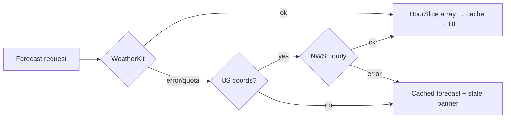

---
aliases:
  - Clearwhen ADR-001
tags:
  - project/clearwhen
  - type/adr
  - status/active
  - tech/swift
created: 2026-07-24
updated: 2026-07-24
status: Accepted
decision: Apple WeatherKit primary, NWS api.weather.gov fallback
---

# ADR-001 — Weather Data Provider

> [!abstract] Decision
> Use **Apple WeatherKit (Swift framework)** as the primary forecast source, with **NWS `api.weather.gov`** as an automatic fallback for US locations, and the last-good cached forecast as the final degradation tier. All providers sit behind a `WeatherProviding` protocol returning Clearwhen's own domain model.

## Context

Clearwhen needs **hourly forecasts across a 7-day horizon** to intersect with user-defined time windows. The app is free (no ads, no IAP) but published by Demers Design and Development — a business — so "non-commercial only" licenses are disqualifying. Cost ceiling is $0/month.

## Considered Options

| Option | Verdict | Killer fact |
|---|---|---|
| **Apple WeatherKit** | ✅ **Primary** | 500K calls/mo included with the Developer Program membership we already pay for; 10-day hourly; global; explicitly licensed for App Store apps; zero-key native Swift integration |
| **NWS api.weather.gov** | ✅ **Fallback** | Public domain, "free for any purpose", no key, exactly 7-day hourly — but US-only, no SLA, intermittent 5xx |
| Open-Meteo | ❌ Rejected | Free tier is **non-commercial only** — a business-published app violates ToS; compliant tier is €29/mo |
| OpenWeatherMap One Call 3.0 | ❌ Rejected | Hourly data covers only **48 h** — breaks days 3–7 of the grid; also requires a credit card on file |
| Met.no / Yr | ❌ Rejected | Hourly only for ~first 2–3 days, then 6-hourly |
| Tomorrow.io | ❌ Rejected | Free tier licensed for testing/evaluation, not production commercial use |
| Pirate Weather | ❌ Rejected (kept as lab spare) | ~10K calls/mo (~330/day) and single-maintainer risk |

## Decision Detail

- **WeatherKit via the native Swift framework** (not REST): auth is automatic through the app's WeatherKit capability/entitlement — no JWT, no keys, no networking code.
- **NWS integration** follows the two-step gridpoint workflow (`/points/{lat},{lon}` → `/gridpoints/{office}/{x},{y}/forecast/hourly`), sends the required identifying `User-Agent` (`Clearwhen/1.0 (matthew@demers.dev)`), caches the points→grid mapping, and wraps calls in retry-with-backoff because intermittent 5xxs are expected.
- **`WeatherProviding` protocol** returns `[HourSlice]` in Clearwhen's own units — providers are swappable and the summarizer never knows the source.

> [!warning] Obligations
> - **Apple Weather attribution**: display the Apple Weather mark and the legal attribution link (Apple provides assets). App Review checks this. Lives on the Settings/About screen and widget footnote where required.
> - **NWS**: no attribution required (public domain); we credit NOAA/NWS on the About screen anyway when fallback data is shown.

> [!info] Quota math
> 500K calls/mo ≈ 16.6K/day ≈ ~2,700 DAU at ~6 fetches/day. Client-side cache (forecast reused for ≥30 min per location) pushes real usage far below that. Overage is opt-in — calls stop rather than bill.

## Consequences

- **Positive:** $0 forever at realistic scale; global coverage; 10-day hourly exceeds requirements; trivial integration; licensing is airtight.
- **Negative:** WeatherKit requires the capability on the App ID and behaves best on a real device (simulator can be flaky) — test on hardware. NWS fallback only helps US users; non-US users degrade straight to cache.
- **Neutral:** Provider abstraction adds one protocol's worth of indirection — cheap insurance if Apple ever reprices.

## See Also
- [[Clearwhen/Architecture|Architecture]]
- [[Clearwhen/Discovery & Requirements|Discovery & Requirements]]
- Sources: [WeatherKit](https://developer.apple.com/weatherkit/get-started/) · [NWS API](https://www.weather.gov/documentation/services-web-api) · [Open-Meteo terms](https://open-meteo.com/en/terms)
