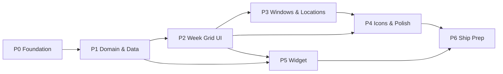

---
aliases:
  - Clearwhen SOW
tags:
  - project/clearwhen
  - type/planning
  - status/draft
  - tech/swift
  - tech/swiftui
created: 2026-07-24
updated: 2026-07-24
repo: Clearwhen/
---

# Clearwhen — Scope of Work

> [!abstract] The plan
> **7 phases, one hard push.** Foundation → domain/data → grid UI → windows/locations → art & polish → widget → ship prep. Phases 0–1 are the load-bearing wall (pure logic + providers, fully testable without UI); everything visual stacks on top. Sizes are T-shirt complexity, not time.

**Phase index:** [[#Phase 0 — Foundation]] · [[#Phase 1 — Domain & Data Layer]] · [[#Phase 2 — Week Grid UI]] · [[#Phase 3 — Windows & Locations]] · [[#Phase 4 — Icon Suite & Polish]] · [[#Phase 5 — Home Screen Widget]] · [[#Phase 6 — Ship Prep]]

---

## Phase 0 — Foundation

> [!example] Objective — Size **S**
> The project builds clean with all targets, capabilities, and shared plumbing in place, so nothing infrastructural interrupts the build later.

**Deliverables**
- [x] Xcode project configured: app target + `ClearwhenKit` shared source folder (synchronized group — compiles into app now, widget target joins in P5)
- [x] Capabilities: WeatherKit (app ID), App Group `group.com.demersdev.Clearwhen` entitlement
- [x] `ClearwhenTheme` with full pastel token set

**Tasks**
- [x] Strip template code (`Item.swift`, boilerplate ContentView)
- [x] Add `ClearwhenKit` as a top-level synchronized source folder wired into the app target *(chose synchronized folder over framework target — Xcode 26 objectVersion 77 makes this trivial and the widget can share it directly)*
- [x] Enable WeatherKit capability + entitlement (done by Matthew in Xcode)
- [x] App Group entitlement added; cache directory targets it (SwiftData container pointed at it when stores land in P2/P3)
- [x] Location usage string via `INFOPLIST_KEY_NSLocationWhenInUseUsageDescription` build setting; project trimmed to iPhone-only (was multiplatform template)
- [x] `ClearwhenTheme.swift`: pastel palette, sky gradient pairs, corner radii, spacing, rounded type treatment
- [x] Repo hygiene: `git init`, Swift `.gitignore`, initial commit, project `CLAUDE.md`

> [!danger] Risks
> **WeatherKit entitlement propagation** can lag after first enabling (fresh App IDs sometimes 401 for a while). Mitigation: enable it in Phase 0 so it's warm before Phase 1 needs it; test on a real device.

> [!success] Acceptance
> App + framework build and run on device; empty grid placeholder renders with a pastel gradient background; entitlements visible in build settings.

---

## Phase 1 — Domain & Data Layer

> [!example] Objective — Size **M**
> Everything from "coordinates in" to "per-window verdicts out" works and is unit-tested — before any real UI exists.

**Deliverables**
- [x] `ClearwhenKit` domain models + severity ladder
- [x] `WindowSummarizer` (pure) with a thorough Swift Testing suite — **14 tests green**
- [x] `WeatherKitProvider` + `NWSProvider` behind `WeatherProviding`, with the fallback chain
- [x] `ForecastCache` (App Group JSON, staleness policy)

**Tasks**
- [x] Models: `WeatherKind` (+ severity ladder + `Comparable`), `HourSlice`, `WindowDaySummary`, `WindowSpec` value snapshot, `Coordinate` (with US-bounds check)
- [x] SwiftData `@Model`s: `TimeWindow` (weekday bitmask, starter seeds, max 5), `SavedLocation`
- [x] `WindowSummarizer.summarize(hours:window:day:calendar:)` + `week(...)` convenience
	- [x] Tests: half-open overlap edges, worst-case ladder, weekday mask skip, missing hours → nil, DST fall-back day, hi/lo/precip aggregation
- [x] `WeatherProviding` protocol (`hourly(for coordinate, days) async throws -> [HourSlice]`)
- [x] `WeatherKitProvider`: `HourWeather` → `HourSlice` with full `WeatherCondition` mapping + ≥20 mph dry-hour wind override
- [x] `NWSProvider`: points → hourly forecast URL, identifying User-Agent, 3-attempt backoff (4xx fails fast), 4-decimal coordinate rounding, `shortForecast` keyword mapping (tested)
- [x] `ForecastChain`: WeatherKit → (US-only) NWS; surfaces provider name for attribution
- [x] `ForecastCache`: atomic `forecast-{key}.json`, fetchedAt metadata, fresh <30 min / usable <6 h / stale beyond (tested)

> [!danger] Risks
> - **Condition-mapping fidelity** (two providers → one enum) is where subtle wrongness hides. Mitigation: single mapping table per provider with tests on representative fixtures.
> - **NWS flakiness** — mandatory backoff + the chain treats NWS as best-effort.

> [!success] Acceptance
> `swift test` green: summarizer suite + mapping tests pass; a scratch harness fetches real WeatherKit hours on device and prints correct window summaries for seeded windows.

---

## Phase 2 — Week Grid UI

> [!example] Objective — Size **M**
> The signature screen exists: 7 days × your windows, one glance, tappable detail.

**Deliverables**
- [ ] `WeekGridView` — day columns across the top, window rows, summary cells
- [ ] In-place expanding hourly strip
- [ ] "Now" header + condition-aware animated background
- [ ] Loading / error / stale states

**Tasks**
- [ ] Grid layout: horizontally paged/scrolling 7-day header (Today, Fri, Sat…), window rows beneath; cell = weather icon + hi° (+ precip droplet ≥ 30%)
- [ ] Seed starter windows on first run: ☕ Commute 7–9a (Mon–Fri), 💼 Workday 9a–5p (Mon–Fri), 🐕 Dog Walk 6–7p (daily)
- [ ] Tap cell → hourly strip unfolds in place (icon, temp, precip % per hour) with spring; tap again to collapse
- [ ] `NowHeader`: current temp, condition icon, location name
- [ ] Background: per-day dominant-condition pastel gradient, cross-fades as you page days
- [ ] Pull-to-refresh + auto-refresh on foreground when cache stale
- [ ] States: first-launch shimmer, offline banner with "last updated", empty state before location permission (friendly mascot moment)
- [ ] Placeholder icon set (temporary colored SF Symbols) so layout work isn't blocked on art

> [!danger] Risks
> Grid density on smaller iPhones with 5 windows. Mitigation: fixed row height budget, test on a mini-size simulator early.

> [!success] Acceptance
> On device: launch → real forecast renders in the grid for current location; cells expand/collapse smoothly; airplane mode shows cached data with the stale banner.

---

## Phase 3 — Windows & Locations

> [!example] Objective — Size **M**
> Users own their schedule: create, edit, schedule, and reorder windows; add and switch locations.

**Deliverables**
- [ ] Window list + editor (cap ~5) with weekday scheduling
- [ ] Location search, saved locations, current-location handling

**Tasks**
- [ ] `WindowListView`: reorder (drag), delete (swipe), add (disabled at cap with friendly note)
- [ ] `WindowEditorView`: name field, icon picker (window icon set), start/end time wheels (same-day validation), weekday toggle pills (M T W T F S S)
- [ ] Grid reacts live to window changes (rows appear/disappear per weekday mask)
- [ ] `LocationService`: When-In-Use flow, denial → saved-locations-only mode with prompt
- [ ] `LocationPickerView`: MKLocalSearch city search → save; list with current-location pinned first; switcher in the grid header (segmented pill or menu)
- [ ] Per-location cache keys; switching locations renders instantly from cache while refreshing

> [!success] Acceptance
> Create "🚴 Saturday Ride 8–11a, Sat only" → appears only in Saturday's column; deny location → app still fully works via a searched city; switching between two saved cities updates grid + header correctly.

---

## Phase 4 — Icon Suite & Polish

> [!example] Objective — Size **M**
> The app stops looking like a prototype and starts looking like the bubbly thing from the pitch: full custom art, motion, and the small touches.

**Deliverables**
- [x] Complete SVG suite per [[Clearwhen/ADR-003 — Icon & Art Strategy|ADR-003]]: 14 weather + 10 window icons, consistent style — in `ClearwhenKit/SharedAssets.xcassets` so the widget shares them
- [x] App icon (sun peeking behind a smiling rosy-cheeked cloud, rendered via rsvg-convert)
- [x] Settings screen: °F/°C segmented toggle, live Apple Weather mark + legal link via `WeatherService.attribution`, NWS credit, about
- [x] Motion & accessibility: expand springs, gradient cross-fade, idle float on Now icon (reduceMotion-aware), selection haptics, VoiceOver cell labels

**Tasks**
- [ ] Author weather SVGs (clear-day/night, partly-day/night, cloudy, fog, drizzle, rain, heavy-rain, thunder, snow, sleet, wind, severe)
- [ ] Author window SVGs (commute-car, workday-briefcase, dog-walk, coffee, bike, run, stroller, gym, garden, night-out)
- [ ] Import to asset catalog (Preserve Vector Data); swap out placeholder symbols via `IconKey` registry
- [ ] App icon at required sizes
- [ ] Settings: units toggle (`@AppStorage`, shared suite), **Apple Weather mark + attribution link**, NOAA/NWS credit line, version/about
- [ ] Motion: cell expand springs, gradient cross-fade, gentle idle float on the Now header icon, `reduceMotion` respected
- [ ] Accessibility: VoiceOver labels ("Commute, Tuesday: rain, high 62"), Dynamic Type within grid budget, contrast check on pastels
- [ ] Haptics: soft tap on expand, success tick on refresh

> [!danger] Risks
> Pastel contrast can fail accessibility on white cards. Mitigation: text always in deep-ink color token, icons carry the pastel load.

> [!success] Acceptance
> Zero SF Symbols visible in weather/window contexts; attribution screen satisfies Apple's WeatherKit requirements; VoiceOver reads every cell meaningfully.

---

## Phase 5 — Home Screen Widget

> [!example] Objective — Size **M**
> Today's windows on the home screen — the "never open the app on a normal day" promise.

**Deliverables**
- [x] Widget extension: small (current/next window) + medium (today's remaining windows) — target added via hand-authored pbxproj surgery (synchronized groups made this clean)
- [x] Timeline provider fed entirely from the shared App Group (SwiftData windows + JSON forecast cache + `lastLocationKey` shared default); hourly entries, stale footer, gallery placeholder with sample data
- [x] Verified live in simulator: widget renders the active Workday window with real cached NWS data

**Tasks**
- [ ] Widget target; link `ClearwhenKit`; App Group on the extension
- [ ] Small family: next/current relevant window (icon + name + condition + temp)
- [ ] Medium family: today's scheduled windows as a row of icon+condition chips
- [ ] `TimelineProvider`: read shared windows + cache, re-summarize, entries at window boundaries + hourly; placeholder/snapshot states
- [ ] App calls `WidgetCenter.reloadTimelines` after each successful fetch
- [ ] Deep link: tapping widget opens the app (small: to that window expanded)
- [ ] Stale handling: cache > 6 h → subtle "open app to refresh" footer

> [!success] Acceptance
> Widget shows correct today-windows after an app refresh, updates across a window boundary without opening the app, and renders sanely in the widget gallery.

---

## Phase 6 — Ship Prep

> [!example] Objective — Size **S**
> Everything App Store submission needs, done once, correctly.

**Deliverables**
- [ ] App Store Connect listing complete; build through TestFlight; submitted

**Tasks**
- [ ] Privacy nutrition label (location = app functionality only, no tracking) + privacy policy page (host under d3cloud.io)
- [ ] Screenshots (6.9" + 6.5"): grid hero, editor, expanded strip, widget — leaning on the pastel brand
- [ ] Metadata: name "Clearwhen", subtitle ("Weather for the parts of your day"), description, keywords
- [ ] App Review notes: mention WeatherKit attribution location
- [ ] Archive → TestFlight → personal device smoke test → submit
- [ ] Tag `v1.0.0`; dev log entry in vault

> [!danger] Risks
> Review rejection over WeatherKit attribution or location-purpose string wording — both are checklist items above; double-check before submitting.

> [!success] Acceptance
> Build in review. 🎉

---

## Summary

| Phase | Objective | Size | Depends on | Status |
|---|---|---|---|---|
| 0 — Foundation | Targets, capabilities, theme tokens | S | — | ✅ |
| 1 — Domain & Data | Summarizer + providers + cache, tested | M | P0 | ✅ |
| 2 — Week Grid UI | Signature grid + hourly expand | M | P1 | ✅ |
| 3 — Windows & Locations | Editor, scheduling, locations | M | P2 | ✅ |
| 4 — Icons & Polish | Full art suite, motion, a11y, attribution | M | P2, P3 | ✅ |
| 5 — Widget | Small + medium home-screen widget | M | P1, P2 | ✅ |
| 6 — Ship Prep | Listing, TestFlight, submission | S | P4, P5, P7 | ⏸ |
| 7 — UI v2: Day-first redesign | Day cards + timeline detail + locations pager ([[Clearwhen/UI v2 — Day-First Redesign\|design doc]]) | L | P2–P5 | ✅ |
| 8 — Intelligence & delight | Insights, alerts, briefings, solar, animated icons ([[Clearwhen/Intelligence Layer\|design doc]]) | L | P7 | ✅ |
| 9 — Guided onboarding | 9-step animated first run configuring every setting ([[Clearwhen/Onboarding Flow\|design doc]]) | M | P8 | ✅ |

---

## Phase 8 — Intelligence & Delight

> [!example] Objective — Size **L**
> Stop being a pretty forecast and start being *advice*. Full detail in [[Clearwhen/Intelligence Layer|Intelligence Layer]].

**Delivered**
- [x] `DayInsights` engine — ranked plain-language takeaways with onset times, dedup, and an all-clear fallback
- [x] Severe weather alerts (`ClearwhenAlert`) from WeatherKit + NWS with an expandable severity banner
- [x] Week-ahead sentence ("Dry until Sunday, then wet")
- [x] Morning briefing notifications, pre-written from real insights on each fetch — no server
- [x] First-run onboarding: concept pitch + 10-preset window picker, permission asked after intent
- [x] `SolarCalculator` — sunrise/sunset/daylight from NOAA equations, validated against published times
- [x] Feels-like/humidity/UV on `HourSlice`; heat index + wind chill derived for NWS
- [x] `AnimatedWeatherIcon` — sun glow breathe, falling rain/snow particles, lightning flash, drifting clouds, twinkling stars (Reduce Motion aware)
- [x] `SkyPalette` — background blends condition *with* time of day; adaptive ink keeps text readable on night skies
- [x] Temperature range bars comparing each day against the week
- [x] Lock Screen widgets (rectangular, circular, inline) + widget insight headline
- [x] Window chips as individual deep links into the day detail

> [!success] Acceptance
> 35 tests across 10 suites green; every feature verified live in the simulator against real NWS data.

---

> [!question] Open questions
> - [ ] Widget: is small-family v1 enough if the day runs long, deferring medium? (Decide at P5.)
> - [ ] Do we want a subtle face on the sun icon in App Store screenshots, or keep faces as an in-app easter egg only? (Decide during P4 art review.)

## See Also
- [[Clearwhen/Discovery & Requirements|Discovery & Requirements]]
- [[Clearwhen/Architecture|Architecture]]
- [[Clearwhen/ADR-001 — Weather Data Provider|ADR-001]] · [[Clearwhen/ADR-002 — Persistence & Caching|ADR-002]] · [[Clearwhen/ADR-003 — Icon & Art Strategy|ADR-003]]
