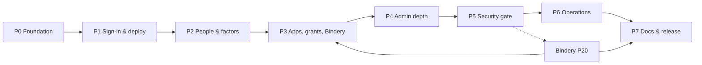

# D3 Auth — Scope of Work

> [!abstract] Summary
> **8 phases (P0–P7), 140 requirements, 71 tasks.** Every phase is vertically sliced and ends in an exit demo you can run. Sizes are T-shirt (`XS`–`XL`); there are no time estimates anywhere. Kept live: check tasks off and flip phase status as work lands. Bindery's side of the reference integration is **Bindery Phase 20**, tracked here as an external dependency.

## Phase summary

| Phase | Objective | Size | Depends on | Exit demo | Status |
|---|---|:---:|---|---|:---:|
| [[#Phase 0 — Foundation & Conformance Harness\|P0]] | Monorepo, Postgres, `oidc-provider` wired, discovery + JWKS, conformance suite green on a dev login | `L` | — | Conformance Basic + Config plans green in CI against a seeded user | **Complete** |
| [[#Phase 1 — Sign-in & First Deploy\|P1]] | Real login state machine, throttling, sessions, logout, security headers; deployed at `auth.d3cloud.io` | `L` | P0 | Express example signs in through the tunnel from a phone | **Complete** |
| [[#Phase 2 — People, Factors & Recovery\|P2]] | Invites, mail relay, TOTP, passkeys, trusted devices, account self-service, admin reset, break-glass | `XL` | P1 | Invite a real guest by email; they enrol a passkey on their phone; you reset them; you recover yourself from the host | **Complete** |
| [[#Phase 3 — Apps, Grants & the Bindery Integration\|P3]] | Manifests, roles, grants, deny-by-default, roles claim, back-channel logout, SDKs, examples; console Users/Apps/Access | `XL` | P2; Bindery P20 | Bindery signs a guest in with the `member` role; revoke lands within a minute | **Provider side complete** · awaiting T-3.12 (Bindery P20) |
| [[#Phase 4 — Administration Depth\|P4]] | Groups, audit UI, sessions UI, keys UI + rotation, settings, export/import, seed file, step-up, home | `L` | P3 | Rotate keys with Bindery live; export, wipe, import, sign in again | Built |
| [[#Phase 5 — The Security Gate\|P5]] | Adversarial suite, logout conformance, ASVS L2 self-assessment, Semgrep, ZAP, WAF rules | `L` | P4 | All gate evidence green and linked from the vault | Built — WAF rules pending ([[D3 Auth/Security/Gate Evidence\|evidence]]) |
| [[#Phase 6 — Operations\|P6]] | Backup bundle to S3, restore drill in CI, alerts, Worker probe, runbooks, sealed admin, migrations hardening | `M` | P5 | Nightly bundle restored by CI; readiness alert arrives when the container is stopped | Built — go-live steps pending (AWS, Worker deploy, sealing) · drill on the host per [[D3 Auth/ADR-004 — Backups Leave, the KEK Stays\|ADR-004]] |
| [[#Phase 7 — Docs & Public Release\|P7]] | Install guide, examples gallery polish, package publishing, licence flip, public repo | `M` | P6, Bindery P20 in prod | Fresh machine to working SSO from the README alone | Planned |

## Phase dependency graph

---

## Phase 0 — Foundation & Conformance Harness
> [!example] Objective · Size `L`
> Stand up the monorepo, database and provider so that the OpenID conformance suite passes its Basic and Config plans against a throwaway login page. Protocol correctness is the top worry, so it is proven first.

**Deliverables**
- [x] pnpm monorepo with `apps/server`, `apps/console`, `packages/auth-client`, `packages/auth-client-python`, `workers/mail-relay`, `examples/`, `conformance/`
- [x] Docker Compose: server + postgres; conformance overlay (`conformance/docker-compose.conformance.yml`)
- [x] Prisma schema for all entities in [[D3 Auth/Data Model]]; migration 0001
- [x] `oidc-provider` configured per ADR-001 with the Prisma adapter
- [x] Conformance suite job in GitHub Actions

**Tasks**
- [x] **T-0.1** — Scaffold monorepo, tsconfig strict, ESLint, Vitest, pnpm workspaces · `REQ-134` · Size `S`
  - Files: `package.json`, `pnpm-workspace.yaml`, `tsconfig.base.json`, `.github/workflows/ci.yml`
  - Done when: `pnpm -r lint test` passes on empty packages; CI runs lint → unit
  - Landed 2026-09-15 in `d76ce30` ([matdemers1/d3-auth](https://github.com/matdemers1/d3-auth), private). TypeScript pinned to 6.0 because typescript-eslint 8.70 does not support TS 7; ESLint 10 `strictTypeChecked`, Vitest 5, pnpm 9.15.9. CI: `lint` (lint + typecheck) → `unit`, green on first push.
- [x] **T-0.2** — Docker Compose with `postgres:16`, server Dockerfile (multi-stage, Node 22), healthcheck on `/readyz` · `REQ-113`, `REQ-125` · Size `S`
  - Files: `docker-compose.yml`, `apps/server/Dockerfile`
  - Done when: `docker compose up` reaches healthy with no host ports except a dev-only override file
  - Landed 2026-09-15 in `8332645`. Compose split into three files: `docker-compose.yml` (base, no host ports), `docker-compose.dev.yml` (loopback-only 3000/5432, the only host ports), `docker-compose.tunnel.yml` (external `tunnel` network for Zima). Image `node:22-trixie-slim`, runs as `node` with root-owned code, read-only rootfs, `cap_drop: ALL`, `no-new-privileges`; healthcheck is a Node probe of `/readyz` baked into the image. Verified: base stack healthy with no published ports, SIGTERM exits 0. Seed-file bind mount deferred to T-4.6.
- [x] **T-0.3** — Prisma schema and migration for USER, credentials, SESSION, TRUSTED_DEVICE, INVITE, APP, REDIRECT_URI, ROLE, GRANT(+ROLE), GROUP(+MEMBER, GRANT, GRANT_ROLE), SIGNING_KEY, AUDIT_EVENT, OIDC_PAYLOAD · `REQ-021`, `REQ-022`, `REQ-023`, `REQ-058`, `REQ-111` · Size `M`
  - Files: `apps/server/prisma/schema.prisma`, `apps/server/prisma/migrations/0001_init`
  - Done when: `citext` unique on email/username; audit table has no update/delete grant; schema review confirms no tenant assumption
  - Landed 2026-09-15 in `03bfb59`. Prisma 7 (`prisma-client` generator + `@prisma/adapter-pg`). Append-only enforced by a **trigger** (UPDATE/DELETE/TRUNCATE rejected) rather than a privilege revoke, because the service connects as table owner. `oidc_payload` keyed by `(kind, id)`. Deviations: `backchannel_logout_uri_set` dropped (derivable from a nullable URI); `post_logout_redirect_uris` and `transports` are `text[]`. Integration tests rebuild a `*_test` database from migrations and refuse any other; CI runs a migration drift check.
- [x] **T-0.4** — KEK crypto module (AES-256-GCM), pepper loading, boot refuses without `KEK`/`PEPPER`/`COOKIE_KEYS` · `REQ-117`, `REQ-024` · Size `S`
  - Files: `apps/server/src/security/kek.ts`, `apps/server/src/config.ts`
  - Done when: unit tests round-trip; boot without KEK exits non-zero with a clear message
  - Landed in `c3628a8`. Envelope `[version][kek id][iv][tag][ct]` with the row context bound as AAD, so a sealed value cannot be moved to another row. Config also refuses `PEPPER == KEK`, http issuers (unless `INSECURE_HTTP_ISSUER` on localhost/`*.test`) and the dev login on a real issuer.
- [x] **T-0.5** — Signing key bootstrap: generate an ES256 `current` key at first boot, encrypted at rest; JWKS served from DB · `REQ-006`, `REQ-002` · Size `M`
  - Files: `apps/server/src/oidc/keys.ts`
  - Done when: JWKS shows one key with `kid`; restart keeps the same `kid`
  - Landed in `ebe1ff8`. **Deviation:** two `current` keys, ES256 and RS256 — OpenID Connect Core requires RS256 in `id_token_signing_alg_values_supported`, and the conformance suite checks it. ES256 remains every client's default. kid = RFC 7638 thumbprint; first-boot generation under an advisory lock.
- [x] **T-0.6** — Prisma adapter for `oidc-provider` (7 methods) with expiry and `grant_id` revocation · `REQ-001` · Size `M`
  - Files: `apps/server/src/oidc/adapter.ts`, `apps/server/test/adapter.test.ts`
  - Done when: adapter contract tests pass for every payload kind incl. `consume` and `revokeByGrantId`
  - Landed in `350705d`. Contract tests for all 14 provider models (129 tests) plus cross-kind isolation and family revocation.
- [x] **T-0.7** — Provider configuration: issuer, PKCE S256 required, opaque access 10 min, rotating refresh 30 d with reuse revocation, `iss` in response, `devInteractions` off, `proxy` on, cookie `__Host-` with `path: '/'`, features off for DCR/introspection-public/implicit · `REQ-003`, `REQ-004`, `REQ-005`, `REQ-007`, `REQ-008`, `REQ-009`, `REQ-014`, `REQ-015`, `REQ-018`, `REQ-019` · Size `L`
  - Files: `apps/server/src/oidc/provider.ts`, `apps/server/src/oidc/clients.ts`
  - Done when: integration tests via `openid-client` cover code + refresh + reuse; discovery golden snapshot committed
  - Landed in `f482b8d`. Issuer at root, endpoints under `/oidc`. **Cookie note (R-10):** session and interaction cookies are `__Host-`; the provider pins the *resume* cookie's path to the resume URL, so that one is `__Secure-d3auth_resume`. **REQ-015:** `oidc-provider` compares secrets in plaintext, so `Client.prototype.compareClientSecret` is replaced with an Argon2id verify and the schema-required `client_secret` is a random never-stored placeholder (HS* algorithms disabled). PAR, DPoP and resource indicators explicitly off. Clients load from `APP` rows at boot; a broken app is skipped and logged instead of crashing sign-in for everyone. 28 protocol integration tests incl. golden discovery snapshot.
- [x] **T-0.8** — Throwaway interaction: a minimal server-rendered login form that authenticates a seeded dev user (replaced in P1) and `findAccount` mapping · `REQ-001` · Size `S`
  - Files: `apps/server/src/interaction/dev-login.ts`
  - Done when: an `openid-client` script completes a full code flow
  - Landed in `f482b8d`. Also `cli/dev-seed.ts`, `pnpm dev:up` (writes `.env` with fresh secrets, builds, migrates, seeds) and `pnpm example:flow` — the exit-demo script, verified against the Docker stack.
- [x] **T-0.9** — Conformance harness: compose overlay running the OpenID suite on the job network, plan configs for `oidcc-basic-certification-test-plan` and `oidcc-config-certification-test-plan`, GitHub Actions job gated after integration · `REQ-126`, `REQ-134` · Size `L`
  - Files: `conformance/docker-compose.conformance.yml`, `conformance/plans/*.json`, `conformance/run.sh`, `.github/workflows/ci.yml`
  - Done when: both plans green in CI; failures upload the suite's log as an artifact
  - Landed in `f02b360`. Suite `release-v5.2.4` prebuilt images; Caddy (internal CA) terminates TLS for `op.d3auth.test` — **R-12 resolved: plain `http` is not needed and not used.** Two Docker networks because the suite's nginx hard-codes its backend as `server`. **[[D3 Auth/ADR-002 — Conformance Profile, PKCE Exemption and POST Authorization|ADR-002]]:** the Basic plan does not send PKCE, so the two suite clients are exempt on `.test` issuers only; `SameSite=Lax` kept, so POST authorization is an expected failure. Basic: 35 modules, 1,721 conditions passed; 3 expected failures (POST auth, `client_secret_post`, request objects), 3 expected warnings, 4 expected skips, 3 REVIEW with screenshots auto-uploaded. Config: clean pass. A local run takes ~2.5 min of plan time.
- [x] **T-0.10** — Structured JSON logging with secret scrubber; `/healthz`, `/readyz`; no-egress assertion (only mail relay and S3 hosts allowed) · `REQ-112`, `REQ-113`, `REQ-139` · Size `S`
  - Files: `apps/server/src/log.ts`, `apps/server/src/health.ts`
  - Done when: log test proves a token never appears; readiness false with DB down
  - Landed in `7470af7`. Pino JSON logs; scrubber replaces sensitive keys and scrubs JWTs, Basic/Bearer credentials, credential query params and token-shaped strings in objects, messages and errors; request log records path only. `/readyz` checks DB, a current key per signing alg, and that every migration shipped in the image is applied — verified 503 in Docker with Postgres stopped. **No-egress:** an integration test spies on `net.Socket#connect` during a full flow and asserts the only outbound target is the database; a sibling test asserts no code, token, verifier, state, nonce, secret or password reaches the logs.
- [x] **T-0.11** — Console shell: React 19 + Vite + `@d3cloud/ui`, built into the image, served at `/admin`, `/account`, `/login` with route-level code splitting; `d3-check-usage` in lint · `REQ-061`, `REQ-077` · Size `M`
  - Files: `apps/console/*`, `apps/server/src/static.ts`
  - Done when: three routes render a placeholder; interaction chunk ≤ 150 KB gz check in CI
  - Landed in `6c90ebb`. `@d3cloud/ui` **1.0.0** from the release tarball (plan said 0.1.x). No Tailwind: `tokens.css` + token-only CSS, `d3-check-usage` clean. Interaction bundle **108.6 KB gz** of 150 KB, enforced in CI by a manifest-walking script. Server serves hashed assets immutable and the shell `no-store`; a missing build is 503 on console routes only.

> [!danger] Risks
> R-12 conformance suite in CI (fallback: recorded local run) · R-10 cookie path · R-01 protocol.

> [!success] Acceptance
> Discovery and JWKS golden; adapter tests; Basic + Config plans green; boot fails safely without secrets.

**Exit demo:** open the CI run, show the two conformance plans green; run `pnpm example:flow` locally and see an ID token printed.

> [!success] Phase 0 complete — 2026-09-15
> CI run [35028278027](https://github.com/matdemers1/d3-auth/actions/runs/35028278027) on `f02b360`: lint → unit → integration → conformance all green (conformance 201 s; Basic 35 modules / 1,721 conditions passed with the ADR-002 expected-results register; Config clean). `pnpm dev:up && pnpm example:flow` prints an ES256 ID token with `kid`. Deviations recorded inline: two signing keys (ES256 + RS256), `__Secure-` resume cookie, `@d3cloud/ui` 1.0.0, ADR-002.

---

## Phase 1 — Sign-in & First Deploy
> [!example] Objective · Size `L`
> Replace the throwaway login with the real state machine, throttling, sessions and logout; ship it to `auth.d3cloud.io` behind the tunnel so every later phase is a production increment.

**Tasks**
- [x] **T-1.1** — Login state machine (`identified → password_ok → mfa_required|mfa_ok → trusted? → complete`) with exhaustive transition tests; only `complete` calls `interactionFinished` · `REQ-029` · Size `M`
  - Files: `apps/server/src/interaction/machine.ts`, `test/machine.test.ts`
  - Landed in `52e6bf8`. Pure `advance(state, event)`; every state × event pair tested against an allow-table. `complete` is terminal and the only state carrying an accountId.
- [x] **T-1.2** — Password verify with Argon2id params, decoy hash on unknown email, generic errors · `REQ-024`, `REQ-026`, `REQ-086` · Size `S`
  - Files: `apps/server/src/security/password.ts`
  - Landed in `972cdd7`. One Argon2id verify on every attempt, against a decoy computed at boot when the account has no password. **Bug found by the tests:** an early version short-circuited for unknown accounts, which defeated the whole point.
- [x] **T-1.3** — Password policy with blocklist incl. long entries · `REQ-025` · Size `S`
  - Files: `apps/server/src/security/policy.ts`, `apps/server/src/security/blocklist.txt`
  - Landed in `972cdd7`. 147 entries, 49 of them 12+ characters; matches the password with trailing digits/punctuation stripped and letters-only, and refuses passwords containing the account's own name, username or email.
- [x] **T-1.4** — Throttle: per-account 4→doubling→10 min; per-IP (`CF-Connecting-IP`) 20→doubling; evaluated before hashing; `Retry-After` · `REQ-027`, `REQ-028` · Size `M`
  - Files: `apps/server/src/security/throttle.ts`
  - Landed in `e8e8f9f`, migration 0002. Account 4 free then doubling to 10 min; IP (`CF-Connecting-IP`) 20 free; longer of the two reported; cleared on success; `prune()` for the 90-day rule.
- [x] **T-1.5** — Sessions table wiring: create on login, record IP/UA, regenerate id, expiry 30 d, revoke; CSRF token on interaction POSTs · `REQ-030`, `REQ-031`, `REQ-045` · Size `M`
  - Files: `apps/server/src/interaction/session.ts`, `apps/server/src/security/csrf.ts`
  - Landed in `625fe61`. Flow state lives in the provider's payload table keyed by interaction uid (no new table); CSRF token minted with the flow and held beside it; session rows carry IP, user agent and a 30-day expiry. **Fixed after CI:** sessions and their audit rows are written in provider middleware, not a fire-and-forget event listener, so the response cannot beat the record.
- [x] **T-1.6** — Interaction UI in the console app: sign-in (email → password step), logged-out, error, static unavailable page served without DB · `REQ-076`, `REQ-084` · Size `M`
  - Files: `apps/console/src/login/*`, `apps/server/public/unavailable.html`
  - Landed in `625fe61` and `f4bd57a`. Screens on `@d3cloud/ui`, phone first. **The form is server-rendered into the console shell** and React takes over when it loads: sign-in works with JavaScript off, on a slow connection, and for the conformance suite's browser, which cannot run React.
- [x] **T-1.7** — RP-Initiated Logout with `id_token_hint` and registered post-logout URIs · `REQ-010` · Size `S`
  - Landed in `625fe61`. Plain-HTML confirmation naming the operator, session row revoked and audited, unregistered post-logout URIs refused, no-redirect case lands on I-8.
- [x] **T-1.8** — Security headers + CSP on all responses incl. errors · `REQ-132` · Size `S`
  - Files: `apps/server/src/security/headers.ts`
  - Landed in `625fe61`. CSP, HSTS, nosniff, DENY, no-referrer, COOP/CORP, Permissions-Policy on every response including errors; the provider's own responses keep `frame-ancestors 'none'` while allowing its form posts.
- [x] **T-1.9** — Audit writer + events for login success/failure (incl. unknown email), logout, session revoke; request log fields · `REQ-110`, `REQ-116` · Size `M`
  - Files: `apps/server/src/audit/*`
  - Landed in `625fe61`. Typed event names; login success/failure/throttled, session started/logout, owner claimed. Request log carries path only — never the query.
- [x] **T-1.10** — Migrations on boot after automatic pre-migration dump; readiness gated · `REQ-121` · Size `S`
  - Files: `apps/server/src/boot/migrate.ts`
  - Landed in `8abfd17`. `pg_dump` before anything is applied (skipped on an empty first boot), then `prisma migrate deploy`; nothing listens until it succeeds. Image ships `postgresql-client`. The interim compose `migrate` service is gone.
- [x] **T-1.11** — CI: images to GHCR after e2e; Zima deploy runbook (compose, env, tunnel route for `auth.d3cloud.io`, WAF rate rule) and first deploy · `REQ-136`, `REQ-125`, `REQ-019` · Size `M`
  - Files: `.github/workflows/ci.yml`, `docs/runbooks/deploy.md`
  - Images and runbook landed in `74221a2`; CI publishes `ghcr.io/matdemers1/d3-auth/server` tagged by commit sha after lint → unit → integration → conformance → e2e (first fully green run: `4053a7f`).
  - **Deployed 2026-09-16** at `https://auth.d3cloud.io`, image `sha-4053a7f`. D3 Auth runs **its own** `cloudflared` (tunnel `d3auth`, id `c33bb414…`), as Bindery does — the Zima has no shared tunnel network. No host ports on any container. Verified from the public internet: issuer `https://auth.d3cloud.io`, HSTS `max-age=63072000; includeSubDomains; preload`, full CSP, `/readyz` all green, JWKS serving the two boot keys. Migrations ran at boot. Secrets generated on the laptop and handed to the owner for the password manager (R-03).
  - **Outstanding:** the three WAF rate rules (§5 of the runbook) — the deploy token has tunnel and DNS scope but not Firewall Services, so they are added by hand. The in-app throttle does not depend on them.
  - **Noticed on the deployed sign-in page:** Cloudflare injects its Web Analytics beacon at the edge and our CSP blocks it (`script-src 'self'`). Worth turning the injection off for these hostnames — REQ-139 says no telemetry, and the block is the policy working rather than a reason to relax it.
- [x] **T-1.12** — Express example app (`examples/express`) using `openid-client` directly; Playwright F1 at 390 px · `REQ-133` · Size `S`
  - Landed in `f4bd57a`. Example RP follows the consumer contract (discovery, PKCE, state/nonce, identity by `(iss, sub)`, its own session). Playwright at Pixel 7 dark and desktop light: F1 sign-in/out, generic wrong-password message, unknown email answered identically, keyboard-only with focus asserted on arrival.
- [x] **T-1.13** — First-run setup: a fresh instance with no accounts serves a setup screen that creates the owner, guarded by a one-time code printed in the server log; gone for good once an account exists · `REQ-141` · Size `M`
  - Files: `apps/server/src/setup/*`, `apps/console/src/login/Setup.tsx`, `docs/runbooks/deploy.md`
  - Done when: the deployed instance is claimed through the browser, a second attempt is refused, and the code is required
  - Landed in `44f81d2`. See REQ-141. Setup code is 20 characters of Crockford base32 without I/L/O/U, grouped in fours, matched after normalisation; only its hash is stored; claim takes an advisory lock and re-checks the count inside the transaction. **Bug found by the tests:** the first alphabet was base64url, which contains dashes itself, so stripping display dashes could corrupt a valid code.

> [!danger] Risks
> R-07 household throttling numbers · R-09 bundle size · first exposure of the login page to the internet.

> [!success] Acceptance
> Sixth bad password → `429`, no Argon2 spy call; unknown vs wrong timing within 20%; cookie attributes asserted; headers on 500s; deployed discovery issuer correct.

**Exit demo:** on a phone over mobile data, open the Express example, sign in through `auth.d3cloud.io`, see the ID token claims, log out. The very first account is created through the first-run setup screen (T-1.13), not a CLI.

> [!success] Phase 1 complete — 2026-09-16
> Live at `https://auth.d3cloud.io` (owner claimed through the first-run screen) with the Express example at `https://demo.d3cloud.io`, registered as the `express-demo` client. A full authorization-code + PKCE flow against production returns an ES256 ID token carrying `sub`, `email`, `preferred_username` and `name`, an opaque 10-minute access token and a refresh token; the browser flow was walked to the password step at 390 px. CI is green end to end including the conformance suite. The phone-on-mobile-data run is the owner's to do.

---

## Phase 2 — People, Factors & Recovery
> [!example] Objective · Size `XL`
> Real people can be invited, protect their accounts with a passkey or TOTP, manage themselves, and be recovered by an admin or by you from the host.

**Tasks**
- [x] **T-2.1** — `MailAdapter` + Worker relay driver + SMTP driver; templates (invite, re-enrol, verify, alert) · `REQ-105`, `REQ-107` · Size `M`
  - Files: `apps/server/src/mail/*`
  - Landed 2026-09-16 in `e5b8cd8`. Three drivers behind one adapter: `worker-relay` (production), `smtp` (nodemailer), `log` (development). The log driver **rejects** rather than reporting success, so the console shows its copy-link fallback instead of pretending a mail was sent.
- [x] **T-2.2** — `workers/mail-relay`: `POST /send` with bearer secret → `send_email`; wrangler config for `no-reply.d3cloud.io` · `REQ-106` · Size `S`
  - Landed 2026-09-16 in `e5b8cd8`. Constant-time bearer comparison; message built with `mimetext` and handed to the `send_email` binding. 11 tests.
- [x] **T-2.3** — Invites: create (admin API + console screen with copy-link fallback), accept, expiry; `email_verified` semantics · `REQ-065`, `REQ-078`, `REQ-040`, `REQ-108` · Size `L`
  - Files: `apps/server/src/admin/invites.ts`, `apps/console/src/admin/InviteUser.tsx`, `apps/console/src/login/InviteWizard.tsx`
  - Landed 2026-09-16 in `e18a505`. Only the SHA-256 of the token is stored; 72-hour expiry, 2 hours for re-enrol. Acceptance runs in a transaction so two simultaneous acceptances cannot both win, and a rejected attempt (weak password, taken username) does not burn the invite.
- [x] **T-2.4** — TOTP enrol/verify with single-use step tracking; encrypted secret · `REQ-033` · Size `M`
  - Files: `apps/server/src/security/totp.ts`
  - Landed 2026-09-16 in `062eff5`. Secret sealed under the KEK with the row id as AAD, so the row exists before its secret does. `last_used_step` makes every code single use. The verifier takes an explicit timestamp: `otpauth` otherwise validates against the real clock, which makes the caller's notion of "now" a lie.
- [x] **T-2.5** — Passkeys: registration + authentication (`@simplewebauthn/server`), discoverable credentials, conditional UI on the sign-in screen · `REQ-034`, `REQ-032` · Size `L`
  - Files: `apps/server/src/security/webauthn.ts`, `apps/console/src/login/Passkey.tsx`
  - Landed 2026-09-16 in `603c1bf`. The authenticator is given an opaque per-user handle, never the user id or email, and user verification is required. The RP ID is the bare host and can never change without orphaning every passkey. Proven by Chrome's virtual authenticator in Playwright: enrol, sign out, sign in with the passkey, remove.
  - **Found by that test:** the password step answered "next step: factor" without saying *which* factors, so the screen asked for a code from people who only had a passkey.
- [x] **T-2.6** — Second-factor step in the state machine; trusted-device cookie offer + verification; admin/owner factor rule enforced at grant time; last-factor removal refused · `REQ-035`, `REQ-036`, `REQ-042`, `REQ-041` · Size `M`
  - Landed 2026-09-16 in `d3da15b`. Trusted device: 30-day cookie, SHA-256 only at rest, bound to one account, listed and revocable from Security, refused for a suspended account (REQ-041). The factor rule lives in one module (`security/factors.ts`) and is enforced from both directions — promotion to admin is refused without a verified factor, and removal down to none is refused — because if those two ever disagreed the result is an admin who cannot be asked to prove anything.
  - The no-JavaScript fallback form now renders the factor and trust steps too.
- [x] **T-2.7** — Account self-service: My apps (placeholder until P3), profile, password change with step-up, security (factors), sessions & devices · `REQ-080`, `REQ-081`, `REQ-082`, `REQ-083` · Size `L`
  - Files: `apps/server/src/account/*`, `apps/console/src/account/*`
  - Landed 2026-09-16 in `e0f6553`. Changing a password is not a password-only act: somebody at an unlocked browser already has the session, so anyone holding a factor must use it here too (passkey or code). A successful change ends every other sign-in and leaves the current one alone. Sessions & devices ends the *provider* session, not just our mirror row, and names the browser ("Chrome on Mac") rather than reciting a user-agent.
  - **Found on the way:** the dev seed's password is on the blocklist, so it cannot be set through the API. Tests that change passwords use their own account.
- [x] **T-2.8** — User states (invited/active/suspended) with suspend revoking sessions; admin reset flow (clear password + factors, revoke, re-enrol mail) · `REQ-038`, `REQ-039` · Size `M`
  - Landed 2026-09-16 in `f9c63a3`. Suspending ends sessions and forgets trusted devices along with the status change. Reset clears password, passkeys and authenticator apps, ends sessions, and mails a re-enrol link; the account keeps its id so its `sub` and history survive. The console asks twice before a reset.
  - **Deferred:** the back-channel logout notices REQ-038/039 mention need the provider feature, which lands in T-3.6. Ending the session is what stops the next authorization request today.
- [x] **T-2.9** — Break-glass CLI `recover --user --minutes`, one-time link, `amr: [recovery]`, forced re-enrol, audit · `REQ-122` · Size `M`
  - Files: `apps/server/src/cli/recover.ts`, `docs/runbooks/break-glass.md`
  - Landed 2026-09-16 in `0457ac2`. **Deviation, see [[ADR-003 — Break-glass is a Window, not a Key]]:** the link does not sign anybody in. Opening it clears the factors and opens a short password-only window; the sign-in carries `amr: ["pwd","recovery"]`. Two reasons — `oidc-provider` 9 has no supported way to mint a session outside an interaction, and a link printed on a terminal that *was* a way in would make scrollback, screenshots and shell history equal to the owner's account.
- [x] **T-2.10** — Operator display name setting used in copy; keyboard-only and a11y checks; Playwright F2, F5, F6 and viewport matrix · `REQ-087`, `REQ-085`, `REQ-076`, `REQ-133` · Size `M`
  - Landed 2026-09-16 in `43508a2`. F5 and F6 are real flows now: F6 runs the actual `recover` CLI in the actual container, F5 proves the `sub` survives a reset by reading the app's own claims before and after. An axe sweep (`wcag2a/2aa/21a/21aa`) covers both sign-in steps, an error state, all four account screens and People at phone-dark and desktop-light — no violations. A global setup reseeds the fixtures before every run, because these flows change accounts on purpose.

> [!danger] Risks
> Passkeys on real devices (Safari quirks) · mail Beta quota (R-13) · R-06 lockout — break-glass must be tested on the real host.

> [!success] Acceptance
> Same TOTP code twice → rejected; grant admin to factorless user → 409; invite with mail down still yields a usable link; recovery link on Zima signs in and demands re-enrolment.

**Exit demo:** invite a family member by email; they enrol a passkey on their phone and sign in to the Express example; you reset them from the console; you run the break-glass CLI on Zima and get back in.

---

## Phase 3 — Apps, Grants & the Bindery Integration
> [!example] Objective · Size `XL`
> The reason the project exists: register an app from a manifest, grant a person roles, see the roles land in Bindery, and revoke with effect within a minute. Ships both SDKs and the examples.

**Tasks**
- [x] **T-3.1** — App registration from manifest (schema, validation, diff with in-use guard), redirect URIs, secret rotation, enable/disable with token revocation · `REQ-046`, `REQ-047`, `REQ-048`, `REQ-054`, `REQ-055`, `REQ-015` · Size `L`
  - Files: `apps/server/src/admin/apps.ts`, `apps/server/src/admin/manifest.ts`, `apps/server/src/oidc/clients.ts`
  - Landed 2026-09-16 in `21737b0`. **Architecture change:** clients were a list built at boot, so registering an app meant restarting the service every other app signs in through. They now come from the App table through the provider's own `Client` adapter, looked up per request and cached by a hash of the metadata — registration takes effect immediately. Disabling an app takes its live tokens with it. `roles_claim_name` was dropped from the manifest in T-3.3 (not in the documented contract, nothing honoured it).
- [x] **T-3.2** — Grants (user × app × roles), effective-roles resolver (direct only for now), deny-by-default check in the authorization interaction with audit · `REQ-049`, `REQ-051` · Size `M`
  - Files: `apps/server/src/authz/*`
  - Landed 2026-09-16 in `876e869`. The enforcement point that matters is **`loadExistingGrant`**, called on every authorization request: without it a returning person with a stored provider grant skips the interaction entirely, so a revocation would not be felt until their tokens expired. The invariant test caught exactly that. Granting refuses a role the app never declared; a refused grant writes nothing.
  - The dev, conformance and integration-harness seeds now declare roles and grants, because deny-by-default means a fixture user with no grant cannot sign in to a fixture app.
- [x] **T-3.3** — Claims: `d3:roles` scope, `roles` claim scoped to client, userinfo, `amr`/`auth_time`/`sid`; two-client no-leak test · `REQ-013`, `REQ-017`, `REQ-052` · Size `M`
  - Landed 2026-09-16 in `b8311a6`. Roles are computed when the token or userinfo response is built, so a demotion lands on the next renewal. Two apps, two role sets, one person: neither token mentions the other's roles.
  - **Gotcha worth keeping:** declaring `claims` *replaces* the provider's defaults, and anything undeclared is filtered out of the token — which is how `amr` and `auth_time` went missing. A top-level entry only marks a claim supported; a scope has to ask for it. `sid` arrives with T-3.5, since it names the session an app is being told to end.
- [x] **T-3.4** — Continue-as interstitial on first login per app; no consent screen; public native client support · `REQ-059`, `REQ-060`, `REQ-016` · Size `M`
  - Landed 2026-09-16 in `fb34101`. Once per app, not per session, so the grant carries `first_sign_in_at` and `last_sign_in_at` (migration `0003_grant_sign_in`). Marking the first sign-in in `finish()` — the obvious place — made the screen unreachable, because the consent step comes after it.
  - *Not you?* ends the session and **rebuilds the app's authorization request from its own parameters**: an interaction is bound to the session that created it, and the provider refuses the pair as a mismatch.
- [x] **T-3.5** — Back-channel logout: token builder, triggers (logout, suspend, grant change, revoke-all), retry ×3, *slow revoke* badge + audit · `REQ-011`, `REQ-012`, `REQ-056` · Size `L`
  - Files: `apps/server/src/oidc/backchannel.ts`
  - Landed 2026-09-16 in `cfeaf80`. Ending a session notifies the apps *before* destroying it, because the identifiers they know it by go with it. Three attempts, then *slow revoke* in the audit trail — the person is signed out here either way.
  - **Deviation:** the token is built by the provider but **posted by us**. `oidc-provider` refuses outright to post to loopback or private addresses, which is right for the internet and impossible to test against a local listener. The same rule is enforced in our own delivery, with one escape hatch: an issuer on `localhost` or a `.test` domain (RFC 6761), which is by definition not production.
  - No `jobs/` directory: delivery is synchronous with retries rather than a queue. A queue buys nothing until there is something to run it — revisit with P6 operations if delivery proves slow.
  - The delivery log REQ-066 asks for is the audit trail (`logout.delivered` / `logout.failed` / `logout.slow_revoke`), which the P4 audit UI already has to render.
- [x] **T-3.6** — Console: Users list/detail (profile, factors, grants editor, sessions, actions, MFA status), Apps list/detail/register, Access tab, role-gated routes · `REQ-062`, `REQ-063`, `REQ-064`, `REQ-066`, `REQ-067`, `REQ-075`, `REQ-074` · Size `XL`
  - Files: `apps/console/src/admin/*`
  - Landed 2026-09-16 in `9edb4fb`. Apps list, register-with-preview, and a detail page carrying roles, who can sign in, the manifest to re-paste, secret rotation and disable. Person detail carries **no credential** — no hashes, no seeds, no session identifiers — and a test asserts it. The grants editor is one click per role, which is where somebody stops being locked out of everything.
  - Audit search and the keys/groups screens stay in P4, as planned.
- [x] **T-3.7** — Account: My apps launcher · `REQ-079` · Size `S`
  - Landed 2026-09-16 in `9edb4fb`.
- [x] **T-3.8** — `@d3cloud/auth-client`: discovery, PKCE, verify (pinned algs), `(iss, sub)`, roles helper + userinfo refresh, back-channel handler (idempotent), `ssoMode`, React button/hook on `@d3cloud/ui` with health probe · `REQ-088`, `REQ-089`, `REQ-093`–`REQ-099`, `REQ-102` · Size `L`
  - Files: `packages/auth-client/src/*`
  - Landed 2026-09-16 in `453d30f`. Wraps `openid-client` rather than reimplementing OAuth. **No email lookup exists, and a test asserts it never will.** The logout-token rule worth remembering: a logout token must carry **no `nonce`**, or an ID token could be replayed at the back-channel endpoint to sign somebody out at will.
  - Proven against the real provider in the server's integration suite, including a logout token the provider actually delivered to a listening endpoint.
- [x] **T-3.9** — `d3auth-client` Python helper over Authlib Starlette client with the same contract; pytest · `REQ-090`, `REQ-093`–`REQ-099` · Size `M`
  - Files: `packages/auth-client-python/*`
  - Landed 2026-09-16 in `e2775d8`. Same twelve rules in the same order as the TypeScript tests, so the two read side by side. **Deviation:** verification uses `joserfc`, not `authlib.jose` — authlib deprecates its own JOSE module and will drop it before 2.0.
  - CI runs it in its own job (no Node in that package) and the image job will not publish without it.
- [x] **T-3.10** — Examples: Express (dual-login with linking + required mode), FastAPI, iOS snippet; JIT provisioning demo; CI boots Express and FastAPI and runs F1 · `REQ-091`, `REQ-100`, `REQ-101`, `REQ-103` · Size `L`
  - Landed 2026-09-16 in `beea8f4`. The Express example is now the reference dual-login app on the SDK: own login, linking, JIT provisioning, back-channel endpoint, and a local owner who can always get in when the provider cannot be reached.
  - **Still open:** the FastAPI example and the iOS snippet. The Python SDK exists (T-3.9) but no example app uses it yet; fold those into P7's gallery polish or take them with Bindery's integration.
- [x] **T-3.11** — Consumer contract doc finalised in the repo (`docs/consumer-contract.md`) mirroring the vault · `REQ-092` · Size `XS`
  - Landed 2026-09-16 in `beea8f4`. Ten rules with the reason for each, not just the rule.
- [ ] **T-3.12** — *External:* Bindery Phase 20 (T-20.1–T-20.9) integrated against this phase's deploy · `REQ-100`, `REQ-101`, `REQ-103` · Size `L` (Bindery repo)
- [x] **T-3.13** — Playwright F1 (via Bindery or Express), F3, F4 · `REQ-133` · Size `M`
  - Landed 2026-09-16 in `beea8f4`. F4 is the one the project exists for: revoke in the console, and the app's own session is gone before the next request. That needed the dev seed to register the example's back-channel endpoint and the container to have a route back to the host (`host.docker.internal`) — without those the flow is *slow revoke*, which is a different and equally honest outcome.

> [!danger] Risks
> R-15 Bindery slips (exit demo falls back to the Express dual-login example) · R-02 linking · R-08 logout delivery.

> [!success] Acceptance
> No-grant user → `access_denied` before interstitial, audited; roles claim never leaks another app; revoke → back-channel delivered → consumer session gone; SDK refuses `alg=none`, wrong `iss`, wrong `aud`, wrong `nonce`.

**Exit demo:** grant a guest `member` on Bindery in the console; on their phone they tap *Sign in with D3 Auth* and land in a fresh Bindery account; revoke the grant; their next Bindery request is signed out.

---

## Phase 4 — Administration Depth
> [!example] Objective · Size `L`
> The single UI becomes complete: groups, audit, sessions, keys, settings, export/import, seed file, step-up, home.

**Tasks**
- [x] **T-4.1** — Groups: CRUD, members, group grants; union resolver; never in tokens · `REQ-053`, `REQ-050`, `REQ-068` · Size `M`
  - Landed 2026-09-16 in `092714d`. Access is the **union** of what a person holds directly and what every group they are in holds — never an override, because an override makes "why can they do that?" unanswerable. A group hands out access to several people at once and appears in no token: what an app is told is the role; how the operator organised people is not the app's business.
  - Changing a group's access fires back-channel logout for everybody affected, so a revocation through a group lands as fast as a direct one.
- [x] **T-4.2** — Audit log screen with filters and export · `REQ-069` · Size `M`
  - Landed 2026-09-16 in `359a083`. Filter by event, actor, target and date; export exactly what is showing, so the file and the screen can never disagree. Every CSV cell is quoted — a detail containing a comma would otherwise shift every column after it.
  - A deleted account keeps its rows and is named *Deleted account*; the trail outlives the person, which is the point of it.
- [x] **T-4.3** — Signing-key lifecycle (`next/current/retiring/retired`), one-command rotation CLI, Keys screen with overlap guard and runbook text · `REQ-118`, `REQ-070` · Size `M`
  - Files: `apps/server/src/oidc/keys.ts`, `apps/server/src/cli/rotate-keys.ts`, `apps/console/src/admin/Keys.tsx`
  - Landed 2026-09-16 in `19a145d` (+ `a215bcb`). Two waits of two hours each, enforced rather than suggested: promote before consumers have seen the new key and real tokens fail to verify; retire before the old ones expire and the same thing happens from the other end. `--force` exists for a key nobody else is holding, and says so.
  - JWKS is served from the database and mounted before the provider, so a generated key is published immediately instead of at the next restart. It is sorted current-first, ES256 before RS256 — a golden test caught the order changing when it moved off the provider's own list.
  - The runbook (`docs/runbooks/key-rotation.md`) was written from an actual rehearsal, not from the code.
- [x] **T-4.4** — Owner step-up (5 min) on owner-only routes; step-up modal · `REQ-037` · Size `S`
  - Landed 2026-09-16 in `0f416a9`. The threat is a session left open on a desk. Signing in counts as proof for five minutes; after that, anything that changes what the whole system trusts — apps, keys, settings, imports — asks again. Reading is never behind it: the guard is about changing things, not hiding them.
- [x] **T-4.5** — Settings screen: mail driver + test send, alert recipients, lifetimes · `REQ-071`, `REQ-109` · Size `M`
  - Landed 2026-09-16 in `691c3d6`. Secrets are sealed under the KEK and never live in the settings row's `value`, so exporting settings or reading the table gives nothing away — proven by a test that searches the response, the row and the audit detail for the secret it just set.
  - The environment is the floor, not the ceiling: an instance with mail configured in its container keeps working with no settings at all. The test send reports the driver's own error word for word (REQ-109) — "relay answered 401" tells an operator what to fix; "could not send" tells them nothing.
- [x] **T-4.6** — Export/import with dry-run diff; *secret pending* on imported apps; seed file on boot (idempotent) · `REQ-072`, `REQ-057` · Size `L`
  - Files: `apps/server/src/admin/state.ts`, `apps/server/src/cli/state.ts`, `apps/server/src/boot/seed.ts`, `apps/console/src/admin/Transfer.tsx`
  - Landed 2026-09-16 in `7abe614`. **Deviation from the plan's file list:** one `state.ts` module with `export.ts`/`import.ts` as a single CLI (`cli/state.ts`), because the preview and the apply must be the same code path — a dry run produced by different code is a comforting lie waiting to happen.
  - The file is a *shape, not a backup*: no client secrets, no password hashes, no passkeys, no signing keys. That is what makes it safe in version control, and it is why an import says out loud which apps arrive **secret pending** (R-11) and who will exist with no way to sign in. An import only creates and updates; deleting stays a deliberate act in the console.
  - `SEED_FILE` applies one on every boot, idempotently. A missing or malformed seed file is logged and the service starts anyway — a seed is a convenience, not a precondition for serving.
- [x] **T-4.7** — Console home with health tiles, recent events, counts, first-run checklist · `REQ-073` · Size `S`
  - Landed 2026-09-16 in `b049256`. Each tile is derived from what the service itself acts on — the readiness probe, the key rows, the last real mail send — rather than a separate cheerful summary that can drift. Mail counts as working only if the **last** test delivered.
  - The first-run checklist disappears once every box is ticked. It is scaffolding, not furniture.
- [x] **T-4.8** — Playwright F7 and console flows; full audit event coverage test · `REQ-133`, `REQ-110` · Size `M`
  - Landed 2026-09-16 in `55a48cf`. F7 drives the real console, promotes with the real CLI in the real container, restarts the service, and asks the provider which key is signing now. A rotation done by the book is invisible to the app — which is the whole claim.
  - The coverage test compares the event registry against the source and found what it was written to find: the key routines wrote their audit rows with **string literals** instead of the typed names, so a typo would have gone unnoticed. Fixed.
  - **Bug found and fixed by the console spec:** deleting a group left the operator on a page describing something that no longer existed, headed *"That did not work"*. It goes back to the list now.

> [!danger] Risks
> R-04 rotation overlap · R-11 import secrets.

> [!success] Acceptance
> Direct + group roles union correct in all four cases; promote blocked before window; export → wipe → import → Bindery sign-in works after secret rotation.

**Exit demo:** rotate keys while Bindery stays signed in; export, drop the database, import, rotate Bindery's secret, sign in again.

---

## Phase 5 — The Security Gate
> [!example] Objective · Size `L`
> Produce the objective evidence that answers the kill criterion. Nothing new is built; everything is attacked.

**Tasks**
- [x] **T-5.1** — Adversarial integration suite per [[D3 Auth/Test Strategy]] (code replay, PKCE downgrade, redirect mutations, alg confusion at consumer, TOTP replay, refresh reuse, throttled cost, timing, factorless admin, unverified-account linking) · `REQ-128`, `REQ-004`, `REQ-003`, `REQ-005`, `REQ-095`, `REQ-033`, `REQ-009`, `REQ-027`, `REQ-026`, `REQ-035`, `REQ-093` · Size `L`
  - Landed 2026-09-16 in `25b4ac5`, `0dabbe1`, `0ce6a97`, `f69d119`, `abc29f3`. Five classes in `apps/server/test/adversarial/` (73 attacks, its own CI step) plus the SDK's own (15). The surface class walks the **live router** rather than a list, so a route added later without a guard fails unprompted.
  - **It found six defects**, two High: an import or seed file could create admins and owners without factors (F-1), and revoking access left the tokens working (F-3). The SDK never verified ID token signatures — `openid-client` skips it for token-endpoint responses (F-5). Full ledger in [[D3 Auth/Security/Gate Evidence|Gate Evidence]].
- [x] **T-5.2** — Logout conformance plans (RP-Initiated, Back-Channel) in CI · `REQ-127` · Size `M`
  - Landed 2026-09-16 in `e3069f5` (+ harness fixes `59c21b5`, `0bc4ab6`). All four plans green locally. The suite as a real RP needed the Caddy bridge to answer for its hostname on our side, and the Back-Channel plan its own clients (`conformance-3/4`, recorded in the [[D3 Auth/ADR-002 — Conformance Profile, PKCE Exemption and POST Authorization|ADR-002]] addendum).
  - **Found F-7:** a sign-out at the provider never reached apps on a private network — the library's delivery guard refuses private addresses, silently. And F-8, the poster's own private check judged by hostname spelling.
- [x] **T-5.3** — Semgrep in CI with custom rules for SDK `alg` pinning and `state`/`nonce` · `REQ-130` · Size `S`
  - Landed 2026-09-16 in `052f477`. Eight project rules with rule tests, plus `p/jwt`, `p/owasp-top-ten`, `p/typescript`, `p/nodejs`: 274 rules, **0 findings**. The provider was clean; the supply chain was not — actions pinned to SHAs with Dependabot, **pnpm 9 → 10.34.5** for release-age, provenance and exotic-source policies (a deviation from the stack table, recorded here), and a required database password.
- [x] **T-5.4** — ZAP Automation Framework nightly authenticated scan · `REQ-131` · Size `M`
  - Landed 2026-09-16 in `2cb6569`. `.github/workflows/security.yml` + `security/zap/`. Authenticated through the real sign-in; fails before scanning if the session did not take. **0 High.** Fixed `'unsafe-inline'` in the provider CSP; clients now accept query responses only.
- [x] **T-5.5** — ASVS 5.0 L2 self-assessment (V6, V7, V9, V10) written to `D3 Cloud Vault/D3 Auth/Security/ASVS Self-Assessment.md` with evidence links · `REQ-129` · Size `L`
  - Landed 2026-09-16. [[D3 Auth/Security/ASVS Self-Assessment|89 requirements]], no open fail: 54 pass, 15 pass after a fix, 7 documented, 5 accepted with rationale (guests may be single-factor; shared identity scopes; organisational consent), 8 N/A.
  - **Reading every row found seven more defects**, two High: a borrowed session could plant its own passkey (F-10, `d8952d3`), and the reference app would finish a sign-in started by another browser — attaching a victim's identity and roles to an attacker's account through linking (F-12, `b8fc4c5`). Plus the breach corpus (F-13), session lifetimes that were not enforced (F-9), and sign-out visibility (F-11).
- [ ] **T-5.6** — Cloudflare WAF rate rules applied and verified from outside; port scan of the host · `REQ-125`, `REQ-124` · Size `S`
  - Port scan done 2026-09-16: nothing of D3 Auth's is published on the host. **WAF rules not applied** — the token lacks *Firewall Services → Edit*; the rules are in `docs/runbooks/deploy.md` §5.
  - Seen while scanning, outside D3 Auth: Immich's Postgres, Dozzle, cAdvisor and Prometheus are open to the LAN.
- [x] **T-5.7** — Fix everything the gate finds; re-run until clean · `REQ-128`, `REQ-129`, `REQ-130`, `REQ-131` · Size `M`
  - 19 findings fixed (4 High, 7 Medium, 8 Low), each with a test that fails without the fix. Remaining: the WAF rules (T-5.6).

> [!danger] Risks
> Findings that change the data model late — accepted; that is what the gate is for.

> [!success] Acceptance
> All four conformance plans green; adversarial suite green; ASVS has no open fail; Semgrep zero; ZAP no High.

**Exit demo:** a vault page linking every piece of gate evidence to a green CI run.

---

## Phase 6 — Operations
> [!example] Objective · Size `M`
> Day-two: backups you have restored, alerts that arrive when the service cannot send them, and runbooks you have followed once for real.

**Tasks**
- [x] **T-6.1** — Backup bundle command + nightly job to S3 with SSE-KMS (Bindery P13 pattern) · `REQ-119` · Size `M`
  - Files: `apps/server/src/cli/backup.ts`, `docs/runbooks/backup-restore.md`
  - Landed 2026-09-16 in `57a5c77`. Bundle = `database.dump` + `state.json` + `keys.json` (public only) + `manifest.json` (SHA-256 per file, schema revision, key kids, counts, **KEK fingerprint** as an HMAC — never the KEK). `src/backup/{bundle,store,operations,pg}.ts`; S3 `PutObject` with `aws:kms` + bucket key; a directory store for offline copies; seven local copies in `/backups/bundles`. Nightly at `BACKUP_AT` (02:30 UTC) via `jobs/daily.ts`. New bucket and KMS key, write-only IAM user (no `s3:DeleteObject`; lifecycle expires).
- [x] **T-6.2** — Restore drill: restore latest bundle, boot, check discovery + JWKS `kid`s · `REQ-120` · Size `M`
  - Landed 2026-09-16 in `57a5c77`. **Deviation ([[D3 Auth/ADR-004 — Backups Leave, the KEK Stays|ADR-004]]):** runs nightly **on the Zima** at `DRILL_AT`, not in GitHub Actions, so the KEK never leaves the host. Downloads the newest offsite bundle, verifies checksums and KEK fingerprint, restores into a throwaway `d3auth_drill_<ts>` database, migrates, **decrypts** every published key (R-03), compares people/app counts, then boots a second service on loopback and compares discovery issuer and JWKS kids. Always drops the drill database. Integration tests prove it fails by name on a wrong KEK, a tampered file, and a bundle with no keys.
- [x] **T-6.3** — Alert rules (refresh reuse, admin change, failed-login spike, relay failure) with hourly dedupe via mail adapter · `REQ-114` · Size `M`
  - Landed 2026-09-16 in `a9f4e0e`. `src/audit/alerts.ts` reads the audit trail every 5 minutes: `refresh_reuse` (new `token.refresh_reused` event from `grant.error`), `privilege_change`, `failed_login_spike` (≥25 in 10 min), `mail_failure` (new `mail.failed`), `backup_failure`, `backup_overdue` (36 h), and — with T-6.5 — `sealed_admin_used`. The quiet period is measured from the rule's last `alert.sent` row; with no recipients nothing is recorded, so the first recipient added still hears.
- [x] **T-6.4** — Worker scheduled readiness probe emailing after 5 minutes red · `REQ-115` · Size `S`
  - Landed 2026-09-16 in `d75e180`. `workers/mail-relay/src/probe.ts`, cron every minute, state in KV `PROBE_STATE`: one email after 5 minutes down, one on recovery. **Deployed 2026-09-17** as `d3auth-mail-relay` (workers.dev), KV `PROBE_STATE`, `ALERT_TO` as a secret, binding restricted to `no-reply@no-reply.d3cloud.io` (already onboarded for Cloudflare Email Sending). Production mail switched from `log` to `worker`; alert recipients set (audited, `via: host shell`).
- [x] **T-6.5** — Sealed second admin procedure; runbooks for rotation, break-glass, upgrade/rollback · `REQ-123`, `REQ-124` · Size `S`
  - Landed 2026-09-16 in `501159b`. `cli/seal-admin.ts` (`--email`, `--rotate`): an admin used for nothing else, random password + confirmed TOTP printed once; rotation deletes every factor, revokes devices, deletes provider sessions and revokes tokens. `sealed_admin_used` alert. Runbooks `backup-restore.md`, `upgrade-rollback.md`, `sealed-admin.md`; console home gains a **Backups** tile (OK only when the last backup is recent *and* the last drill passed).
  - Finding: no admin can reset the **owner** (`owner_protected`), so the sealed admin keeps the instance running but does not recover the owner — that stays break-glass from the host. Documented in both runbooks; not changed, because the alternative lets any admin take over the instance.
  - [ ] **Go-live, owner's hands:** ~~provision bucket + KMS key + IAM user; set `BACKUP_*` and AWS keys~~ (done 2026-09-17); ~~deploy the relay Worker and configure production mail; set alert recipients~~ (done 2026-09-17); run the sealing ceremony (sign in once, rotate, store); follow `upgrade-rollback.md` once for real.

> [!bug] Found in production 2026-09-17 — the console had no way in
> Going straight to `auth.d3cloud.io` gave a 404 at `/`, an error at `/login`, empty console pages, and a sign-out that went nowhere: a console session only existed if an app had started the sign-in. Fixed in `79c9263` with a built-in `d3auth-console` client, `/signin`, a redirect on `sign_in_required`, and sign-out back to sign-in — [[D3 Auth/ADR-005 — The Console Signs In Through Its Own Client|ADR-005]]. Every console e2e spec had signed in through the Express example first, which is why no test saw it; `e2e/tests/console-signin.spec.ts` now goes straight to `/admin`.

> [!success] Console rebuilt on @d3cloud/ui 1.1 — 2026-09-17
> The console's look and composition were rebuilt on the design system's new frame and page patterns ([[Design System/v1.1 Page Layout Plan]]): sidebar shell with account menu and System/Light/Dark theme, AuthLayout sign-in, every screen composed from the List/Detail/Settings/Dashboard patterns, destructive actions confirmed in a Modal, correct 403-vs-error states. `styles.css` is down to the QR code's white ground. The console CSP allows the theme boot script by hash and runtime styles by a per-response nonce (still no `'unsafe-inline'`), with an e2e check that opening a dialog raises no violation.

> [!danger] Risks
> R-03 KEK loss — the drill must prove key decryption, not just table counts. First to cut if scope doubles: T-6.3/T-6.4 (owner's call).

> [!success] Acceptance
> Restore drill green three nights running; stopping the container produces an email; sealed admin signs in once and is re-sealed.

**Exit demo:** stop the container, receive the alert, start it, show last night's bundle restored by CI.

---

## Phase 7 — Docs & Public Release
> [!example] Objective · Size `M`
> Someone else can run it. The repo goes public under a permissive licence once the gate has passed and Bindery Phase 20 is in production.

**Tasks**
- [ ] **T-7.1** — Install guide: compose, env, seed, first-run owner claim, tunnel or reverse proxy, mail drivers · `REQ-137` · Size `M`
- [ ] **T-7.2** — Examples gallery polish and README per example; iOS snippet verified in a scratch app · `REQ-091` · Size `M`
- [ ] **T-7.3** — Publish `@d3cloud/auth-client` to npm and `d3auth-client` to PyPI · `REQ-104` · Size `S`
  - Deferred by the owner 2026-09-17: both stay installable from the repository until the API has settled with a second consumer.
- [x] **T-7.4** — Licence flip, SECURITY.md with disclosure address, CHANGELOG, tag `v0.1.0`, repo public · `REQ-138` · Size `S`
  - Landed 2026-09-17 in `5878b4f`. **Apache-2.0** (owner's choice over MIT: the patent grant matters for infrastructure others may depend on). README rewritten for people who did not write it — what it does, *what it refuses to do*, quick start, connecting an app, the security gate. `SECURITY.md`: report to matthew@demers.dev, what is in and out of scope (a report needing the KEK, the pepper, the database or a shell is out), what CI already checks, and a promise not to quietly patch. `CHANGELOG.md` v0.1.0. Repo flipped public with the gate passed and Immich in production; the owner chose *now* rather than waiting for Bindery.
  - History was scanned before flipping: no keys, tokens or private-key material in 61k lines of diffs across 102 commits. The deploy runbook's LAN address and workers.dev subdomain became placeholders.
- [ ] **T-7.5** — Ecosystem docs updated (overview, ecosystem map, Home) · `REQ-138` · Size `XS`

> [!success] Acceptance
> A fresh machine reaches a working Bindery SSO login from the README alone; packages install.

**Exit demo:** fresh VM, README, twenty minutes of typing, sign in.

---

## Later (not scheduled)
- Device authorization grant (`REQ-020`) · per-app `acr` (`REQ-043`) · organisations (`REQ-140`) · paid certification (`REQ-135`) · Prometheus · webhook alert driver · `d3auth` CLI.

## Traceability matrix (Must → tasks)
| REQ | Tasks |
|---|---|
| 001 | T-0.6, T-0.8 | 002 | T-0.5 | 003 | T-0.7, T-5.1 | 004 | T-0.7, T-5.1 | 005 | T-0.7, T-5.1 | 006 | T-0.5 | 008–009 | T-0.7 | 010 | T-1.7 | 011–012 | T-3.5 | 013 | T-3.3 | 014–015 | T-0.7, T-3.1 | 017 | T-3.3 | 019 | T-1.11 |
| 021–023 | T-0.3 | 024 | T-0.4, T-1.2 | 025 | T-1.3 | 026 | T-1.2, T-5.1 | 027–028 | T-1.4 | 029 | T-1.1 | 030–031 | T-1.5 | 032 | T-2.5 | 033 | T-2.4 | 034 | T-2.5 | 035–036 | T-2.6 | 037 | T-4.4 | 038–039 | T-2.8 | 040 | T-2.3 | 041–042 | T-2.6 | 045 | T-1.5 |
| 046–048 | T-3.1 | 049 | T-3.2 | 050 | T-4.1 | 051 | T-3.2 | 052 | T-3.3 | 053 | T-4.1 | 054–055 | T-3.1 | 056 | T-3.5 | 057 | T-4.6 | 059–060 | T-3.4 |
| 061 | T-0.11 | 062–064 | T-3.6 | 065 | T-2.3 | 066–067 | T-3.6 | 068 | T-4.1 | 069 | T-4.2 | 070 | T-4.3 | 071 | T-4.5 | 072 | T-4.6 | 073 | T-4.7 | 075 | T-3.6 |
| 076 | T-1.6, T-2.10 | 078 | T-2.3 | 079 | T-3.7 | 080–083 | T-2.7 | 084 | T-1.6 | 085 | T-2.10 | 086 | T-1.2 |
| 088–089 | T-3.8 | 090 | T-3.9 | 091 | T-3.10, T-7.2 | 092 | T-3.11 | 093–099 | T-3.8, T-3.9 | 100–101 | T-3.10 | 102 | T-3.8, T-0.10 | 103 | T-3.10 |
| 105 | T-2.1 | 106 | T-2.2 | 107 | T-2.1 | 108 | T-2.3 | 109 | T-4.5 |
| 110 | T-1.9, T-4.8 | 111 | T-0.3 | 112–113 | T-0.10 | 117 | T-0.4 | 118 | T-4.3 | 119 | T-6.1 | 120 | T-6.2 | 121 | T-1.10 | 122 | T-2.9 | 123–124 | T-6.5, T-5.6 | 125 | T-0.2, T-1.11, T-5.6 |
| 126 | T-0.9 | 127 | T-5.2 | 128 | T-5.1 | 129 | T-5.5 | 130 | T-5.3 | 131 | T-5.4 | 132 | T-1.8 | 133 | T-1.12, T-2.10, T-3.13, T-4.8 | 134 | T-0.1, T-0.9 | 136 | T-1.11 | 137 | T-7.1 | 138 | T-7.4 | 139 | T-0.10 |

> [!question] Open
> - ~~Does the OpenID conformance suite accept an `http://` issuer on the CI network, or does the harness need a self-signed TLS proxy?~~ **Resolved in T-0.9:** a Caddy TLS proxy with an internal CA; the suite accepts it.
> - Does WebAuthn hybrid transport make cross-device enrolment free? Verified in T-2.5.

## See Also
- [[D3 Auth/Requirements Register]] · [[D3 Auth/Phase Plans/Phase 0 — Foundation & Conformance Harness|Phase 0]] · [[D3 Auth/Phase Plans/Phase 1 — Sign-in & First Deploy|Phase 1]] · [[D3 Auth/Phase Plans/Phase 2 — People, Factors & Recovery|Phase 2]] · [[D3 Auth/Phase Plans/Phase 3 — Apps, Grants & the Bindery Integration|Phase 3]] · [[D3 Auth/Phase Plans/Phase 4 — Administration Depth|Phase 4]] · [[D3 Auth/Phase Plans/Phase 5 — The Security Gate|Phase 5]] · [[D3 Auth/Phase Plans/Phase 6 — Operations|Phase 6]] · [[D3 Auth/Phase Plans/Phase 7 — Docs & Public Release|Phase 7]]
- [[D3 Auth/Architecture]] · [[D3 Auth/Risk Register]] · [[D3 Auth/Test Strategy]] · [[Bindery/Scope of Work|Bindery SOW — Phase 20]]
