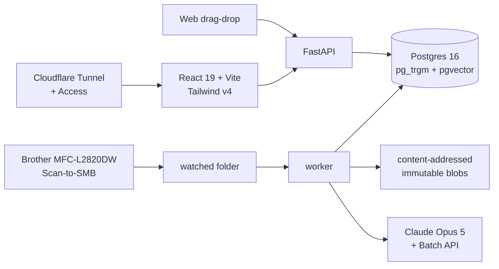

# Bindery Overview

> [!abstract] One line
> **Bindery finds the document you can't find.** A self-hosted document archive that OCRs and indexes everything at the **page** level, decomposes 100-page bundled PDFs into their real constituent documents without ever modifying the original, and classifies them with Claude against a taxonomy it already knows.

> [!quote] The itch, verbatim
> "I have a ton of documents for my house and from my time in the military, and a lot of those are, like, a hundred page documents where I'm looking for, like, my DD-214, and I can't find it... **Even if I just knew what PDF to look in for it or what page on what PDF to look in, that would be ideal.**"

---

## What It Is

| | |
|---|---|
| **Status** | `= Planned` — planning complete 2026-08-27, not yet scaffolded |
| **Archetype** | Composite: **F** Service/Pipeline (spine) + **A** Product Web App (surface) |
| **Repo** | `bindery/` — private |
| **Host** | ZimaOS server — 16 GB RAM, AMD Ryzen, 16 TB storage |
| **Stakes** | Personal tool, architected so it *could* become a product |
| **Success** | Find the DD-214 in under 10 seconds |
| **Kill criterion** | Loss of trust in the automated filing |

## The Wedge

Every self-hosted document manager — Paperless-ngx, Docspell, Mayan EDMS, Teedy — treats a PDF as **one atomic document**. None of them address a 100-page military service bundle with a DD-214 buried inside it. **Page-level retrieval inside bundled PDFs is the thing nobody in this space does**, and it is why building fresh rather than layering on Paperless-ngx is defensible.

## The Governing Principle

> [!important] Auditable Automation
> The success goal (speed) demands aggressive automation with no confirmation step. The kill criterion (trust) demands that no decision be opaque. They reconcile one way only: **automate by default, but make every automated decision cheap to inspect and one click to reverse.** Trust is earned after the fact, not by asking permission first.
>
> This constrains the schema (provenance on every AI-written field), the pipeline (nothing overwrites without recording), and every screen that displays AI output.

## Architecture at a Glance

**Pipeline:** ingest → normalize (OCRmyPDF/Tesseract) → page → segment → embed → classify → rules → file → mirror. Every stage persists its artifact and is **independently replayable**, so improving a prompt never means re-running OCR.

## Decisions That Define It

| Decision | Choice | ADR |
|---|---|---|
| Document model | **A page range over an immutable source file.** Bundles are sliced virtually; originals are never modified | [[Bindery/ADR-001 — Documents as Page Ranges over Immutable Source Files\|ADR-001]] |
| Queue | Postgres `SKIP LOCKED`, no Redis; every stage replayable | [[Bindery/ADR-002 — Postgres Job Queue with Replayable Pipeline Stages\|ADR-002]] |
| AI | Claude Opus 5 behind an adapter; `existing_ids` vs `new_names` contract; candidates from embedding neighbours | [[Bindery/ADR-003 — Claude Behind an Adapter with an ID-Constrained Taxonomy Contract\|ADR-003]] |
| Search | Postgres FTS + `pg_trgm`; `pgvector` for classification, not primary search | [[Bindery/ADR-004 — Postgres FTS with Trigram Fuzzy Matching over a Search Engine\|ADR-004]] |
| Access | Library is the access boundary; no per-document ACLs | [[Bindery/ADR-005 — Library as the Access Boundary\|ADR-005]] |
| Ingress | Cloudflare Tunnel, zero published host ports. **Access is being removed as the front door** in favour of Bindery's own login (Phase 10) | [[Bindery/ADR-006 — Cloudflare Tunnel and Access for Ingress\|ADR-006]] · [[Bindery/ADR-008 — App-Native Authentication as the Front Door\|ADR-008]] |
| Isolation | An admin administers accounts, storage and the pipeline — and cannot read anyone else's documents | [[Bindery/ADR-005 — Library as the Access Boundary\|ADR-005]] · [[Bindery/ADR-009 — Strict Per-Account Isolation\|ADR-009]] |
| Auto-file gating | **Structural signals**, not the model's self-reported confidence | [[Bindery/Phase Plans/Phase 3 — Classification & Review\|Phase 3]] |
| Retention | **Nothing is ever automatically deleted** | — |

## Roadmap

- [ ] **P0 Foundation** — stack runs, nothing exposed, nothing deletable
- [ ] **P1 Retrieval (no AI)** — ingest, OCR, page index, search, viewer. **Solves the stated problem outright**
- [ ] **P2 Bundles & Known Forms** — segments, manual editor, DD-214 recognised deterministically
- [ ] **P3 Classification & Review** — Claude, provenance, structural gate, review queue, rules
- [ ] **P4 Backlog Import** — dry run, two-pass with taxonomy curation, Batch API, bulk edit
- [ ] **P5 Entities & Organization** — correspondents, assets, timelines, shelves, packets
- [ ] **P6 Trust, Export & Resilience** — integrity, export-without-Bindery, go-bag, restore drill
- [ ] **P7 Household & Libraries** — multi-user, leak test suite
- [ ] **P8 Ask, Health & Hardening** — cited Q&A, health panel, notifications, polish
- [ ] **P9 Later** — expiry reminders, cloud replication, native iOS

## Deliberate Refusals

Never modifies an original · no collaboration layer · no telemetry · no unexplainable AI decision · no engagement notifications · no third-party account required · **nothing auto-deletes**.

## Planning Corpus

[[Bindery/Discovery Roadmap|Discovery Roadmap]] · [[Bindery/Discovery & Requirements|Discovery & Requirements]] · [[Bindery/Research Notes|Research Notes]] · [[Bindery/Feature Ideas & Future Development|Feature Ideas]] · [[Bindery/Architecture|Architecture]] · [[Bindery/Data Model|Data Model]] · [[Bindery/Glossary|Glossary]] · [[Bindery/UX Flows & Screen Inventory|UX Flows & Screen Inventory]] · [[Bindery/Risk Register|Risk Register]] · [[Bindery/Test Strategy|Test Strategy]] · [[Bindery/Requirements Register|Requirements Register]] · [[Bindery/Scope of Work|Scope of Work]] · [[Bindery/Phase Plans/Phase 0 — Foundation|Phase Plans ×10]] · ADR-001 … ADR-009

## See Also

- [[D3 Cloud Ecosystem]] · [[Tech Stack Overview]] · [[Infrastructure & Deployment]] · [[Shared Patterns]]
- [[Someday Vault Overview]] — shares the Postgres-over-Redis scheduling precedent and the irreplaceable-data posture
- [[Murmur Overview]] — shares the Claude adapter pattern and pgvector usage
