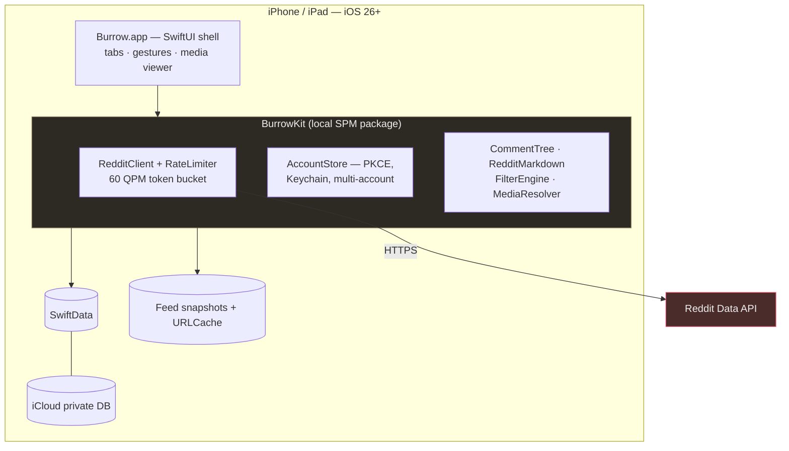

---
aliases:
  - Burrow
  - Burrow Reddit Client
tags:
  - type/overview
  - project/burrow
  - status/planned
  - tech/swift
  - tech/swiftui
project: burrow
repo: burrow-reddit
tech_stack:
  - Swift 6.2
  - SwiftUI (iOS 26+)
  - SwiftData + CloudKit
  - AVKit (HLS)
  - Reddit Data API (OAuth PKCE)
created: 2026-08-10
updated: 2026-08-10
---

# Burrow Overview

> [!abstract] What it is
> **Burrow** is a personal, ad-free, ultra-native iOS 26 Reddit client — a daily-driver replacement for the official app with Apollo-caliber comment ergonomics, a first-class media viewer, and zero monetization. Lurk-first: flawless feed scrolling is priority #1. It never touches the App Store (Xcode/TestFlight-to-self only) and runs on Reddit's free API tier under the user's own installed-app client id, compliant with the June-2026 Responsible Builder Policy. The name is the brand: digging into communities + lurking — warm soil-brown/moss-green identity over Liquid Glass.

## Architecture



## The Plan at a Glance

| | |
|---|---|
| **Requirements** | 86 (47 Must) — [[Burrow/Requirements Register\|Requirements Register]] |
| **Phases** | 9 (0–8), 62 tasks — [[Burrow/Scope of Work\|Scope of Work]] |
| **Top risks** | RBP approval denial · NSFW mod-exception unverified · CloudKit prod-schema trap — [[Burrow/Risk Register\|Risk Register]] |
| **Kill criterion** | Reddit denies/revokes API access — the only one |
| **Cost** | $0/mo incremental |

## Feature Checklist (Musts, by phase)

- [ ] P0: PKCE auth · metered client · tolerant decoding · debug console · RBP request filed · NSFW spike
- [ ] P1: butter feed (`/best`) · snapshots <0.5s relaunch · read-dimming · sort memory · switcher · filters · dogfood install
- [ ] P2: collapse trees · jump FAB · morechildren · core Reddit markdown · suggested sort
- [ ] P3: multi-account · vote/save · composer + local drafts · two-stage gestures
- [ ] P4: media viewer · HLS video with audio · galleries · NSFW handling
- [ ] P5: subs + multis CRUD · search · inbox + PMs · profiles · deep links/share extension
- [ ] P6: CloudKit sync (+ prod schema) · scroll continuity · iPad three-column
- [ ] P7: mod tools · modmail · exotic markdown · themes · advanced filters
- [ ] P8: states audit · perf + privacy pass · TestFlight · **delete the official app**

## Development

```bash
cd ~/workspace/d3cloud/burrow-reddit
open burrow-reddit.xcodeproj        # app work
cd BurrowKit && swift test          # engine tests
```

Conventions: all logic in BurrowKit (tested), SwiftUI shell thin; zero third-party deps (swift-markdown excepted); no telemetry; update the SOW as tasks complete.

## See Also

- [[Burrow/Discovery & Requirements|Discovery & Requirements]] · [[Burrow/Discovery Roadmap|Discovery Roadmap]] · [[Burrow/Research Notes|Research Notes]]
- [[Burrow/Architecture|Architecture]] · [[Burrow/Data Model|Data Model]] · [[Burrow/API Contract|API Contract]] · [[Burrow/UX Flows & Screen Inventory|UX Flows & Screen Inventory]] · [[Burrow/Glossary|Glossary]]
- [[Burrow/Feature Ideas & Future Development|Feature Ideas]] · [[Burrow/Requirements Register|Requirements Register]] · [[Burrow/Risk Register|Risk Register]] · [[Burrow/Test Strategy|Test Strategy]]
- [[Burrow/Scope of Work|Scope of Work]] + Phase Plans 0–8
- ADRs: [[Burrow/ADR-001 — SwiftData and the Zero-Dependency Policy|001]] · [[Burrow/ADR-002 — iCloud Sync Engine|002]] · [[Burrow/ADR-003 — HLS-First Video|003]] · [[Burrow/ADR-004 — Ship While Awaiting API Approval|004]]
- [[Blockslam Overview]] · [[Clearwhen Overview]] — sibling native iOS projects
- [[Home]] · [[D3 Cloud Ecosystem]]
