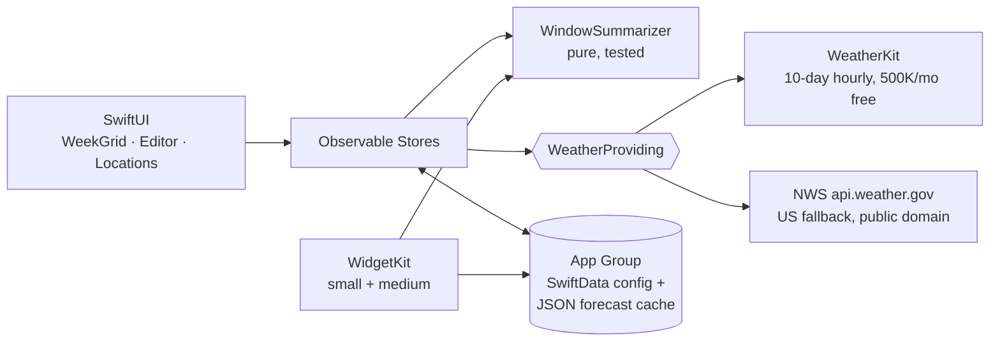

---
aliases:
  - Clearwhen
  - Clearwhen
tags:
  - project/clearwhen
  - type/overview
  - status/active
  - tech/swift
  - tech/swiftui
created: 2026-07-24
updated: 2026-07-24
tech_stack:
  - Swift 6
  - SwiftUI
  - SwiftData
  - WeatherKit
  - WidgetKit
  - CoreLocation
platform: iOS 26+
repo: Clearwhen/
bundle_id: com.demersdev.Clearwhen
price: Free (no ads, no IAP)
---

# Clearwhen Overview

> [!abstract] What it is
> **Weather for the parts of your day that matter.** Weather apps say "rain today" because of a 1 AM shower you'll sleep through. Clearwhen lets you define your real windows — commute, workday, dog walk — and shows a bubbly pastel 7-day grid with one honest, **worst-case-wins** summary per window per day. Free on the App Store; entirely client-side Swift.

## Core Ideas

- **Windows, not days**: up to ~5 custom time windows with names, icons, and per-weekday scheduling (no commute row on Saturday)
- **Worst-case wins**: if it rains at all during your commute, the commute cell shows rain — severity ladder `severe > thunder > sleet > snow > heavy rain > rain > drizzle > wind > fog > clouds > partly > clear`
- **Advice, not data**: an [[Clearwhen/Intelligence Layer|insights engine]] turns hours into sentences — "Rain during your Commute — starting around 7 AM", "Best time outside: 2–6 PM", "Dry until Sunday, then wet"
- **Tap to trust**: every day opens a timeline where windows are highlighted blocks with their own hours
- **Bubbly & happy**: pastel skies that shift with condition *and* time of day, plus a fully custom SVG icon suite that animates (rain falls, sun breathes, lightning flashes)
- **Zero infrastructure**: no backend, no accounts, no analytics, no third-party packages — even the morning notifications and sunrise times are computed on-device

## Architecture (at a glance)

Full detail: [[Clearwhen/Architecture|Architecture]] · [[Clearwhen/ADR-001 — Weather Data Provider|ADR-001 Weather Provider]] · [[Clearwhen/ADR-002 — Persistence & Caching|ADR-002 Persistence]] · [[Clearwhen/ADR-003 — Icon & Art Strategy|ADR-003 Icons]]

## Feature Checklist (v1)

- [x] Day-first cards: headline from a user-set Day Summary range + per-window chips
- [x] Day detail timeline with window blocks, conditions, best-time-outside, sunrise/sunset
- [x] Custom windows (≤5): name, icon, time range, weekday mask
- [x] Apple Weather-style location pager + locations list
- [x] Insights engine, severe weather alerts, week-ahead summary
- [x] Morning briefing notifications
- [x] First-run onboarding with preset window picker
- [x] Animated custom SVG icon suite + time-of-day sky palette
- [x] Home screen widget (small + medium) + Lock Screen widgets (rectangular/circular/inline)
- [x] °F/°C, attribution screen (Apple Weather mark), offline cache
- [ ] App Store submission (see [[Clearwhen/App Store Submission Kit|Submission Kit]])

## Status

**Built 2026-07-24** in a single-day push. Repo at `Clearwhen/` (`com.demersdev.Clearwhen`), 35 tests across 10 suites, verified live in simulator against NWS data. Remaining: on-device WeatherKit verification, privacy page, screenshots, App Store Connect. Execution tracker: [[Clearwhen/Scope of Work|Scope of Work]] (8 phases).

## Conventions

- Swift 6 strict concurrency; zero third-party dependencies (VaultDrv/Blockslam precedent)
- Domain logic (`ClearwhenKit`) is pure and unit-tested before UI consumes it
- Providers behind protocols; provider identity surfaces for attribution
- Vault-first planning; SOW checkboxes updated as work lands

## See Also

- [[Clearwhen/Discovery & Requirements|Discovery & Requirements]]
- [[Clearwhen/Scope of Work|Scope of Work]]
- [[Blockslam Overview]] — sibling native Swift app
- [[D3 Cloud Ecosystem]]
