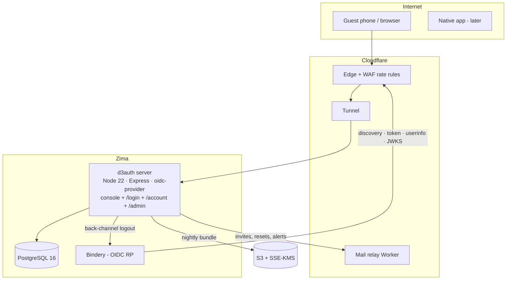
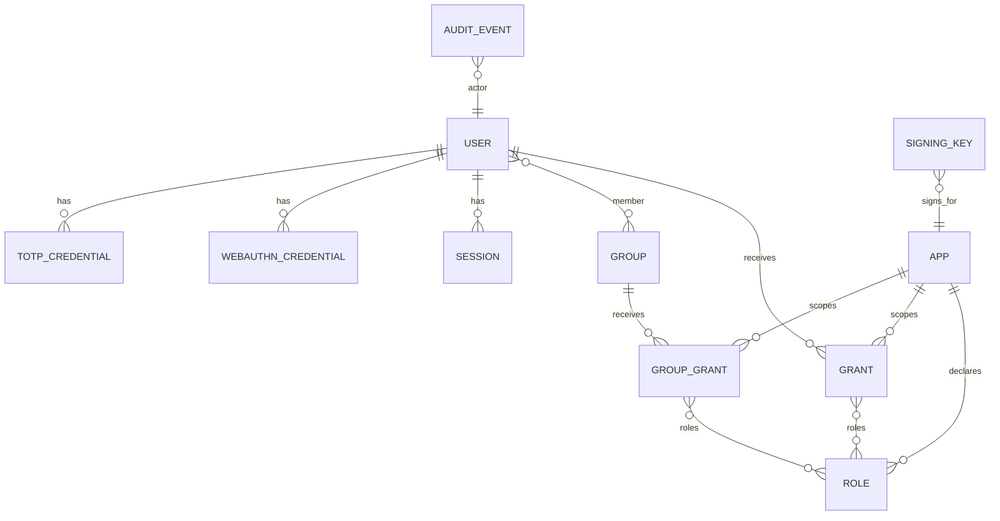

# D3 Auth Overview

> [!abstract] What it is
> **D3 Auth** is a self-hosted OpenID Connect identity provider with a single admin console for users, registered apps, per-app access grants and per-app roles delivered as token claims. It is an **optional** sign-in method that D3 Cloud apps can enable beside their own login, never a replacement for it. Invite-only, password + TOTP + passkeys, hosted at `auth.d3cloud.io` on the Zima host behind a Cloudflare Tunnel. Bindery is the reference consumer; the coming wave of open-source tools built on `@d3cloud/ui` each offer *Sign in with D3 Auth* as a configured option. Open-sourced (MIT/Apache-2.0) once the security gate passes and Bindery is in production with it.

> [!quote] In the owner's words
> "Something that's mine and that I can control and that I know is secure from my standpoint."

## Architecture


## Features (all planned)
- [ ] OIDC provider: code + PKCE only, opaque 10-min access tokens, rotating refresh with reuse detection, RP-Initiated and Back-Channel Logout, ES256, `iss` in responses
- [ ] Email login identifier + stable username; public UUID `sub`
- [ ] Password (Argon2id, NIST-style policy, decoy hashing) · TOTP · passkeys (discoverable, conditional UI) · trusted devices
- [ ] Owner + delegated admins with mandatory user-verified factor; guests optional
- [ ] Apps from JSON manifests; app-declared roles; direct and group grants; union semantics; deny by default; per-app `roles` claim only
- [ ] Console: users, apps, access, groups, audit, sessions, keys, settings, export/import, seed file, step-up
- [ ] Account self-service: profile, password, factors, sessions & devices, app launcher
- [ ] Invites via Cloudflare Email Sending (Worker relay) with SMTP fallback; admin reset; sealed second admin; break-glass CLI
- [ ] `@d3cloud/auth-client` (TS) and `d3auth-client` (Python) SDKs; examples for Express, FastAPI, iOS
- [ ] Security gate: conformance suite in CI, adversarial suite, ASVS 5.0 L2 self-assessment, Semgrep, ZAP
- [ ] Ops: nightly S3 backup bundle with CI restore drill, email alerts, Worker readiness probe, runbooks

## Data model

Full model in [[D3 Auth/Data Model]].

## Tech stack
| Layer | Choice | Why |
|---|---|---|
| Provider | `oidc-provider` 9.x on Node 22 | Only base already certified for Basic, Config, RP-Initiated and Back-Channel Logout ([[D3 Auth/ADR-001 — OIDC Provider on node-oidc-provider\|ADR-001]]) |
| API | Express + Prisma | Ecosystem TS default |
| Database | PostgreSQL 16 | Universal |
| Console | React 19 + Vite + `@d3cloud/ui` | Design system |
| Factors | `@simplewebauthn/server` 14, `otpauth` 9, `argon2` | Verified current |
| Mail | Cloudflare Worker relay (`send_email`) → SMTP fallback | Existing sender domain |
| Ingress | Cloudflare Tunnel, no host ports | Bindery posture |
| Backups | S3 + SSE-KMS | Bindery P13 pattern |

## Repo layout
```
d3-auth/
├── apps/server            # provider + interaction + console API + CLI
├── apps/console           # React console, /login /account /admin
├── packages/auth-client   # @d3cloud/auth-client
├── packages/auth-client-python
├── workers/mail-relay
├── examples/{express,fastapi,ios}
├── conformance/           # OpenID suite harness
└── docs/runbooks
```

## Conventions
- Plan in the vault first; SOW checked off as work lands.
- Manual pull-and-restart deploys; migrations on boot after a pre-dump.
- No time estimates; T-shirt sizes.
- Anti-features: no dynamic client registration, no WebFinger, no wildcard redirects, no telemetry, no social login, no public signup.

## Status
**Active** — **Phases 0 and 1 complete** (2026-09-15, 2026-09-16); live at `https://auth.d3cloud.io`. Phase 0 ([matdemers1/d3-auth](https://github.com/matdemers1/d3-auth), private): `oidc-provider` on Postgres with sealed ES256/RS256 keys, Prisma adapter, strict provider config, throwaway dev login, console shell on `@d3cloud/ui`, structured logging and readiness, and the OpenID conformance suite (Basic + Config) green in CI — see [[D3 Auth/ADR-002 — Conformance Profile, PKCE Exemption and POST Authorization|ADR-002]]. Phase 1 added the real login (state machine, Argon2id with a decoy, throttling, sessions, CSRF, logout, security headers, audit), migrations at boot behind a dump, the first-run setup screen (REQ-141) and the deploy behind D3 Auth's own Cloudflare Tunnel. Next: Phase 2 — People, Factors & Recovery.

## See Also
- [[D3 Auth/Discovery Roadmap]] · [[D3 Auth/Discovery & Requirements]] · [[D3 Auth/Research Notes]] · [[D3 Auth/Feature Ideas & Future Development]] · [[D3 Auth/Architecture]] · [[D3 Auth/Data Model]] · [[D3 Auth/API Contract]] · [[D3 Auth/UX Flows & Screen Inventory]] · [[D3 Auth/Glossary]] · [[D3 Auth/Risk Register]] · [[D3 Auth/Test Strategy]] · [[D3 Auth/Requirements Register]] · [[D3 Auth/Scope of Work]] · [[D3 Auth/ADR-001 — OIDC Provider on node-oidc-provider|ADR-001]]
- [[Bindery Overview]] (reference consumer, Phase 20) · [[D3 Cloud Ecosystem]] · [[Shared Patterns]]
