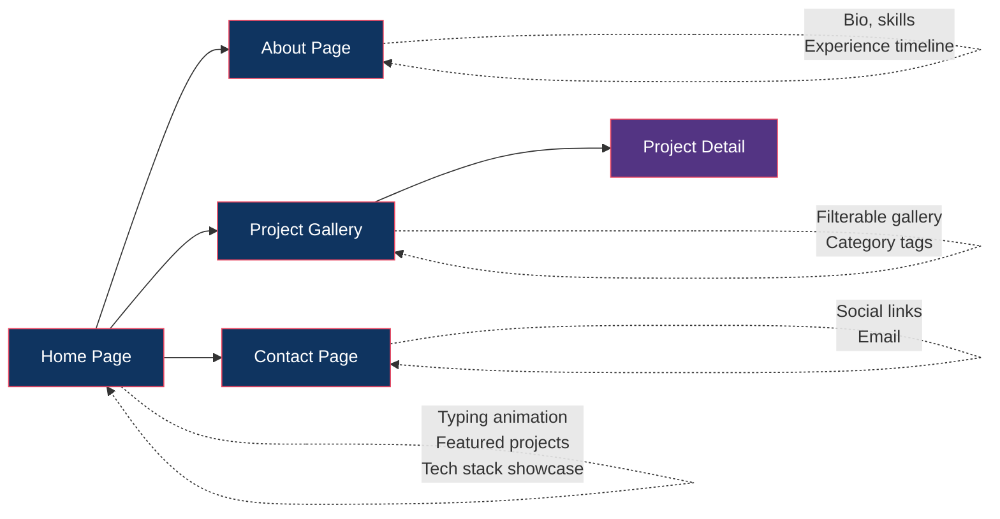
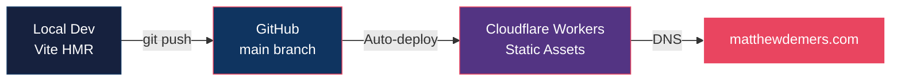

---
aliases:
  - Website
  - Portfolio
  - Personal Site
  - matthewdemers.com
tags:
  - project/website
  - type/overview
  - tech/react
  - tech/docker
  - status/active
project: Personal Website
repo: Personal-Website
tech_stack:
  - React 19
  - Vite 7
  - Tailwind CSS 4
  - Framer Motion
  - React Router v7
  - Cloudflare Workers
status: active
created: 2026-04-04
updated: 2026-04-04
---

# Personal Website Overview

> [!abstract] Summary
> Matthew Demers' **personal portfolio site** with a neon cyberpunk aesthetic. A fully static React SPA hosted on Cloudflare Workers, featuring smooth animations, a filterable project gallery, and content driven entirely by JSON data files. Auto-deploys on push to `main`.

---

## Key Details

| Property | Value |
|----------|-------|
| **Repo** | `d3cloud/Personal-Website` |
| **Stack** | React 19, Vite 7, Tailwind CSS 4, Framer Motion |
| **Routing** | React Router v7 (SPA — all paths → `index.html`) |
| **Hosting** | Cloudflare Workers (static assets) |
| **DNS** | Cloudflare |
| **Deploy** | Auto-deploy on push to `main` via Cloudflare GitHub integration |
| **Dev Command** | `npm run dev` → `http://localhost:5173` |

---

## Design System

> [!tip] Neon Cyberpunk Aesthetic
> The site uses a distinctive visual identity:
> - **Dark backgrounds** with deep navy/black tones
> - **Neon accent colors** (glowing pinks, blues, purples)
> - **Smooth animations** via Framer Motion
> - **Monospace typography** accents for a tech feel

### Color Palette

| Role | Description |
|------|-------------|
| Background | Deep dark navy / near-black |
| Primary Accent | Neon pink / hot pink glow |
| Secondary Accent | Electric blue |
| Tertiary | Purple / violet |
| Text | Light gray / white |

---

## Pages & Features



### Home Page
- Animated typing effect for hero text
- Featured project cards with hover effects
- Tech stack icon showcase

### About Page
- Personal bio and background
- Skills grid with proficiency indicators
- Experience timeline (animated on scroll)

### Project Gallery
- Filterable by category / technology tags
- Card grid with project thumbnails
- Click-through to detailed project pages

### Contact
- Social media links (GitHub, LinkedIn, etc.)
- Email contact

---

## Content Management

> [!info] JSON-Driven Content
> All site content lives in JSON files — no CMS, no database. To update content, edit the JSON and push.

| File | Content |
|------|---------|
| `src/data/projects.json` | Project entries (title, description, tech, links, images) |
| `src/data/profile.json` | Bio, skills, experience, social links |

This approach keeps the site:
- **Fast** — fully static, no API calls
- **Simple** — content changes are just JSON edits
- **Version controlled** — all content in git history

---

## Deployment Pipeline



> [!note] SPA Routing
> Cloudflare Workers is configured to serve `index.html` for all paths, enabling client-side routing via React Router.

---

## File Structure

```
Personal-Website/
├── src/
│   ├── components/        # React components
│   │   ├── layout/       # Header, Footer, Nav
│   │   ├── home/         # Home page sections
│   │   ├── projects/     # Gallery & detail
│   │   └── ui/           # Shared UI primitives
│   ├── data/
│   │   ├── projects.json # Project content
│   │   └── profile.json  # Profile content
│   ├── pages/            # Route pages
│   └── styles/           # Tailwind config
├── public/               # Static assets (images, favicon)
├── vite.config.ts
├── tailwind.config.ts
├── wrangler.toml         # Cloudflare Workers config
└── README.md
```

---

## See Also

- [[D3 Cloud Ecosystem]] — How the website showcases all projects
- [[Home]] — Back to vault home

