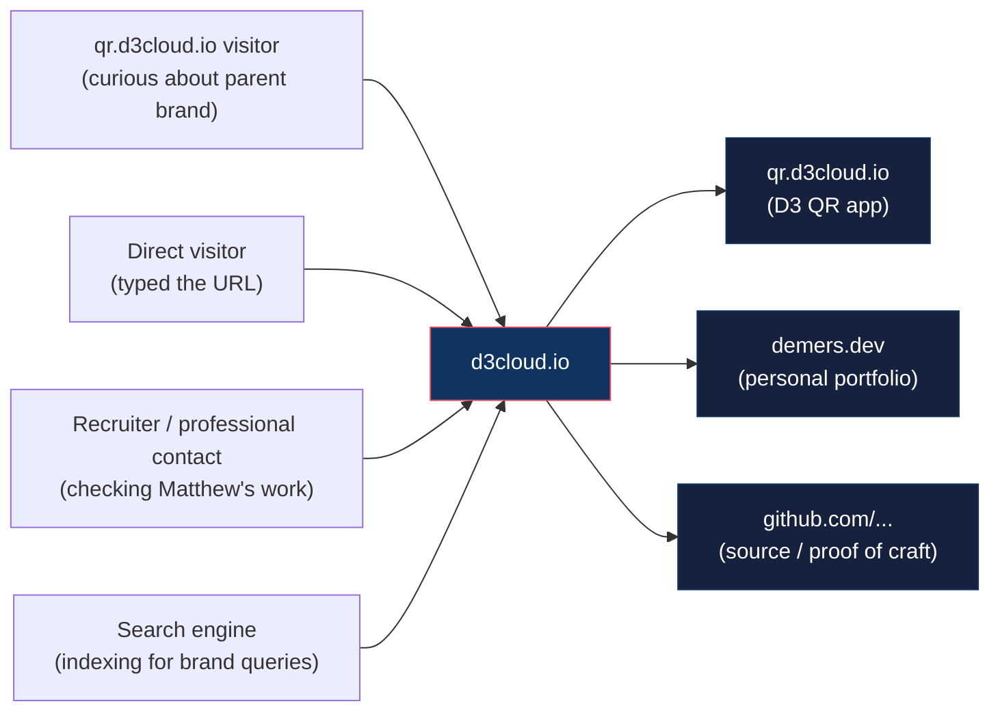
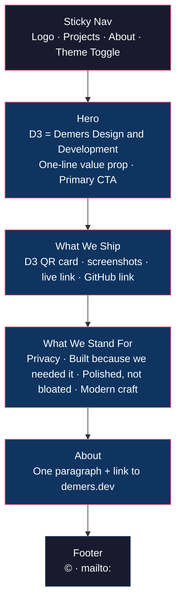

---
aliases:
  - d3cloud.io Discovery
  - Demers Design and Development Discovery
  - DDD Discovery
tags:
  - type/planning
  - project/d3cloudio
  - status/approved
created: 2026-05-03
updated: 2026-05-03
project: d3cloud.io
phase: discovery
---

# d3cloud.io — Discovery & Requirements

> [!abstract] Elevator Pitch
> A small static landing site at the apex of `d3cloud.io` that introduces **Demers Design and Development** — an independent, one-person software studio shipping privacy-first everyday tools. It catches visitors who land on the apex from project subdomains (e.g. `qr.d3cloud.io`), explains the brand, links to the live products, and cross-links to Matthew's professional portfolio at `demers.dev`. **No backend, no docs, no auth.**

---

## Brand Positioning

> [!info] What "D3" Means
> **D3 = Demers Design and Development.** This is the public, on-page expansion of the acronym. The site treats "Demers Design and Development" as the studio name and "D3 Cloud" as the umbrella product family.

> [!tip] Tone
> Professional small software shop. Not a passion-project blog. The voice is confident and understated — _"we build the everyday tools we couldn't find"_ rather than _"check out my side projects."_ Visitors arriving from `qr.d3cloud.io` should feel like they've landed somewhere intentional and well-built, not a personal homepage.

---

## Audience

> [!note] Primary audience
> Cross-traffic from existing D3 Cloud subdomains. The page exists *because* `qr.d3cloud.io` is live and the apex is currently empty — anyone who clicks the brand mark or trims the URL today gets nothing.

---

## Feature Scope (MoSCoW)

> [!example] MoSCoW Framework
> **Must Have** — page is incomplete without these.
> **Should Have** — important polish for v1.
> **Could Have** — defer to a later iteration.
> **Won't Have** — explicitly out of scope.

| Tier | Feature | Notes |
|------|---------|-------|
| **Must** | Hero section with wordmark + one-line value prop | "Demers Design and Development" + tagline |
| **Must** | Generic SVG logo (development-themed) | Inline SVG, no image asset dependency |
| **Must** | "What we ship" / projects section | D3 QR card with live link + per-project GitHub link + screenshots of the running app |
| **Must** | Principles section | Privacy is not a feature · Built because we needed it · Polished, not bloated · Modern stack, durable choices |
| **Must** | About section + cross-link to `demers.dev` | One paragraph framing the studio + founder |
| **Must** | Footer (copyright, email) | `mailto:matthew@demers.dev` — GitHub links live on project cards, not the footer |
| **Must** | Light/dark theme toggle | Mirror d3-qr's pattern; theme persisted in localStorage |
| **Must** | Responsive design | Mobile, tablet, desktop |
| **Must** | Apex `d3cloud.io` deployment via Cloudflare Workers | Same Worker + Static Assets pattern as d3-qr |
| **Should** | SEO meta tags (description, OG image, Twitter card) | OG image generated at build time (Satori or similar) using the logo + tagline |
| **Should** | Custom 404 page | Branded, links back home |
| **Should** | Smooth-scroll anchor navigation | One-page layout — anchor nav between sections |
| **Should** | CSP / HSTS / security headers via Worker | Same pattern as d3-qr (`run_worker_first: true`) |
| **Should** | `favicon.svg` matching the wordmark | Single SVG favicon |
| **Could** | Subtle entrance animations | CSS-only or Framer Motion if budget allows |
| **Could** | Placeholder "more coming" hint | Avoid making the projects section look thin without overpromising |
| **Could** | `robots.txt` + `sitemap.xml` | Simple static files |
| **Won't (v1)** | Blog / changelog / news | No content stream yet — defer until there's something to write |
| **Won't (v1)** | Contact form | `mailto:` link is sufficient; no form = no spam vector, no backend |
| **Won't (v1)** | Newsletter signup | No content cadence to feed it |
| **Won't (v1)** | Backend / API / database | Pure static SPA |
| **Won't (v1)** | Authentication | Public site only |
| **Won't (v1)** | Analytics / telemetry on this site | Site itself collects nothing; this is *not* a public stance about future projects |
| **Won't (v1)** | Featured slots for D3 Chat / Murmur / PM | Per user direction — not in shippable shape, and Murmur is moving to employer ownership |
| **Won't (v1)** | Docs site | Existing `d3cloud-docs/` Astro scaffold stays untouched; revisit if a project ever needs public docs |

---

## User Stories

> [!example] Stories
> Numbered for easy reference in later phases.

1. **As a visitor arriving from `qr.d3cloud.io`**, I want to understand what the parent "D3 Cloud" brand is, so that I trust the tool I just used and can find related work.
2. **As a direct visitor typing `d3cloud.io`**, I want to see at a glance what the studio does and what it's shipped, so that I can decide whether to dig deeper.
3. **As a recruiter or professional contact**, I want to verify the studio is real and find Matthew's professional portfolio, so that I can vet his work.
4. **As a search-engine crawler**, I want clean meta tags, semantic HTML, and a sitemap, so that "Demers Design and Development" surfaces for brand queries.
5. **As Matthew (the operator)**, I want adding a future project to be a single card edit in one file, so that the site doesn't become a maintenance burden.
6. **As any visitor on mobile**, I want the site to be readable and fast on a phone, so that the impression isn't ruined by a desktop-only layout.
7. **As a privacy-conscious visitor**, I want to confirm there's no tracking, so that the studio's privacy claim isn't just marketing copy.

---

## Constraints & Requirements

| Category | Decision |
|----------|----------|
| **Authentication** | None — public site |
| **Data sensitivity** | None — pure static content |
| **Scale** | Low — personal brand traffic, well within Cloudflare Workers free tier |
| **Hosting** | Cloudflare Workers (Static Assets binding, `run_worker_first: true`) on the existing `d3cloud.io` zone |
| **Stack** | React 19 + Vite 7 + TypeScript + Tailwind CSS v4 — mirrors `d3-qr` exactly for stack reuse and visual consistency |
| **Telemetry** | None. CSP `connect-src 'self'` enforces it architecturally |
| **Bundle budget** | < 150kb gzipped (lighter than d3-qr since no QR/PDF libraries) |
| **Performance target** | Lighthouse 100/100/100/100 on mobile |
| **Accessibility** | WCAG AA contrast, keyboard nav, semantic HTML, `prefers-reduced-motion` honored |
| **Deployment** | Manual `npx wrangler deploy` for v1 (matches d3-qr); auto-deploy from `main` to add later |
| **Domain** | Apex `d3cloud.io` (currently empty) |
| **Cross-link requirement** | Must link out to `demers.dev` (Matthew's portfolio) and `qr.d3cloud.io` (D3 QR) |
| **Timeline** | None set — apex is currently 404, so sooner is better |

---

## Visual Identity

> [!info] Theme Inheritance
> Matches the existing **d3-qr** look: dark mode default, light mode toggle, Tailwind v4 utility classes. This makes the family of `*.d3cloud.io` sites feel coherent.

> [!example] Logo Direction
> Generic SVG, development-themed (think: bracket marks `< />`, terminal cursor, stacked lines, or geometric "D3" mark). Inline in the markup so there's no extra request, scalable, color-inheriting via `currentColor` so it auto-themes with light/dark mode.

> [!tip] Wordmark
> "Demers Design and Development" in the hero, "D3 Cloud" in the header/logo lockup. The expansion is the *reveal* on the landing page — a small piece of personality.

---

## High-Level Page Structure

---

## Resolved Decisions

> [!success] Locked in during discovery
> - **No global GitHub link.** Footer is just `©` + `mailto:matthew@demers.dev`. Each project card carries its own GitHub link, since per-project repos have different visibility/states.
> - **OG image is generated at build time** (Satori or `vercel/og`-style), not hand-designed. Logo + tagline composed against the dark theme palette.
> - **Hero tagline:** _"Independent software studio building privacy-first everyday tools."_
> - **Principles (4 cards):**
>   1. **Privacy is not a feature.** — what this site (and our tools, where applicable) won't do
>   2. **Built because we needed it.** — origin story for every project; not chasing a market
>   3. **Polished, not bloated.** — quality bar; small bundles, sharp UI, no dead weight
>   4. **Modern stack, durable choices.** — engineering philosophy; current tech, conservative dependencies
> - **D3 QR card visual:** real screenshots of the running app (hero shot + maybe a secondary detail shot). Avoid stock-y decorative QR codes.

> [!info] Why we dropped "self-hosted" and "no telemetry" from the principles
> Both could be misread as a public commitment that binds *every* future project. Some future projects may be closed-source, hosted-only, or include analytics. Keeping the principles broad protects future flexibility while still reading as a serious software shop.

---

## Risks

> [!warning] Things to watch
> - **Thin projects section.** Only one shipped project means the "What We Ship" area can feel sparse. Mitigation: one well-designed card with strong visual + clear copy beats a grid of placeholders.
> - **Brand cohesion drift.** If the page deviates too far from d3-qr's look, the family stops feeling like a family. Mitigation: lift d3-qr's Tailwind theme tokens, fonts, and dark-mode pattern verbatim.
> - **Logo sourcing.** A weak logo undermines the "professional studio" positioning. Mitigation: keep the SVG simple and geometric — better minimal-and-confident than ornate-and-amateur.
> - **Apex DNS conflict with subdomains.** Existing `qr.d3cloud.io` Worker route must not be disrupted by adding an apex Worker route. Mitigation: in Phase 2, verify the route pattern is `d3cloud.io/*` (apex only, not wildcard subdomains).

---

## Success Criteria for v1

> [!success] Done means…
> - [ ] `https://d3cloud.io` resolves to the page (no 404)
> - [ ] Page introduces Demers Design and Development clearly within the first viewport
> - [ ] D3 QR is featured with a working live link
> - [ ] Cross-link to `demers.dev` is present and working
> - [ ] Light + dark theme both look intentional and pass WCAG AA contrast
> - [ ] Mobile, tablet, and desktop layouts all look polished
> - [ ] Lighthouse score 95+ across all four categories on mobile
> - [ ] No outbound network requests after page load (verified in DevTools)
> - [ ] CSP, HSTS, X-Frame-Options headers present (verified via `curl -I`)

---

## See Also

- [[Architecture]] — Phase 2 output (not yet drafted)
- [[Scope of Work]] — Phase 3 output (not yet drafted)
- [[D3 QR Overview]] — Sibling project, stack and visual reference
- [[D3 Cloud Ecosystem]] — Where this site fits in the umbrella
- [[Tech Stack Overview]] — Shared technology baseline
