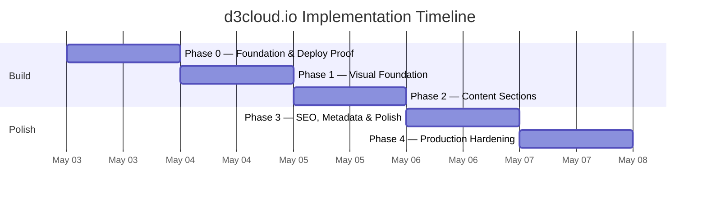

---
aliases:
  - d3cloud.io SOW
  - DDD Scope of Work
tags:
  - type/planning
  - project/d3cloudio
  - status/draft
created: 2026-05-03
updated: 2026-05-03
project: d3cloud.io
phase: scope-of-work
---

# d3cloud.io — Scope of Work

> [!abstract] Project Summary
> Build the apex `d3cloud.io` landing site for **Demers Design and Development**. Five sequential phases: foundation/deploy proof, visual system, content sections, SEO & polish, production hardening. Total estimated effort: **one focused weekend** of work, broken into checkpoints small enough to ship one phase per session.

---

## Table of Contents

- [[#Phase 0 — Foundation & Deploy Proof]] (M)
- [[#Phase 1 — Visual Foundation]] (S)
- [[#Phase 2 — Content Sections]] (M)
- [[#Phase 3 — SEO, Metadata & Polish]] (M)
- [[#Phase 4 — Production Hardening]] (S)
- [[#Summary Table]]
- [[#Timeline]]
- [[#Open Questions]]

---

## Phase 0 — Foundation & Deploy Proof

> [!example] Objective · Size: M
> Stand up the repo, scaffold the d3-qr-style stack, and **deploy a placeholder page to `d3cloud.io` end-to-end** — proving the Cloudflare apex Worker route works without breaking `qr.d3cloud.io`. This phase de-risks the deployment path before a single line of real UI exists.

### Deliverables

- [ ] `d3cloud-www/` repo created at workspace root, initial commit pushed
- [ ] React 19 + Vite 7 + TS + Tailwind v4 scaffold building cleanly
- [ ] `src/worker.ts` returning at minimum a "D3 Cloud — coming soon" page with full security headers
- [ ] `wrangler.jsonc` configured with `run_worker_first: true`
- [ ] `https://d3cloud.io` resolves to the placeholder; `https://qr.d3cloud.io` still resolves to D3 QR (unchanged)
- [ ] `curl -I https://d3cloud.io` shows CSP, HSTS, X-Frame-Options, etc.

### Tasks

- [ ] **Repo setup**
  - [ ] `mkdir d3cloud-www && cd d3cloud-www && git init`
  - [ ] Copy d3-qr's `eslint.config.js`, `.gitignore`, `tsconfig.*.json`, `vite.config.ts` as starting point
  - [ ] Create `package.json` with name `d3cloud-www`, scripts: `dev`, `build`, `preview`, `lint`, `format`, `test`
  - [ ] Initial commit (no co-author footer per memory)
- [ ] **Scaffold**
  - [ ] `npm install` core deps: `react@19`, `react-dom@19`, `vite@7`, `@vitejs/plugin-react`, `typescript`, `tailwindcss@4`, `@tailwindcss/vite`
  - [ ] `npm install -D` dev deps: `@types/react`, `@types/react-dom`, `eslint`, `prettier`, `vitest`, `wrangler`
  - [ ] Minimal `index.html` with Tailwind imported
  - [ ] Minimal `src/main.tsx` mounting a placeholder `<App />`
  - [ ] Minimal `src/App.tsx` rendering "D3 Cloud — coming soon"
  - [ ] Verify `npm run dev` works on `localhost:5173`
  - [ ] Verify `npm run build` produces `dist/` with sane output
- [ ] **Worker setup**
  - [ ] Create `src/worker.ts` with `fetch` handler that calls `env.ASSETS.fetch(request)` and clones the response to attach security headers
  - [ ] Headers per [[Architecture#Security Headers]] spec (CSP, HSTS, X-Frame-Options, etc.)
  - [ ] Create `wrangler.jsonc` with `name: "d3cloud-www"`, `main: "src/worker.ts"`, `assets: { directory: "./dist", run_worker_first: true }`
  - [ ] `tsconfig.worker.json` for Worker types (mirror d3-qr)
- [ ] **Cloudflare deploy**
  - [ ] Verify `CLOUDFLARE_API_TOKEN` is loaded from `~/.zshrc` (`echo $CLOUDFLARE_API_TOKEN`)
  - [ ] First deploy: `npx wrangler deploy` — should succeed on workers.dev subdomain
  - [ ] Verify deployment at `d3cloud-www.<subdomain>.workers.dev` (placeholder loads, headers present)
  - [ ] Bind apex Custom Domain via Cloudflare dashboard OR via API: `PUT /accounts/<account-id>/workers/domains` with hostname `d3cloud.io`, worker `d3cloud-www`
  - [ ] Wait for cert provisioning (~30-60s)
  - [ ] **CRITICAL CHECK:** verify `https://qr.d3cloud.io` still resolves to D3 QR (open in browser — must not 500 or show wrong content)
  - [ ] Verify `https://d3cloud.io` resolves to the placeholder
  - [ ] `curl -I https://d3cloud.io` — confirm all security headers present
- [ ] **Documentation**
  - [ ] `README.md` with build/dev/deploy commands (mirror d3-qr's structure)
  - [ ] `CLAUDE.md` referencing the vault docs, key conventions, and "DO NOT TOUCH `qr.d3cloud.io`" warning

### Dependencies
None — this is the entry phase.

> [!danger] Risks
> - **Apex Custom Domain misconfig could break `qr.d3cloud.io`.** Mitigation: register via Custom Domain (apex hostname only), NOT a Worker Route pattern. Verify `qr.d3cloud.io` after every DNS-touching action.
> - **Wrangler token scope missing apex zone permission.** Token already covers d3cloud.io zone (DNS Write, Workers Routes Write per `reference_cloudflare_d3qr.md`), but verify before deploy. Mitigation: rotate token only if needed; do not modify the existing one without backing it up.
> - **Tailwind v4 setup gotchas.** v4 changed config from `tailwind.config.ts` to CSS-first `@theme`. Mitigation: copy d3-qr's CSS exactly.

> [!success] Acceptance Criteria
> - `https://d3cloud.io` returns 200 with the placeholder page
> - `https://qr.d3cloud.io` still returns the D3 QR app (zero regression)
> - `curl -I https://d3cloud.io` shows: `Content-Security-Policy`, `Strict-Transport-Security`, `X-Frame-Options: DENY`, `X-Content-Type-Options: nosniff`, `Referrer-Policy`, `Permissions-Policy`
> - `npm run dev`, `npm run build`, `npm run preview` all work locally

---

## Phase 1 — Visual Foundation

> [!example] Objective · Size: S
> Build the design system foundations — logo SVG, theme tokens, Tailwind config, theme toggle (with FOUC prevention), Nav shell, fonts. Output: an empty page that *looks* like the final site, ready for content to be poured in.

### Deliverables

- [ ] `Logo.tsx` — generic, dev-themed SVG component (color-inheriting via `currentColor`)
- [ ] Tailwind v4 theme tokens defined (background, foreground, muted, accent, border) for both light and dark modes
- [ ] `useTheme.ts` hook — light/dark/system switching, localStorage persistence
- [ ] Inline FOUC-prevention script in `index.html` `<head>`
- [ ] `<ThemeToggle />` component (sun/moon icon button)
- [ ] `<Nav />` sticky top bar — Logo (left), anchor links (center/right), ThemeToggle (right)
- [ ] `favicon.svg` (single-color version of the logo)
- [ ] Font choice locked in (system stack OR a single self-hosted font)

### Tasks

- [ ] **Logo design**
  - [ ] Sketch 2-3 generic-dev SVG concepts (bracket marks `</>`, terminal cursor, geometric "D3" mark, stacked diagonals)
  - [ ] Pick one, hand-author the SVG — single path/group, uses `currentColor` for stroke/fill
  - [ ] Create `src/components/Logo.tsx` accepting `size` and `className` props
  - [ ] Create `public/favicon.svg` (same SVG, no React)
  - [ ] Reference favicon from `index.html`
- [ ] **Theme tokens**
  - [ ] Open d3-qr's `src/index.css` and copy the `@theme` block as the starting point
  - [ ] Define semantic tokens: `--color-background`, `--color-foreground`, `--color-muted`, `--color-muted-foreground`, `--color-accent`, `--color-border`
  - [ ] Define light-mode and `.dark` variants
  - [ ] Verify: a `
` renders with correct colors in both modes
- [ ] **FOUC-prevention script**
  - [ ] Inline `<script>` in `index.html` `<head>` (before any CSS link)
  - [ ] Script: read `localStorage.theme`, fall back to `matchMedia('(prefers-color-scheme: dark)')`, apply `dark` class to `<html>` synchronously
- [ ] **`useTheme` hook**
  - [ ] Create `src/hooks/useTheme.ts` exporting `useTheme(): { theme, setTheme, resolvedTheme }`
  - [ ] On mount: read current `<html>` className
  - [ ] On `setTheme`: update className, write to localStorage, fire a custom event (so other tabs sync)
  - [ ] Add `storage` event listener for cross-tab sync
- [ ] **`ThemeToggle` component**
  - [ ] Sun icon when theme is dark (action: switch to light), moon icon when light
  - [ ] Inline SVG icons (no icon library dep)
  - [ ] Accessible: `aria-label`, focus ring visible
  - [ ] `prefers-reduced-motion`-aware (no rotation animation if user opts out)
- [ ] **Nav component**
  - [ ] Sticky positioning with backdrop blur (semi-transparent background)
  - [ ] Logo on the left, anchor links (`Projects`, `Principles`, `About`) center/right, ThemeToggle far right
  - [ ] Mobile: collapse anchor links into a hamburger or just hide them (page is short enough that scroll works without nav links)
  - [ ] `scroll-margin-top` set on each section to account for sticky Nav height
- [ ] **Fonts**
  - [ ] Decide: system font stack (zero requests, instant render) OR one self-hosted modern sans (e.g. Inter, Geist)
  - [ ] If self-hosted: drop `.woff2` in `public/fonts/`, `@font-face` declaration in CSS, `font-display: swap`
  - [ ] Update CSP `font-src 'self'` (already set)

### Dependencies
- Phase 0 complete

> [!danger] Risks
> - **Logo looks amateurish.** A bad SVG undermines the whole "professional studio" premise. Mitigation: keep it minimal-and-confident; prototype 2-3 options before committing; if uncertain, default to a simple typographic mark (e.g. "D3" with custom kerning).
> - **Theme flash on first paint.** Mitigation: the inline `<head>` script must run before any CSS — verify by opening DevTools → Network, throttling to Slow 3G, hard-reloading.
> - **Tailwind v4 dark-mode pattern differs from v3.** Mitigation: lift d3-qr's exact CSS, don't try to remember the v3 way.

> [!success] Acceptance Criteria
> - Logo renders correctly in light and dark modes (color inherits)
> - Toggle switches themes without page reload, persists across reloads
> - No FOUC on first load (verified at slow network throttle)
> - Nav stays sticky on scroll, doesn't cover section headings
> - Favicon shows correctly in browser tab in both light and dark browser themes

---

## Phase 2 — Content Sections

> [!example] Objective · Size: M
> Build the five content sections with real copy and real screenshots. End of phase: the site is functionally complete (visually) — a visitor sees the full intended page, not Lorem Ipsum.

### Deliverables

- [ ] `<Hero />` — wordmark, "D3 = Demers Design and Development" reveal, tagline, primary CTA scroll-to-projects
- [ ] `<ProjectsGrid />` + `<ProjectCard />` — D3 QR card with screenshots, blurb, live link, GitHub link, tech pills
- [ ] `<Principles />` — 4 principle cards with the locked-in copy
- [ ] `<About />` — one-paragraph studio framing + cross-link to `demers.dev`
- [ ] `<Footer />` — `©` + `mailto:matthew@demers.dev`
- [ ] `src/data/projects.ts` typed and populated with the D3 QR entry
- [ ] D3 QR screenshots captured, optimized to WebP, dropped in `src/assets/screenshots/`

### Tasks

- [ ] **Hero**
  - [ ] Layout: large wordmark, tagline below, optional secondary line revealing "D = Demers, D = Design, D = Development"
  - [ ] Copy: tagline _"Independent software studio building privacy-first everyday tools."_
  - [ ] Primary CTA button → smooth-scroll to `#projects`
  - [ ] Background: subtle (gradient, dot pattern, or just clean negative space)
  - [ ] Responsive: large on desktop, comfortable on mobile
- [ ] **Projects data**
  - [ ] Create `src/data/projects.ts` with the `Project` type from [[Architecture#Data Model]]
  - [ ] Add the D3 QR entry (resolve exact GitHub URL — confirm with user if private/public)
  - [ ] Tech pills: `React`, `Vite`, `TypeScript`, `Tailwind`, `Cloudflare`
- [ ] **Screenshots**
  - [ ] Open `qr.d3cloud.io` in light mode at 1440×900, capture hero shot of the main interface
  - [ ] Capture a second shot showing PDF export preview or bulk-generation result
  - [ ] (Optional) capture a dark-mode variant for the dark-theme card
  - [ ] Convert PNG → WebP at quality 80; target < 80kb each
  - [ ] Place in `src/assets/screenshots/`
- [ ] **ProjectCard**
  - [ ] Layout: screenshot on top (or side on wide viewports), title, tagline, description, tech pills row, two action links (live ↗, GitHub ↗)
  - [ ] Status badge (small chip): "Live" with a green dot for `status: 'live'`
  - [ ] Lazy-load screenshots (`loading="lazy"`)
  - [ ] Conditional rendering: omit GitHub link if `githubUrl` is undefined
  - [ ] Hover state: subtle border/shadow lift
  - [ ] Card is keyboard-accessible (entire card focusable? or just the action links — pick one and be consistent)
- [ ] **ProjectsGrid**
  - [ ] Map over `projects` array
  - [ ] One column on mobile, one wide card on tablet+ (since we only have one project, don't fake a grid; one large card is more honest)
  - [ ] Section heading: "What we ship" or "Currently shipping"
- [ ] **Principles**
  - [ ] Section heading: "What we stand for"
  - [ ] 4 cards in a 2×2 grid (desktop) / 1-column stack (mobile)
  - [ ] Each card: bold one-liner heading + 1-sentence supporting line
    - **Privacy is not a feature.** — _We don't add tracking, telemetry, or analytics that aren't justified by the user, not the business._
    - **Built because we needed it.** — _Every project here started as a problem we couldn't solve with what was already on the shelf._
    - **Polished, not bloated.** — _Small bundles. Sharp UI. No dead weight, no kitchen-sink frameworks._
    - **Modern stack, durable choices.** — _Current tools, conservative dependencies, code that will still build in three years._
  - [ ] (Refine copy with user before committing)
- [ ] **About**
  - [ ] Section heading: "About"
  - [ ] One paragraph (~3-5 sentences) framing the studio: founded by Matthew Demers, focused on small high-quality tools, treats every project as a real product
  - [ ] CTA: "See more of Matthew's work →" linking to `https://demers.dev`
  - [ ] (Refine copy with user before committing)
- [ ] **Footer**
  - [ ] Left: `© 2026 Demers Design and Development`
  - [ ] Right: `matthew@demers.dev` as `mailto:` link
  - [ ] Subtle border-top, muted text color

### Dependencies
- Phase 1 complete (theme + logo + Nav exist)

> [!danger] Risks
> - **Sparse projects section feels thin.** Mitigation: use one large, well-designed card instead of pretending to have a grid. Strong screenshots compensate for low project count.
> - **Copy reads like marketing fluff.** Mitigation: every sentence should have a concrete claim, not vague platitudes. Have user review before merging.
> - **Screenshots become stale** when D3 QR is updated. Mitigation: not a v1 problem; revisit if d3-qr UI changes meaningfully.

> [!success] Acceptance Criteria
> - Every section renders with real (not placeholder) content
> - D3 QR card has working live link and screenshots that actually show D3 QR
> - User has reviewed and approved all copy
> - Page reads top-to-bottom as a coherent story (hero → what we make → what we stand for → who we are)

---

## Phase 3 — SEO, Metadata & Polish

> [!example] Objective · Size: M
> The site looks done; now make it discoverable, shareable, and thoughtful around edges. End of phase: ready for the public, with rich social previews and clean SEO signals.

### Deliverables

- [ ] OG image generated at build time (`scripts/generate-og.ts` → `dist/og-image.png`)
- [ ] Full `<head>` meta: `title`, `description`, `og:*`, `twitter:*`, `theme-color`, canonical
- [ ] `robots.txt` and `sitemap.xml` in `public/`
- [ ] Custom 404 page (Worker handles non-asset paths with branded HTML)
- [ ] Smooth scroll honoring `prefers-reduced-motion`
- [ ] Subtle entrance animations honoring `prefers-reduced-motion`

### Tasks

- [ ] **OG image script**
  - [ ] `npm install -D satori @resvg/resvg-js`
  - [ ] Create `scripts/generate-og.ts`: imports logo SVG, composes JSX layout (1200×630, dark bg, centered logo + tagline, "d3cloud.io" wordmark in corner)
  - [ ] If a custom font is used, load `.ttf` from `public/fonts/`
  - [ ] Add `npm run og` script + chain into `npm run build` (`vite build && tsx scripts/generate-og.ts`)
  - [ ] Output: `dist/og-image.png` (or `public/og-image.png` if generation precedes build — pick one and document)
  - [ ] Verify the generated image renders correctly (open in browser/Finder)
- [ ] **Meta tags**
  - [ ] `<title>` — _"Demers Design and Development"_
  - [ ] `<meta name="description">` — same as hero tagline
  - [ ] `<meta name="theme-color" content="...">` for mobile browser chrome
  - [ ] OG: `og:title`, `og:description`, `og:image`, `og:image:width`, `og:image:height`, `og:url`, `og:type=website`
  - [ ] Twitter: `twitter:card=summary_large_image`, `twitter:title`, `twitter:description`, `twitter:image`
  - [ ] `<link rel="canonical" href="https://d3cloud.io/">`
  - [ ] Test with [opengraph.xyz](https://opengraph.xyz) or `curl` after deploy
- [ ] **Robots & sitemap**
  - [ ] `public/robots.txt`: `User-agent: *\nAllow: /\nSitemap: https://d3cloud.io/sitemap.xml`
  - [ ] `public/sitemap.xml`: single URL entry for `https://d3cloud.io/`
- [ ] **Custom 404 page**
  - [ ] In `src/worker.ts`: when Static Assets returns 404, return branded HTML with the logo, "Page not found", and a "← Back home" link
  - [ ] Apply same security headers
  - [ ] Verify by visiting `https://d3cloud.io/nonexistent` after deploy
- [ ] **Smooth scroll**
  - [ ] CSS: `html { scroll-behavior: smooth; }`
  - [ ] CSS: `@media (prefers-reduced-motion: reduce) { html { scroll-behavior: auto; } }`
  - [ ] Each section: `scroll-margin-top: var(--nav-height)`
- [ ] **Entrance animations** (optional polish)
  - [ ] Section fade-in on scroll into view (Intersection Observer + CSS opacity transition)
  - [ ] Skip animations entirely if `prefers-reduced-motion: reduce`
  - [ ] Keep it subtle — no distracting movement

### Dependencies
- Phase 2 complete (content exists to share)

> [!danger] Risks
> - **OG image looks bad.** Satori's CSS subset is limited; complex designs fail silently. Mitigation: keep the layout simple (logo + tagline + wordmark), test the output before deploy.
> - **CSP blocks the OG generator at build time** — false alarm; the generator runs in Node, not the browser. CSP doesn't apply.
> - **Stale OG images cached by social platforms.** Mitigation: append a version query string (`?v=1`) to bust caches when the image changes; use Facebook/LinkedIn debugger tools to force re-scrape.

> [!success] Acceptance Criteria
> - Pasting `https://d3cloud.io` into Slack/iMessage/Twitter shows the designed OG card
> - `view-source:https://d3cloud.io` shows complete meta tags
> - `https://d3cloud.io/nonexistent` shows the branded 404, not a generic Cloudflare error
> - `prefers-reduced-motion: reduce` users get no animations and instant scroll

---

## Phase 4 — Production Hardening

> [!example] Objective · Size: S
> Verify the production build meets the quality bar before declaring done. Lighthouse audit, security header verification, cross-browser/cross-device QA, accessibility pass.

### Deliverables

- [ ] Lighthouse mobile score ≥ 95 across all four categories
- [ ] All security headers verified via `curl -I`
- [ ] WCAG AA contrast verified (light + dark)
- [ ] Tested on mobile (real iOS Safari + Android Chrome), tablet, desktop
- [ ] Tested on Chrome, Firefox, Safari, Edge
- [ ] All outbound links open correctly (live URLs, mailto:, demers.dev)
- [ ] No console errors or warnings on any tested device

### Tasks

- [ ] **Lighthouse audit**
  - [ ] Deploy production build to `https://d3cloud.io`
  - [ ] Run Lighthouse mobile audit (Chrome DevTools or PageSpeed Insights)
  - [ ] Record baseline scores
  - [ ] Fix any sub-95 categories — likely culprits: image sizing, missing `alt` text, contrast issues
  - [ ] Re-audit until all four are ≥ 95
- [ ] **Security verification**
  - [ ] `curl -I https://d3cloud.io | grep -iE 'content-security|strict-transport|x-frame|x-content|referrer|permissions'`
  - [ ] Confirm every header from [[Architecture#Security Headers]] is present
  - [ ] Run [securityheaders.com](https://securityheaders.com) on `d3cloud.io` — target grade A or A+
  - [ ] Verify no outbound network requests after page load (DevTools Network tab, filter to `xhr`/`fetch`)
- [ ] **Accessibility**
  - [ ] Run axe DevTools on the deployed page — fix any violations
  - [ ] Tab through the page top to bottom — every interactive element reachable, focus visible
  - [ ] Verify contrast ratios (WCAG AA: 4.5:1 normal text, 3:1 large) in both themes using DevTools
  - [ ] Verify `prefers-reduced-motion` actually kills animations
  - [ ] Verify with screen reader (VoiceOver on macOS) — sections announce correctly, links labeled
- [ ] **Cross-browser**
  - [ ] Chrome desktop (current)
  - [ ] Firefox desktop (current)
  - [ ] Safari desktop (current macOS)
  - [ ] Edge desktop (Chromium)
  - [ ] iOS Safari on actual iPhone
  - [ ] Android Chrome (or BrowserStack)
- [ ] **Link & content audit**
  - [ ] Click every external link — `qr.d3cloud.io`, `demers.dev`, GitHub, mailto
  - [ ] Verify mailto: opens default mail client correctly
  - [ ] Proofread every section for typos
- [ ] **Final monitoring**
  - [ ] `npx wrangler tail` — verify no errors in production logs
  - [ ] Set a 7-day reminder to re-check after first week of traffic

### Dependencies
- Phase 3 complete (site is feature-complete)

> [!danger] Risks
> - **Lighthouse SEO drops because of CSR.** Mitigation: ensure every meta tag is in the static `index.html`, not injected by JS. Verify with View Source.
> - **Mobile Safari edge cases** (sticky positioning, backdrop-blur, viewport units). Mitigation: real-device test, not just DevTools mobile emulation.
> - **Contrast failures in light mode.** Mitigation: test light mode rigorously — dark mode often gets all the design love.

> [!success] Acceptance Criteria
> - Lighthouse mobile: ≥ 95 Performance, ≥ 95 Accessibility, ≥ 95 Best Practices, ≥ 95 SEO
> - securityheaders.com grade: A or A+
> - axe DevTools: zero violations
> - Real-device QA on iOS Safari + Android Chrome — site renders correctly, no layout breakage
> - User has personally reviewed the deployed site and signed off

---

## Summary Table

| Phase | Objective | Size | Depends On | Status |
|-------|-----------|:---:|---|---|
| **0 — Foundation & Deploy Proof** | Repo, scaffold, placeholder live at apex without breaking qr.d3cloud.io | M | — | `Not started` |
| **1 — Visual Foundation** | Logo, theme system, Nav, fonts | S | Phase 0 | `Not started` |
| **2 — Content Sections** | Real Hero, Projects, Principles, About, Footer | M | Phase 1 | `Not started` |
| **3 — SEO, Metadata & Polish** | OG image, meta tags, 404, smooth scroll | M | Phase 2 | `Not started` |
| **4 — Production Hardening** | Lighthouse 95+, security headers, cross-device QA | S | Phase 3 | `Not started` |

---

## Timeline

> [!note] Sequencing
> Phases are strictly sequential — each builds on the previous. Phase 0 is the highest-risk phase (DNS / Worker route) and the most important to get right; budget extra time if Cloudflare misbehaves.

---

## Open Questions

> [!question] Resolve before / during execution
> - **Logo direction** — Phase 1 task. Need to either prototype a few SVG concepts or commit to a typographic mark.
> - **Font choice** — Phase 1 task. System stack vs one self-hosted font (e.g. Geist Sans or Inter)?
> - **D3 QR GitHub URL** — Phase 2 needs this exact value. Public repo? Confirm before launch.
> - **Hero CTA copy** — _"See what we ship"_, _"Currently shipping"_, _"Take a look"_? Bikeshed in Phase 2.
> - **Auto-deploy from `main`** — Out of scope for v1 (manual `wrangler deploy` like d3-qr). Add as a separate post-launch task if desired.
> - **`www.d3cloud.io` redirect** — Mentioned in Architecture; confirm we want a Cloudflare Bulk Redirect set up (one-time, separate from the SOW phases).

---

## See Also

- [[Discovery & Requirements]]
- [[Architecture]]
- [[ADR-001 — Static SPA on Cloudflare Workers]]
- [[ADR-002 — Single-page layout, no router]]
- [[ADR-003 — Build-time OG image generation]]
- [[D3 QR Overview]] — sibling reference implementation
